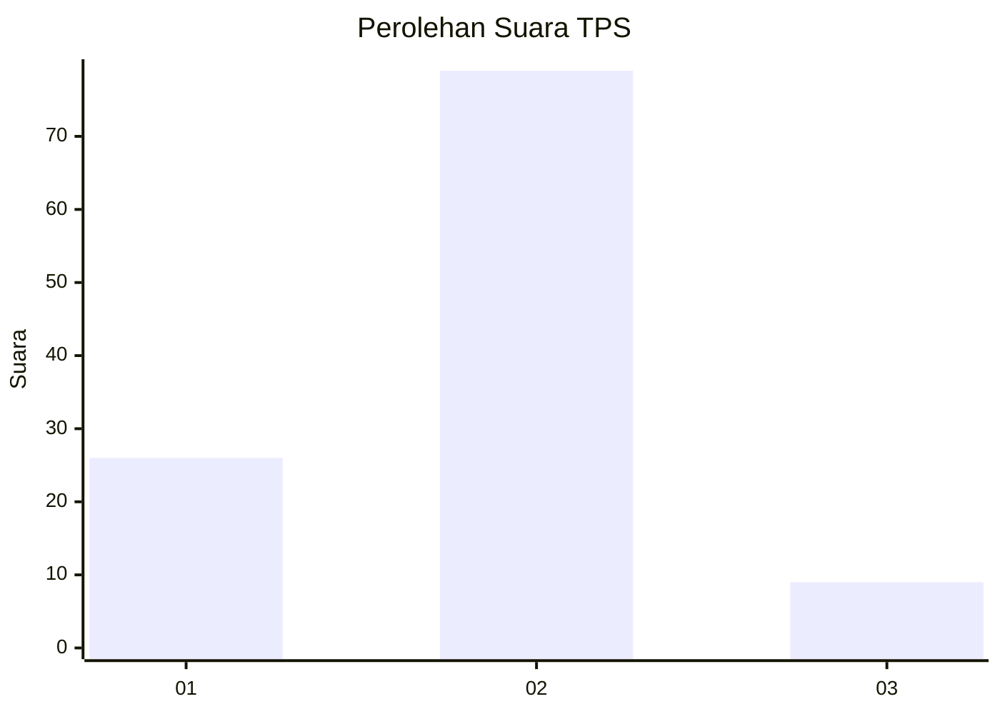
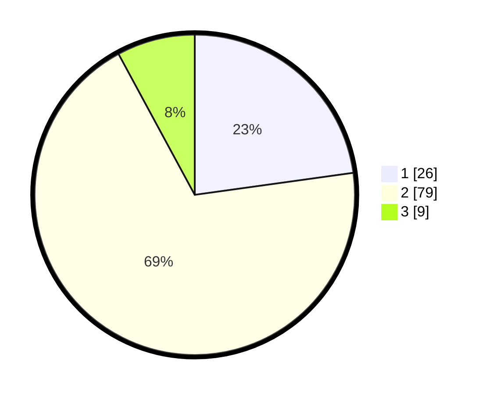

# Hasil

## Grafik

## Tabel

| No. | Nama Paslon    | Suara | Suara (raw) | Persentase |
|:--- |:-------------- | -----:| -----------:| ----------:|
| 1   | ANIES MUHAIMIN | 26    | [26][p-1]   | 22,81      |
| 2   | PRABOWO GIBRAN | 79    | [79][p-2]   | 69,30      |
| 3   | GANJAR MAHFUD  | 9     | [9][p-3]    | 7,89       |

[p-1]: https://github.com/gigit-pemilu/pemilu-2024-33-jawa-tengah/blob/main/pilpres/hitung-suara/sub/33-jawa-tengah/sub/06-purworejo/sub/02-ngombol/sub/2022-wasiat/sub/005-tps/sub/paslon-1.txt
[p-2]: https://github.com/gigit-pemilu/pemilu-2024-33-jawa-tengah/blob/main/pilpres/hitung-suara/sub/33-jawa-tengah/sub/06-purworejo/sub/02-ngombol/sub/2022-wasiat/sub/005-tps/sub/paslon-2.txt
[p-3]: https://github.com/gigit-pemilu/pemilu-2024-33-jawa-tengah/blob/main/pilpres/hitung-suara/sub/33-jawa-tengah/sub/06-purworejo/sub/02-ngombol/sub/2022-wasiat/sub/005-tps/sub/paslon-3.txt

## Foto C Plano

https://sirekap-obj-formc.kpu.go.id/767a/pemilu/ppwp/33/06/02/20/22/3306022022005-20240215-001601--73eb16c7-a9a2-4242-91e7-84c56dad43ee.jpg

https://sirekap-obj-formc.kpu.go.id/767a/pemilu/ppwp/33/06/02/20/22/3306022022005-20240216-133451--018818f0-0a0e-4b79-a88a-4c87cd5e9d3a.jpg

https://sirekap-obj-formc.kpu.go.id/767a/pemilu/ppwp/33/06/02/20/22/3306022022005-20240216-133912--c4eba2cb-f841-4dec-b94b-9bada6003826.jpg

## Metadata

| Key        | Value               |
| ---------- | ------------------- |
| Time Stamp | 2024-02-16 21:01:00 |

