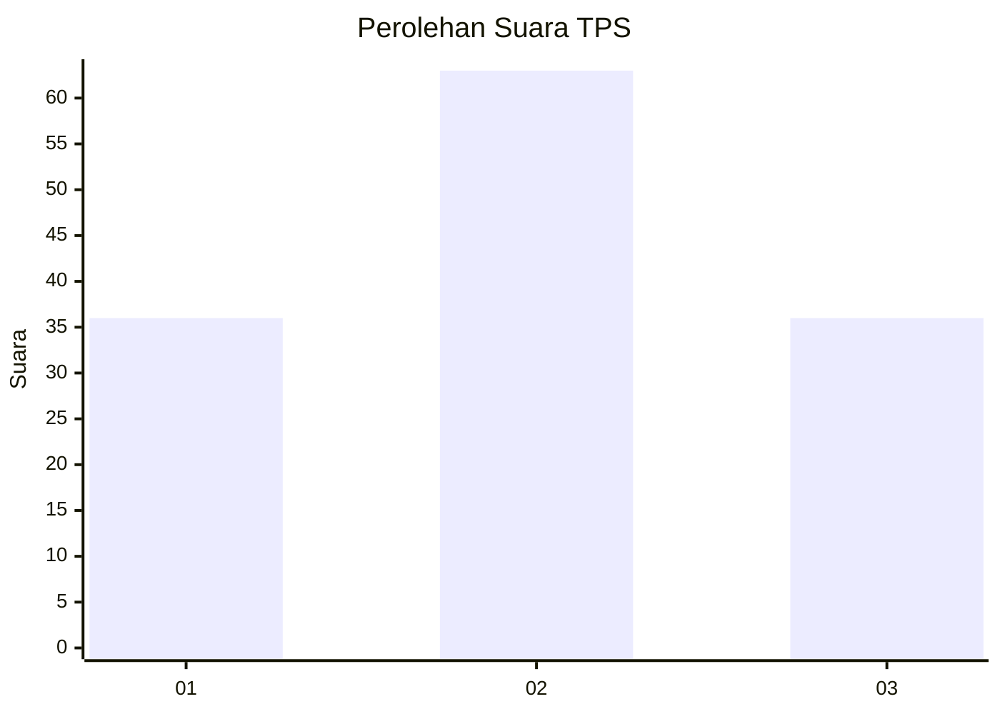
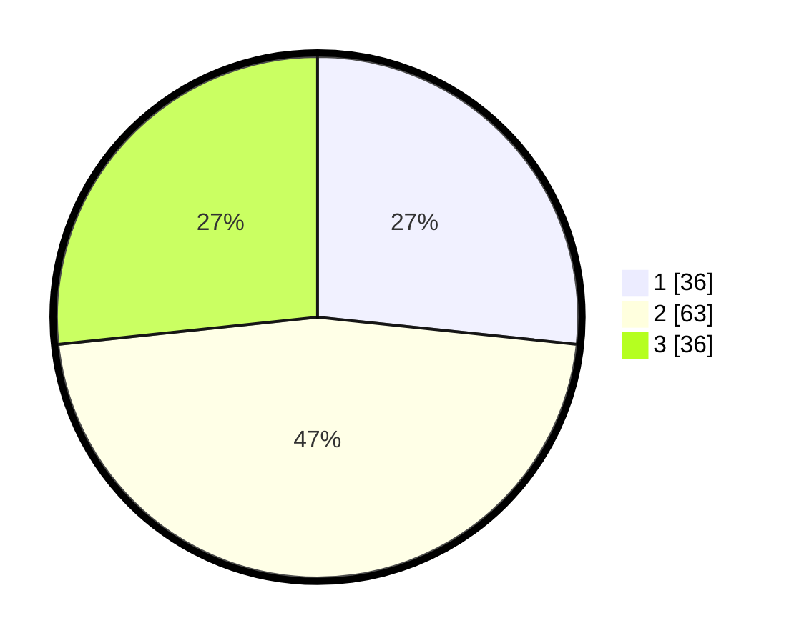

# Hasil

## Grafik

## Tabel

| No. | Nama Paslon    | Suara | Suara (raw) | Persentase |
|:--- |:-------------- | -----:| -----------:| ----------:|
| 1   | ANIES MUHAIMIN | 36    | [36][p-1]   | 26,67      |
| 2   | PRABOWO GIBRAN | 63    | [63][p-2]   | 46,67      |
| 3   | GANJAR MAHFUD  | 36    | [36][p-3]   | 26,67      |

[p-1]: https://github.com/gigit-pemilu/pemilu-2024-33-jawa-tengah/blob/main/pilpres/hitung-suara/sub/33-jawa-tengah/sub/06-purworejo/sub/02-ngombol/sub/2027-cokroyasan/sub/006-tps/sub/paslon-1.txt
[p-2]: https://github.com/gigit-pemilu/pemilu-2024-33-jawa-tengah/blob/main/pilpres/hitung-suara/sub/33-jawa-tengah/sub/06-purworejo/sub/02-ngombol/sub/2027-cokroyasan/sub/006-tps/sub/paslon-2.txt
[p-3]: https://github.com/gigit-pemilu/pemilu-2024-33-jawa-tengah/blob/main/pilpres/hitung-suara/sub/33-jawa-tengah/sub/06-purworejo/sub/02-ngombol/sub/2027-cokroyasan/sub/006-tps/sub/paslon-3.txt

## Foto C Plano

https://sirekap-obj-formc.kpu.go.id/f6c3/pemilu/ppwp/33/06/02/20/27/3306022027006-20240214-205124--7f260499-152e-48f8-a579-b7dc8d590a6f.jpg

https://sirekap-obj-formc.kpu.go.id/f6c3/pemilu/ppwp/33/06/02/20/27/3306022027006-20240216-214045--371da01f-2401-41a7-aaa9-0cc52640aa35.jpg

https://sirekap-obj-formc.kpu.go.id/f6c3/pemilu/ppwp/33/06/02/20/27/3306022027006-20240214-210356--e9b665cd-97d4-4fbd-8edb-9860264c70f7.jpg

## Metadata

| Key        | Value               |
| ---------- | ------------------- |
| Time Stamp | 2024-02-16 23:45:47 |

