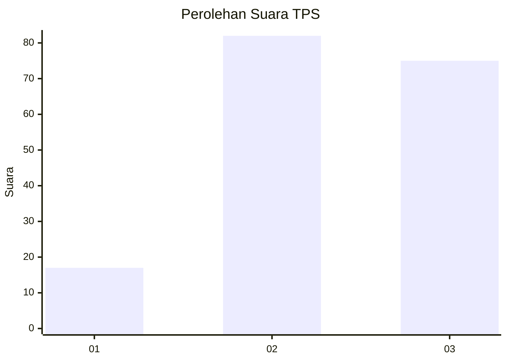
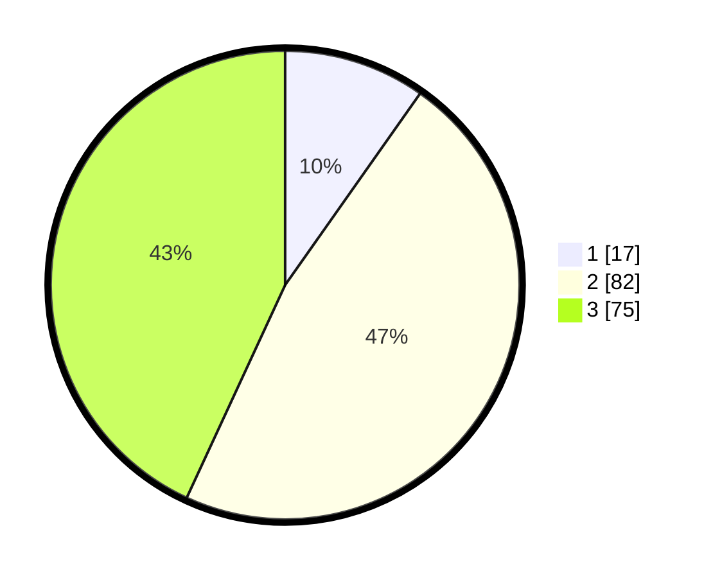

# Hasil

## Grafik

## Tabel

| No. | Nama Paslon    | Suara | Suara (raw) | Persentase |
|:--- |:-------------- | -----:| -----------:| ----------:|
| 1   | ANIES MUHAIMIN | 17    | [17][p-1]   | 9,77       |
| 2   | PRABOWO GIBRAN | 82    | [82][p-2]   | 47,13      |
| 3   | GANJAR MAHFUD  | 75    | [75][p-3]   | 43,10      |

[p-1]: https://github.com/gigit-pemilu/pemilu-2024-33-jawa-tengah/blob/main/pilpres/hitung-suara/sub/33-jawa-tengah/sub/06-purworejo/sub/02-ngombol/sub/2036-pulutan/sub/002-tps/sub/paslon-1.txt
[p-2]: https://github.com/gigit-pemilu/pemilu-2024-33-jawa-tengah/blob/main/pilpres/hitung-suara/sub/33-jawa-tengah/sub/06-purworejo/sub/02-ngombol/sub/2036-pulutan/sub/002-tps/sub/paslon-2.txt
[p-3]: https://github.com/gigit-pemilu/pemilu-2024-33-jawa-tengah/blob/main/pilpres/hitung-suara/sub/33-jawa-tengah/sub/06-purworejo/sub/02-ngombol/sub/2036-pulutan/sub/002-tps/sub/paslon-3.txt

## Foto C Plano

https://sirekap-obj-formc.kpu.go.id/73d3/pemilu/ppwp/33/06/02/20/36/3306022036002-20240215-000002--91911685-b271-400b-8aab-1e0aa7d69507.jpg

https://sirekap-obj-formc.kpu.go.id/73d3/pemilu/ppwp/33/06/02/20/36/3306022036002-20240216-112222--392f4e59-31a7-4d12-b7b7-366ac6906f3a.jpg

https://sirekap-obj-formc.kpu.go.id/73d3/pemilu/ppwp/33/06/02/20/36/3306022036002-20240215-000224--7a879f4c-f3d4-47b3-ac7f-8bc8e21fc83f.jpg

## Metadata

| Key        | Value               |
| ---------- | ------------------- |
| Time Stamp | 2024-02-16 21:01:00 |

