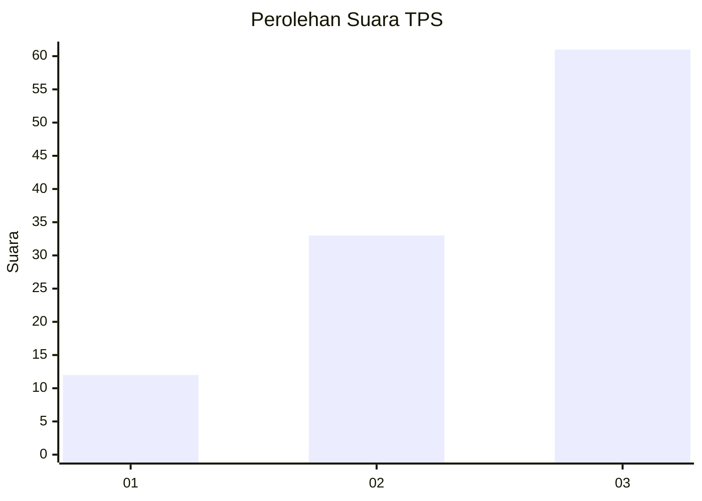
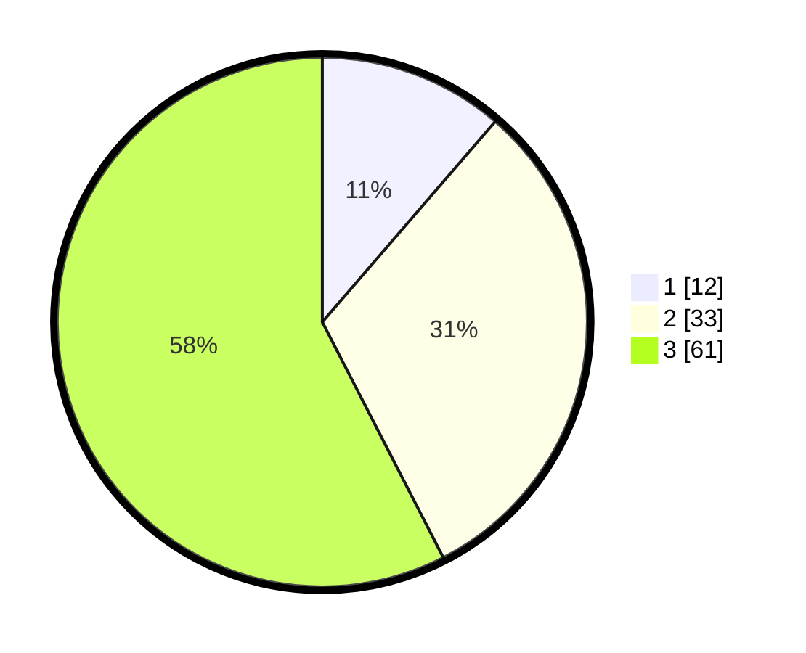

# Hasil

## Grafik

## Tabel

| No. | Nama Paslon    | Suara | Suara (raw) | Persentase |
|:--- |:-------------- | -----:| -----------:| ----------:|
| 1   | ANIES MUHAIMIN | 12    | [12][p-1]   | 11,32      |
| 2   | PRABOWO GIBRAN | 33    | [33][p-2]   | 31,13      |
| 3   | GANJAR MAHFUD  | 61    | [61][p-3]   | 57,55      |

[p-1]: https://github.com/gigit-pemilu/pemilu-2024-33-jawa-tengah/blob/main/pilpres/hitung-suara/sub/33-jawa-tengah/sub/06-purworejo/sub/02-ngombol/sub/2051-wingkosanggrahan/sub/002-tps/sub/paslon-1.txt
[p-2]: https://github.com/gigit-pemilu/pemilu-2024-33-jawa-tengah/blob/main/pilpres/hitung-suara/sub/33-jawa-tengah/sub/06-purworejo/sub/02-ngombol/sub/2051-wingkosanggrahan/sub/002-tps/sub/paslon-2.txt
[p-3]: https://github.com/gigit-pemilu/pemilu-2024-33-jawa-tengah/blob/main/pilpres/hitung-suara/sub/33-jawa-tengah/sub/06-purworejo/sub/02-ngombol/sub/2051-wingkosanggrahan/sub/002-tps/sub/paslon-3.txt

## Foto C Plano

https://sirekap-obj-formc.kpu.go.id/ede6/pemilu/ppwp/33/06/02/20/51/3306022051002-20240214-234443--e61ae0b9-69f5-449b-bc1e-f06303c6d385.jpg

https://sirekap-obj-formc.kpu.go.id/ede6/pemilu/ppwp/33/06/02/20/51/3306022051002-20240216-152513--54a7c9ca-9383-4729-b05c-188043f93105.jpg

https://sirekap-obj-formc.kpu.go.id/ede6/pemilu/ppwp/33/06/02/20/51/3306022051002-20240214-234626--5f7453c3-6ec1-4d68-9442-76814fabb2f0.jpg

## Metadata

| Key        | Value               |
| ---------- | ------------------- |
| Time Stamp | 2024-02-16 21:01:00 |

