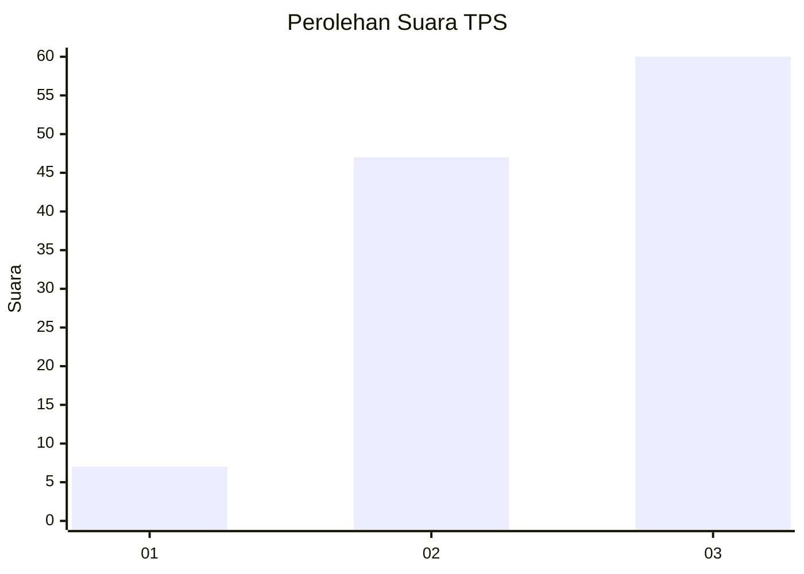
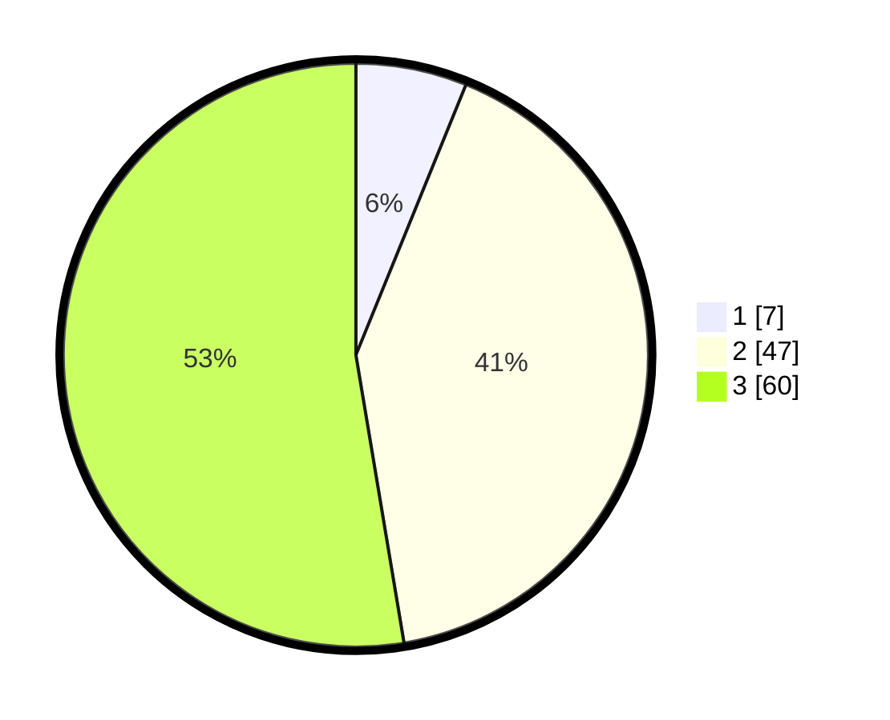

# Hasil

## Grafik

## Tabel

| No. | Nama Paslon    | Suara | Suara (raw) | Persentase |
|:--- |:-------------- | -----:| -----------:| ----------:|
| 1   | ANIES MUHAIMIN | 7     | [7][p-1]    | 6,14       |
| 2   | PRABOWO GIBRAN | 47    | [47][p-2]   | 41,23      |
| 3   | GANJAR MAHFUD  | 60    | [60][p-3]   | 52,63      |

[p-1]: https://github.com/gigit-pemilu/pemilu-2024/blob/main/pilpres/hitung-suara/sub/33-jawa-tengah/sub/06-purworejo/sub/03-purwodadi/sub/2001-jatimalang/sub/001-tps/sub/paslon-1.txt
[p-2]: https://github.com/gigit-pemilu/pemilu-2024/blob/main/pilpres/hitung-suara/sub/33-jawa-tengah/sub/06-purworejo/sub/03-purwodadi/sub/2001-jatimalang/sub/001-tps/sub/paslon-2.txt
[p-3]: https://github.com/gigit-pemilu/pemilu-2024/blob/main/pilpres/hitung-suara/sub/33-jawa-tengah/sub/06-purworejo/sub/03-purwodadi/sub/2001-jatimalang/sub/001-tps/sub/paslon-3.txt

## Foto C Plano

https://sirekap-obj-formc.kpu.go.id/b9e1/pemilu/ppwp/33/06/03/20/01/3306032001001-20240218-121421--c6bf1009-7107-44e0-9d70-eff0aa5ab0b4.jpg

https://sirekap-obj-formc.kpu.go.id/b9e1/pemilu/ppwp/33/06/03/20/01/3306032001001-20240218-122022--976ef5b4-ea07-45cf-b281-81447ef4fa2f.jpg

https://sirekap-obj-formc.kpu.go.id/b9e1/pemilu/ppwp/33/06/03/20/01/3306032001001-20240218-121820--2a2288ba-1d70-4bb4-a32f-239e81ab4753.jpg

## Metadata

| Key        | Value               |
| ---------- | ------------------- |
| Time Stamp | 2024-02-24 22:31:28 |

## DATA PEMILIH TETAP

Jumlah pemilih dalam DPT: **130**.
 * L: **62**.
 * P: **68**.

## DATA PENGGUNA HAK PILIH

Jumlah pengguna hak pilih dalam DPT: **110**.
 * L: **55**.
 * P: **55**.

Jumlah pengguna hak pilih dalam DPTb: **2**.
 * L: **1**.
 * P: **1**.

Jumlah pengguna hak pilih dalam DPK: **0**.
 * L: **0**.
 * P: **0**.

Jumlah pengguna hak pilih: **112**.
 * L: **56**.
 * P: **56**.

## JUMLAH SUARA SAH DAN TIDAK SAH

JUMLAH SELURUH SUARA SAH: **110**.

JUMLAH SUARA TIDAK SAH: **2**.

JUMLAH SELURUH SUARA SAH DAN SUARA TIDAK SAH: **112**.

