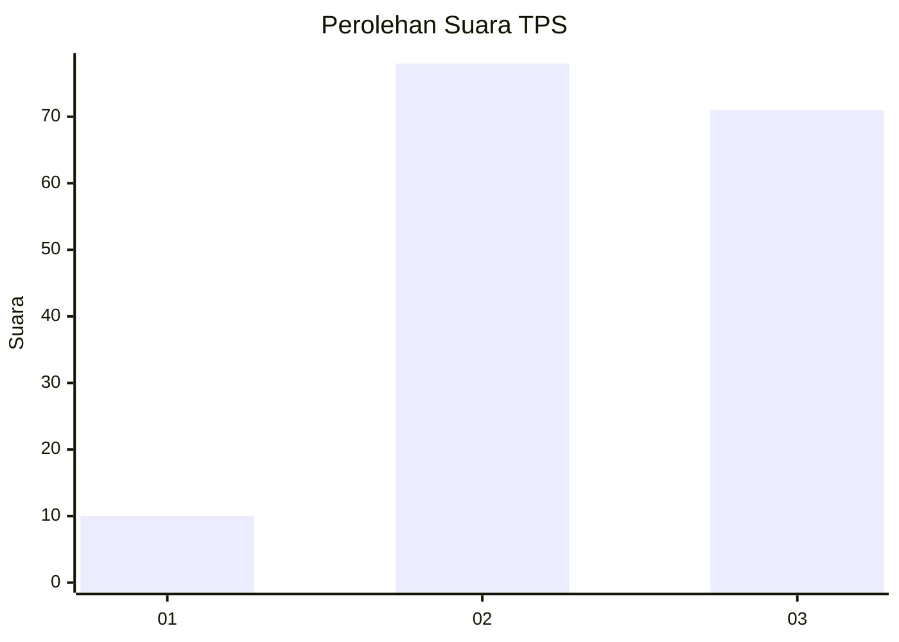
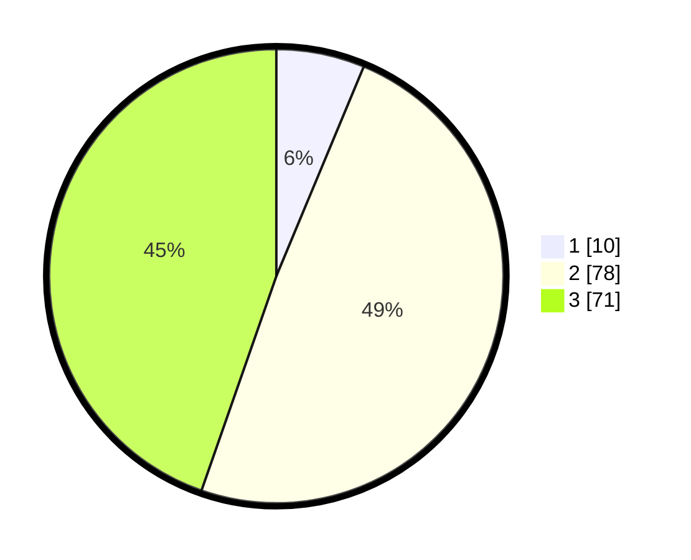

# Hasil

## Grafik

## Tabel

| No. | Nama Paslon    | Suara | Suara (raw) | Persentase |
|:--- |:-------------- | -----:| -----------:| ----------:|
| 1   | ANIES MUHAIMIN | 10    | [10][p-1]   | 6,29       |
| 2   | PRABOWO GIBRAN | 78    | [78][p-2]   | 49,06      |
| 3   | GANJAR MAHFUD  | 71    | [71][p-3]   | 44,65      |

[p-1]: https://github.com/gigit-pemilu/pemilu-2024-33-jawa-tengah/blob/main/pilpres/hitung-suara/sub/33-jawa-tengah/sub/06-purworejo/sub/03-purwodadi/sub/2001-jatimalang/sub/002-tps/sub/paslon-1.txt
[p-2]: https://github.com/gigit-pemilu/pemilu-2024-33-jawa-tengah/blob/main/pilpres/hitung-suara/sub/33-jawa-tengah/sub/06-purworejo/sub/03-purwodadi/sub/2001-jatimalang/sub/002-tps/sub/paslon-2.txt
[p-3]: https://github.com/gigit-pemilu/pemilu-2024-33-jawa-tengah/blob/main/pilpres/hitung-suara/sub/33-jawa-tengah/sub/06-purworejo/sub/03-purwodadi/sub/2001-jatimalang/sub/002-tps/sub/paslon-3.txt

## Foto C Plano

https://sirekap-obj-formc.kpu.go.id/1d00/pemilu/ppwp/33/06/03/20/01/3306032001002-20240214-214145--dab28c50-31c2-4dae-8892-8dd62ee09435.jpg

https://sirekap-obj-formc.kpu.go.id/1d00/pemilu/ppwp/33/06/03/20/01/3306032001002-20240214-234957--c41762b3-4575-42fd-9348-93b30e70e889.jpg

https://sirekap-obj-formc.kpu.go.id/1d00/pemilu/ppwp/33/06/03/20/01/3306032001002-20240217-225514--04ce4ff7-bff9-4f2d-8e20-c712d436f3ca.jpg

## Metadata

| Key        | Value               |
| ---------- | ------------------- |
| Time Stamp | 2024-02-19 06:16:00 |

