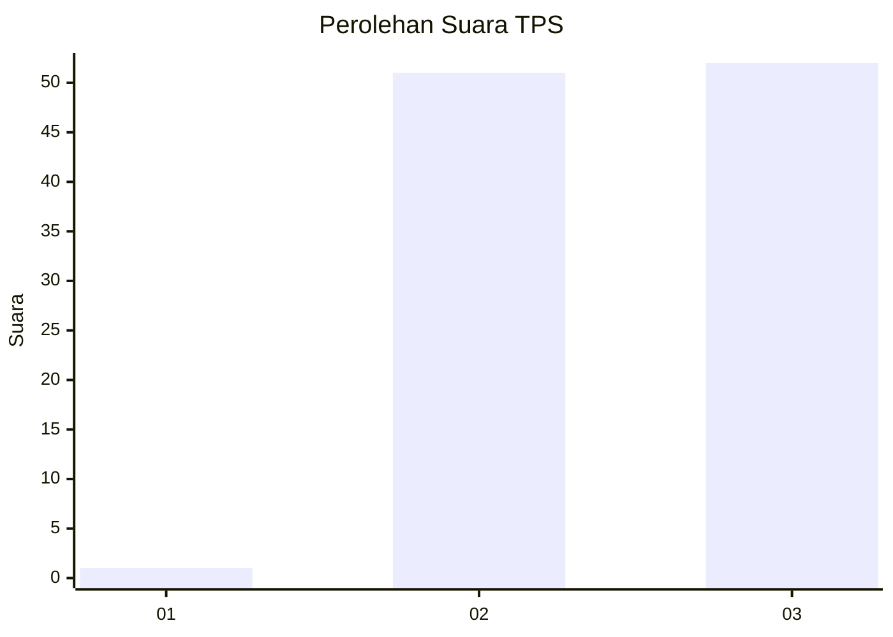
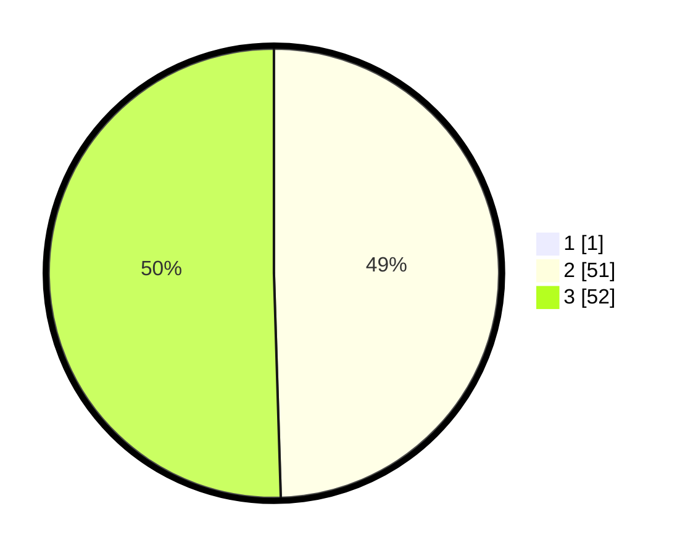

# Hasil

## Grafik

## Tabel

| No. | Nama Paslon    | Suara | Suara (raw) | Persentase |
|:--- |:-------------- | -----:| -----------:| ----------:|
| 1   | ANIES MUHAIMIN | 1     | [1][p-1]    | 0,96       |
| 2   | PRABOWO GIBRAN | 51    | [51][p-2]   | 49,04      |
| 3   | GANJAR MAHFUD  | 52    | [52][p-3]   | 50,00      |

[p-1]: https://github.com/gigit-pemilu/pemilu-2024/blob/main/pilpres/hitung-suara/sub/33-jawa-tengah/sub/06-purworejo/sub/03-purwodadi/sub/2001-jatimalang/sub/004-tps/sub/paslon-1.txt
[p-2]: https://github.com/gigit-pemilu/pemilu-2024/blob/main/pilpres/hitung-suara/sub/33-jawa-tengah/sub/06-purworejo/sub/03-purwodadi/sub/2001-jatimalang/sub/004-tps/sub/paslon-2.txt
[p-3]: https://github.com/gigit-pemilu/pemilu-2024/blob/main/pilpres/hitung-suara/sub/33-jawa-tengah/sub/06-purworejo/sub/03-purwodadi/sub/2001-jatimalang/sub/004-tps/sub/paslon-3.txt

## Foto C Plano

https://sirekap-obj-formc.kpu.go.id/7aca/pemilu/ppwp/33/06/03/20/01/3306032001004-20240218-082332--dc156e8e-6db0-40ab-bd0a-28aeac6f2373.jpg

https://sirekap-obj-formc.kpu.go.id/7aca/pemilu/ppwp/33/06/03/20/01/3306032001004-20240218-082915--9da253a6-e126-4370-9d48-df7cf6e4609f.jpg

https://sirekap-obj-formc.kpu.go.id/7aca/pemilu/ppwp/33/06/03/20/01/3306032001004-20240218-090740--4e899487-437e-4c3d-b2f7-327e519d4999.jpg

## Metadata

| Key        | Value               |
| ---------- | ------------------- |
| Time Stamp | 2024-02-19 06:16:00 |

## DATA PEMILIH TETAP

Jumlah pemilih dalam DPT: **124**.
 * L: **66**.
 * P: **58**.

## DATA PENGGUNA HAK PILIH

Jumlah pengguna hak pilih dalam DPT: **104**.
 * L: **57**.
 * P: **47**.

Jumlah pengguna hak pilih dalam DPTb: **0**.
 * L: **0**.
 * P: **0**.

Jumlah pengguna hak pilih dalam DPK: **3**.
 * L: **1**.
 * P: **2**.

Jumlah pengguna hak pilih: **107**.
 * L: **58**.
 * P: **49**.

## JUMLAH SUARA SAH DAN TIDAK SAH

JUMLAH SELURUH SUARA SAH: **104**.

JUMLAH SUARA TIDAK SAH: **3**.

JUMLAH SELURUH SUARA SAH DAN SUARA TIDAK SAH: **107**.

