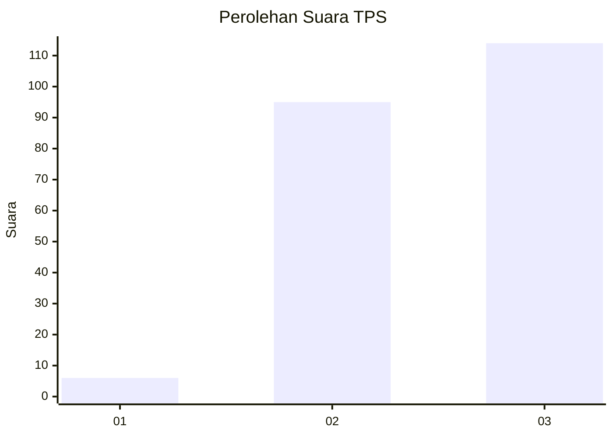
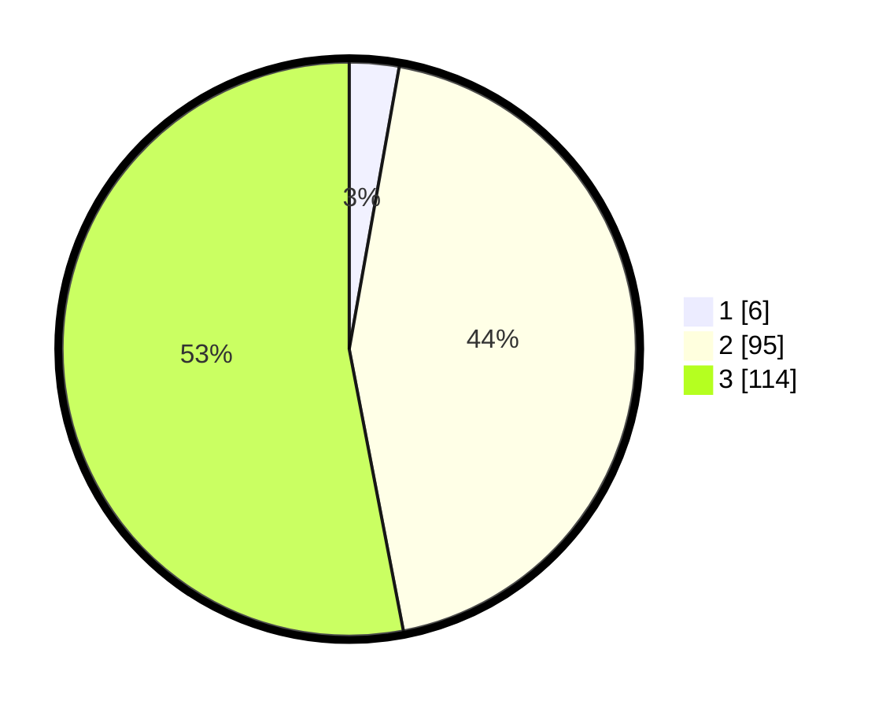

# Hasil

## Grafik

## Tabel

| No. | Nama Paslon    | Suara | Suara (raw) | Persentase |
|:--- |:-------------- | -----:| -----------:| ----------:|
| 1   | ANIES MUHAIMIN | 6     | [6][p-1]    | 2,79       |
| 2   | PRABOWO GIBRAN | 95    | [95][p-2]   | 44,19      |
| 3   | GANJAR MAHFUD  | 114   | [114][p-3]  | 53,02      |

[p-1]: https://github.com/gigit-pemilu/pemilu-2024/blob/main/pilpres/hitung-suara/sub/33-jawa-tengah/sub/06-purworejo/sub/03-purwodadi/sub/2012-geparang/sub/001-tps/sub/paslon-1.txt
[p-2]: https://github.com/gigit-pemilu/pemilu-2024/blob/main/pilpres/hitung-suara/sub/33-jawa-tengah/sub/06-purworejo/sub/03-purwodadi/sub/2012-geparang/sub/001-tps/sub/paslon-2.txt
[p-3]: https://github.com/gigit-pemilu/pemilu-2024/blob/main/pilpres/hitung-suara/sub/33-jawa-tengah/sub/06-purworejo/sub/03-purwodadi/sub/2012-geparang/sub/001-tps/sub/paslon-3.txt

## Foto C Plano

https://sirekap-obj-formc.kpu.go.id/135c/pemilu/ppwp/33/06/03/20/12/3306032012001-20240214-203516--271c4ce2-c50c-45e1-b34a-f0ca97bd4a68.jpg

https://sirekap-obj-formc.kpu.go.id/135c/pemilu/ppwp/33/06/03/20/12/3306032012001-20240214-203529--5bf503bb-b585-405f-be51-be34ede036dc.jpg

https://sirekap-obj-formc.kpu.go.id/135c/pemilu/ppwp/33/06/03/20/12/3306032012001-20240214-203538--5d7e7061-2982-4d77-89e5-474e7977b479.jpg

## Metadata

| Key        | Value               |
| ---------- | ------------------- |
| Time Stamp | 2024-02-15 16:00:26 |

