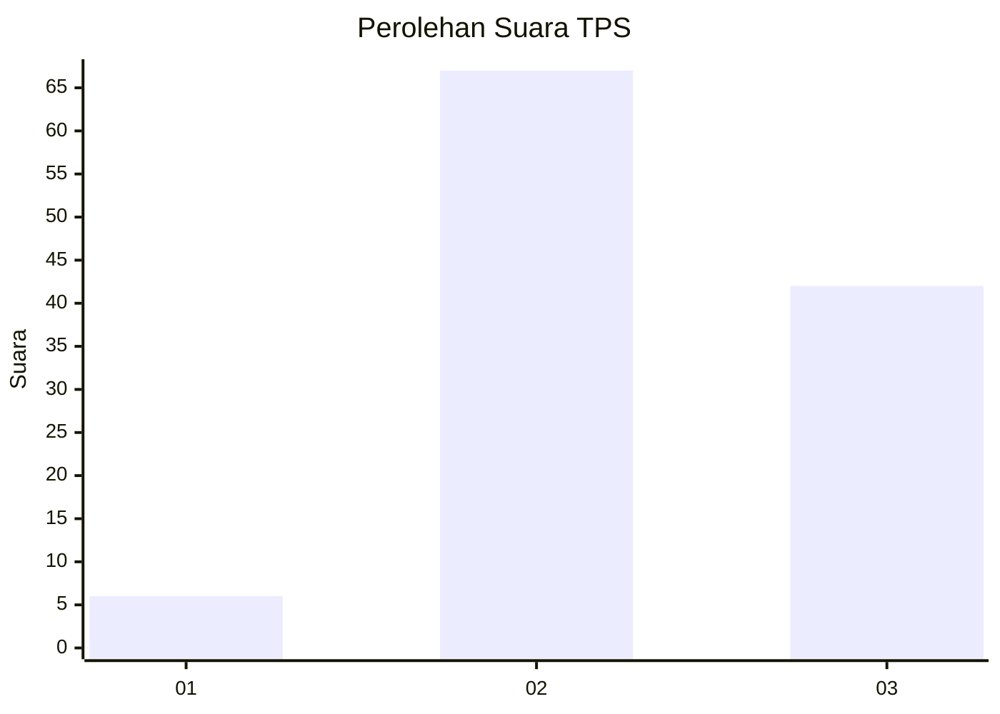
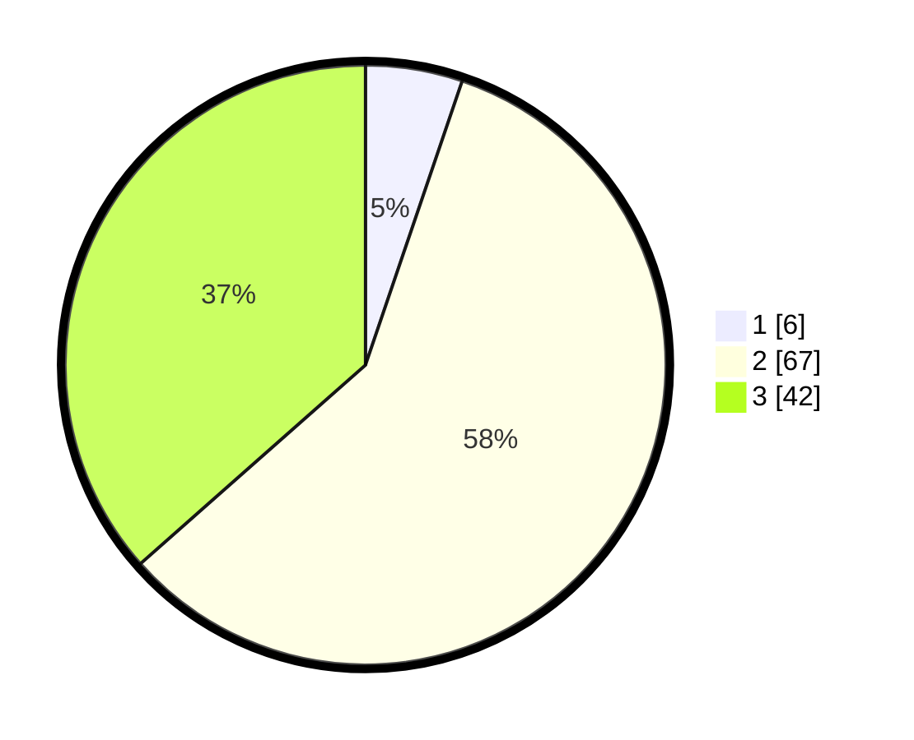

# Hasil

## Grafik

## Tabel

| No. | Nama Paslon    | Suara | Suara (raw) | Persentase |
|:--- |:-------------- | -----:| -----------:| ----------:|
| 1   | ANIES MUHAIMIN | 6     | [6][p-1]    | 5,22       |
| 2   | PRABOWO GIBRAN | 67    | [67][p-2]   | 58,26      |
| 3   | GANJAR MAHFUD  | 42    | [42][p-3]   | 36,52      |

[p-1]: https://github.com/gigit-pemilu/pemilu-2024-33-jawa-tengah/blob/main/pilpres/hitung-suara/sub/33-jawa-tengah/sub/06-purworejo/sub/03-purwodadi/sub/2019-tegalaren/sub/001-tps/sub/paslon-1.txt
[p-2]: https://github.com/gigit-pemilu/pemilu-2024-33-jawa-tengah/blob/main/pilpres/hitung-suara/sub/33-jawa-tengah/sub/06-purworejo/sub/03-purwodadi/sub/2019-tegalaren/sub/001-tps/sub/paslon-2.txt
[p-3]: https://github.com/gigit-pemilu/pemilu-2024-33-jawa-tengah/blob/main/pilpres/hitung-suara/sub/33-jawa-tengah/sub/06-purworejo/sub/03-purwodadi/sub/2019-tegalaren/sub/001-tps/sub/paslon-3.txt

## Foto C Plano

https://sirekap-obj-formc.kpu.go.id/358b/pemilu/ppwp/33/06/03/20/19/3306032019001-20240214-155252--1051f16c-997b-4eec-9018-85973394d161.jpg

https://sirekap-obj-formc.kpu.go.id/358b/pemilu/ppwp/33/06/03/20/19/3306032019001-20240214-141324--77b1a053-f555-41ce-99b3-d698bbad3ac1.jpg

https://sirekap-obj-formc.kpu.go.id/358b/pemilu/ppwp/33/06/03/20/19/3306032019001-20240214-185618--b42b5930-5fc8-4287-a209-7c9203197c10.jpg

## Metadata

| Key        | Value               |
| ---------- | ------------------- |
| Time Stamp | 2024-02-15 16:00:26 |

