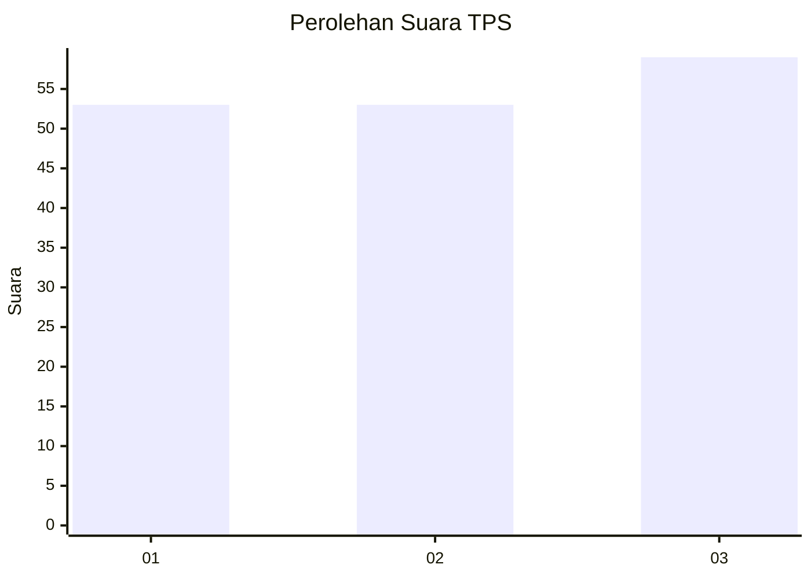
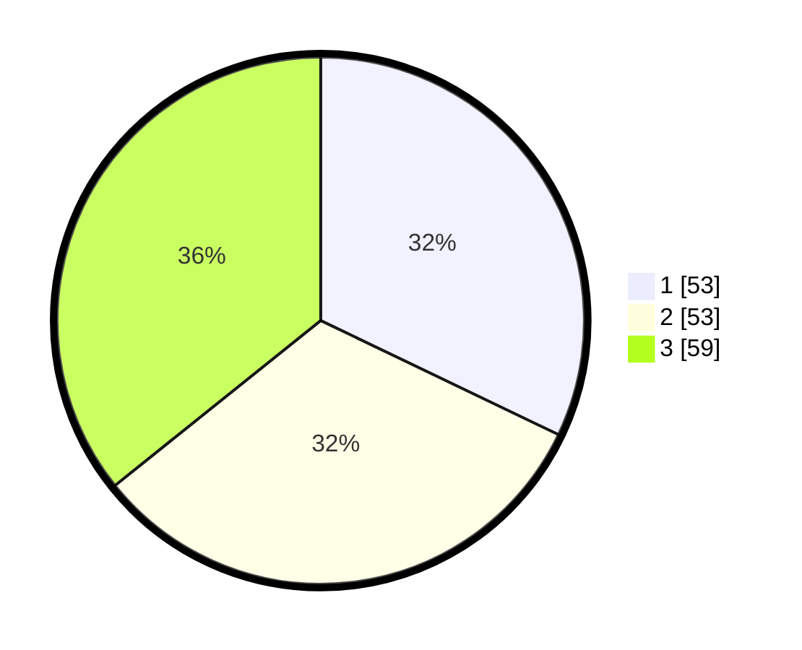

# Hasil

## Grafik

## Tabel

| No. | Nama Paslon    | Suara | Suara (raw) | Persentase |
|:--- |:-------------- | -----:| -----------:| ----------:|
| 1   | ANIES MUHAIMIN | 53    | [53][p-1]   | 32,12      |
| 2   | PRABOWO GIBRAN | 53    | [53][p-2]   | 32,12      |
| 3   | GANJAR MAHFUD  | 59    | [59][p-3]   | 35,76      |

[p-1]: https://github.com/gigit-pemilu/pemilu-2024-33-jawa-tengah/blob/main/pilpres/hitung-suara/sub/33-jawa-tengah/sub/06-purworejo/sub/03-purwodadi/sub/2020-sukomanah/sub/001-tps/sub/paslon-1.txt
[p-2]: https://github.com/gigit-pemilu/pemilu-2024-33-jawa-tengah/blob/main/pilpres/hitung-suara/sub/33-jawa-tengah/sub/06-purworejo/sub/03-purwodadi/sub/2020-sukomanah/sub/001-tps/sub/paslon-2.txt
[p-3]: https://github.com/gigit-pemilu/pemilu-2024-33-jawa-tengah/blob/main/pilpres/hitung-suara/sub/33-jawa-tengah/sub/06-purworejo/sub/03-purwodadi/sub/2020-sukomanah/sub/001-tps/sub/paslon-3.txt

## Foto C Plano

https://sirekap-obj-formc.kpu.go.id/4b1f/pemilu/ppwp/33/06/03/20/20/3306032020001-20240216-201525--d009ea03-e6ab-4433-a483-e8edf48bccc7.jpg

https://sirekap-obj-formc.kpu.go.id/4b1f/pemilu/ppwp/33/06/03/20/20/3306032020001-20240216-201838--fc9d9a78-9496-4f67-b562-c09bf00bf6bf.jpg

https://sirekap-obj-formc.kpu.go.id/4b1f/pemilu/ppwp/33/06/03/20/20/3306032020001-20240216-203030--09a47d53-9f52-4076-8965-fd8762a0b002.jpg

## Metadata

| Key        | Value               |
| ---------- | ------------------- |
| Time Stamp | 2024-02-16 21:01:00 |

