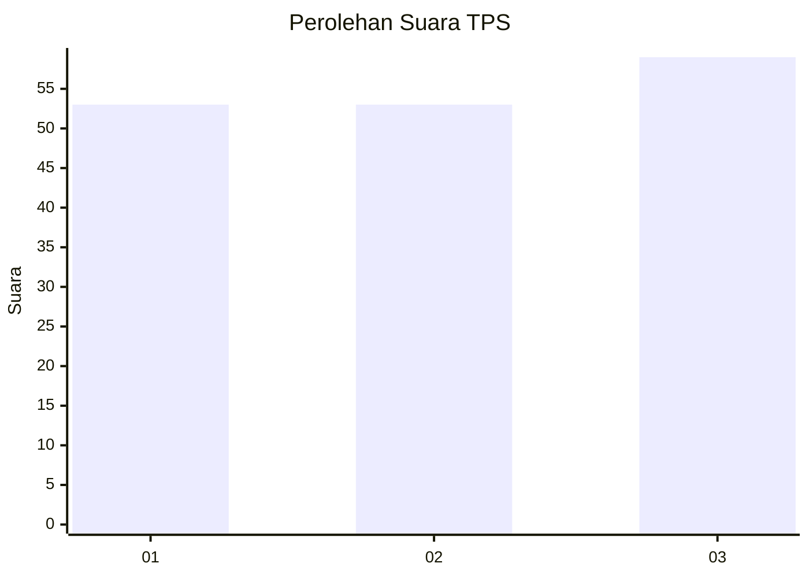
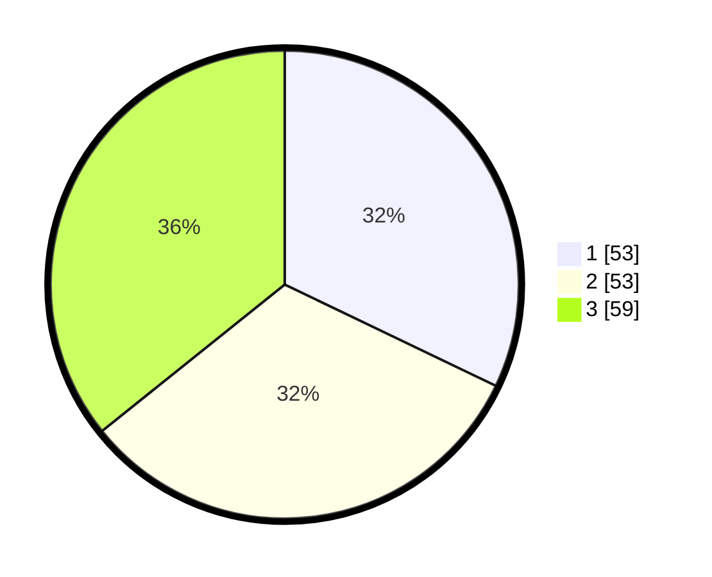

# Hasil

## Grafik

## Tabel

| No. | Nama Paslon    | Suara | Suara (raw) | Persentase |
|:--- |:-------------- | -----:| -----------:| ----------:|
| 1   | ANIES MUHAIMIN | 53    | [53][p-1]   | 32,12      |
| 2   | PRABOWO GIBRAN | 53    | [53][p-2]   | 32,12      |
| 3   | GANJAR MAHFUD  | 59    | [59][p-3]   | 35,76      |

[p-1]: https://github.com/gigit-pemilu/pemilu-2024/blob/main/pilpres/hitung-suara/sub/33-jawa-tengah/sub/06-purworejo/sub/03-purwodadi/sub/2020-sukomanah/sub/002-tps/sub/paslon-1.txt
[p-2]: https://github.com/gigit-pemilu/pemilu-2024/blob/main/pilpres/hitung-suara/sub/33-jawa-tengah/sub/06-purworejo/sub/03-purwodadi/sub/2020-sukomanah/sub/002-tps/sub/paslon-2.txt
[p-3]: https://github.com/gigit-pemilu/pemilu-2024/blob/main/pilpres/hitung-suara/sub/33-jawa-tengah/sub/06-purworejo/sub/03-purwodadi/sub/2020-sukomanah/sub/002-tps/sub/paslon-3.txt

## Foto C Plano

https://sirekap-obj-formc.kpu.go.id/4ed0/pemilu/ppwp/33/06/03/20/20/3306032020002-20240216-221729--8d6926e7-518a-4fe8-b4aa-204efe4292a3.jpg

https://sirekap-obj-formc.kpu.go.id/4ed0/pemilu/ppwp/33/06/03/20/20/3306032020002-20240216-222001--c3ef2c4f-6c48-4120-84ea-5d57e486e14e.jpg

https://sirekap-obj-formc.kpu.go.id/4ed0/pemilu/ppwp/33/06/03/20/20/3306032020002-20240216-222055--8c5a6f8d-e6aa-495f-91d5-c5d3a53e4ca1.jpg

## Metadata

| Key        | Value               |
| ---------- | ------------------- |
| Time Stamp | 2024-02-16 22:30:00 |

