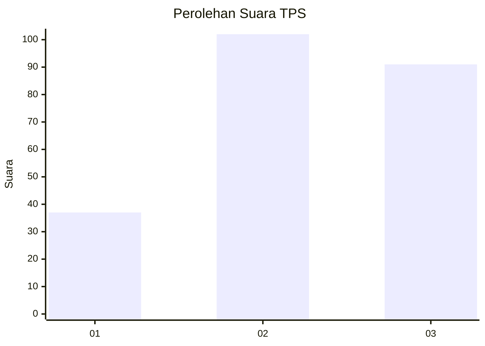
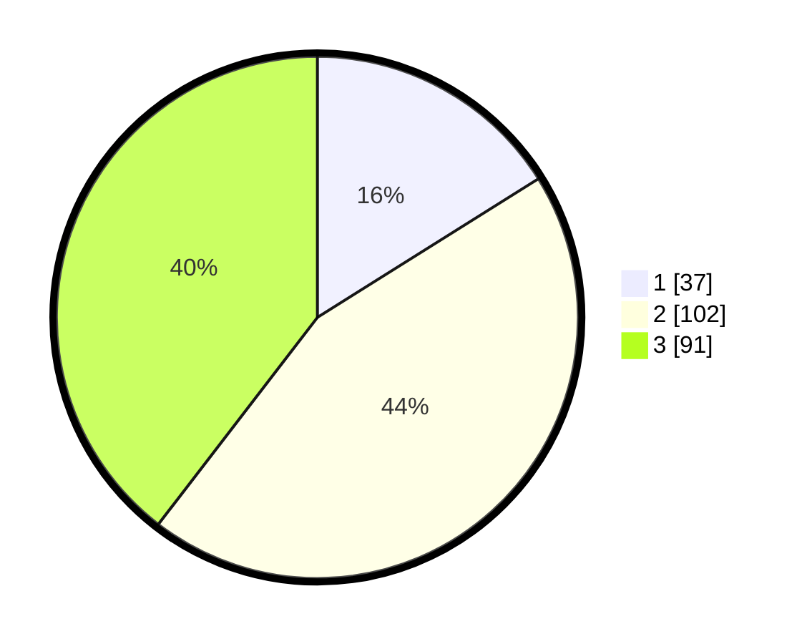

# Hasil

## Grafik

## Tabel

| No. | Nama Paslon    | Suara | Suara (raw) | Persentase |
|:--- |:-------------- | -----:| -----------:| ----------:|
| 1   | ANIES MUHAIMIN | 37    | [37][p-1]   | 16,09      |
| 2   | PRABOWO GIBRAN | 102   | [102][p-2]  | 44,35      |
| 3   | GANJAR MAHFUD  | 91    | [91][p-3]   | 39,57      |

[p-1]: https://github.com/gigit-pemilu/pemilu-2024/blob/main/pilpres/hitung-suara/sub/33-jawa-tengah/sub/06-purworejo/sub/03-purwodadi/sub/2024-purwodadi/sub/003-tps/sub/paslon-1.txt
[p-2]: https://github.com/gigit-pemilu/pemilu-2024/blob/main/pilpres/hitung-suara/sub/33-jawa-tengah/sub/06-purworejo/sub/03-purwodadi/sub/2024-purwodadi/sub/003-tps/sub/paslon-2.txt
[p-3]: https://github.com/gigit-pemilu/pemilu-2024/blob/main/pilpres/hitung-suara/sub/33-jawa-tengah/sub/06-purworejo/sub/03-purwodadi/sub/2024-purwodadi/sub/003-tps/sub/paslon-3.txt

## Foto C Plano

https://sirekap-obj-formc.kpu.go.id/1346/pemilu/ppwp/33/06/03/20/24/3306032024003-20240216-212324--27b20acc-a7a0-4502-a4d9-c481a1e126e8.jpg

https://sirekap-obj-formc.kpu.go.id/1346/pemilu/ppwp/33/06/03/20/24/3306032024003-20240216-212633--2bfe9e6d-e717-4b1f-8467-185636919a2e.jpg

https://sirekap-obj-formc.kpu.go.id/1346/pemilu/ppwp/33/06/03/20/24/3306032024003-20240216-212538--6215634c-56f1-4812-b5a3-5341fcaa30cd.jpg

## Metadata

| Key        | Value               |
| ---------- | ------------------- |
| Time Stamp | 2024-02-16 22:01:00 |

## DATA PEMILIH TETAP

Jumlah pemilih dalam DPT: **255**.
 * L: **677**.
 * P: **173**.

## DATA PENGGUNA HAK PILIH

Jumlah pengguna hak pilih dalam DPT: **5**.
 * L: **634**.
 * P: **88**.

Jumlah pengguna hak pilih dalam DPTb: **5**.
 * L: **804**.
 * P: **75**.

Jumlah pengguna hak pilih dalam DPK: **801**.
 * L: **80**.
 * P: **85**.

Jumlah pengguna hak pilih: **275**.
 * L: **475**.
 * P: **770**.

## JUMLAH SUARA SAH DAN TIDAK SAH

JUMLAH SELURUH SUARA SAH: **230**.

JUMLAH SUARA TIDAK SAH: **5**.

JUMLAH SELURUH SUARA SAH DAN SUARA TIDAK SAH: **235**.

