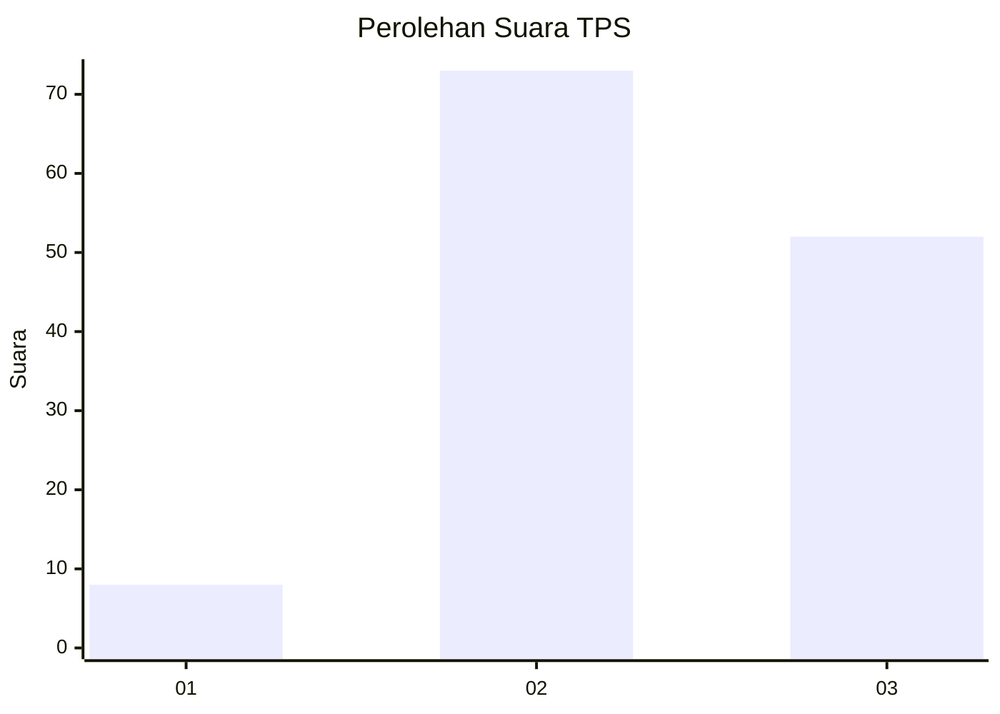
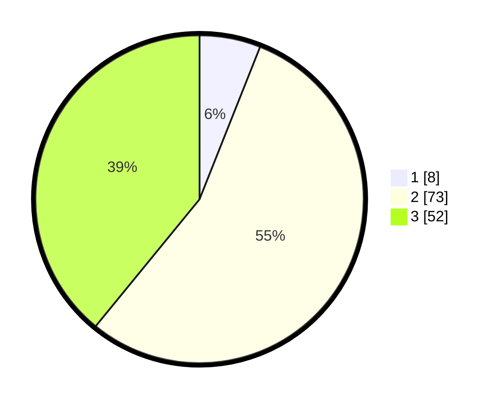

# Hasil

## Grafik

## Tabel

| No. | Nama Paslon    | Suara | Suara (raw) | Persentase |
|:--- |:-------------- | -----:| -----------:| ----------:|
| 1   | ANIES MUHAIMIN | 8     | [8][p-1]    | 6,02       |
| 2   | PRABOWO GIBRAN | 73    | [73][p-2]   | 54,89      |
| 3   | GANJAR MAHFUD  | 52    | [52][p-3]   | 39,10      |

[p-1]: https://github.com/gigit-pemilu/pemilu-2024-33-jawa-tengah/blob/main/pilpres/hitung-suara/sub/33-jawa-tengah/sub/06-purworejo/sub/03-purwodadi/sub/2025-sumbersari/sub/001-tps/sub/paslon-1.txt
[p-2]: https://github.com/gigit-pemilu/pemilu-2024-33-jawa-tengah/blob/main/pilpres/hitung-suara/sub/33-jawa-tengah/sub/06-purworejo/sub/03-purwodadi/sub/2025-sumbersari/sub/001-tps/sub/paslon-2.txt
[p-3]: https://github.com/gigit-pemilu/pemilu-2024-33-jawa-tengah/blob/main/pilpres/hitung-suara/sub/33-jawa-tengah/sub/06-purworejo/sub/03-purwodadi/sub/2025-sumbersari/sub/001-tps/sub/paslon-3.txt

## Foto C Plano

https://sirekap-obj-formc.kpu.go.id/0023/pemilu/ppwp/33/06/03/20/25/3306032025001-20240216-213312--fc6f4978-8183-41a7-830b-4adff2eef582.jpg

https://sirekap-obj-formc.kpu.go.id/0023/pemilu/ppwp/33/06/03/20/25/3306032025001-20240216-213328--b6f441c3-fbbb-4488-ba03-e2c2c78c2288.jpg

https://sirekap-obj-formc.kpu.go.id/0023/pemilu/ppwp/33/06/03/20/25/3306032025001-20240216-213352--486be58f-39d6-4c8a-9afe-3dfd425ee178.jpg

## Metadata

| Key        | Value               |
| ---------- | ------------------- |
| Time Stamp | 2024-02-16 22:01:00 |

## DATA PEMILIH TETAP

Jumlah pemilih dalam DPT: **225**.
 * L: **220**.
 * P: **2**.

## DATA PENGGUNA HAK PILIH

Jumlah pengguna hak pilih dalam DPT: **554**.
 * L: **0**.
 * P: **21**.

Jumlah pengguna hak pilih dalam DPTb: **222**.
 * L: **500**.
 * P: **2**.

Jumlah pengguna hak pilih dalam DPK: **0**.
 * L: **220**.
 * P: **502**.

Jumlah pengguna hak pilih: **2**.
 * L: **154**.
 * P: **5**.

## JUMLAH SUARA SAH DAN TIDAK SAH

JUMLAH SELURUH SUARA SAH: **139**.

JUMLAH SUARA TIDAK SAH: **6**.

JUMLAH SELURUH SUARA SAH DAN SUARA TIDAK SAH: **145**.

