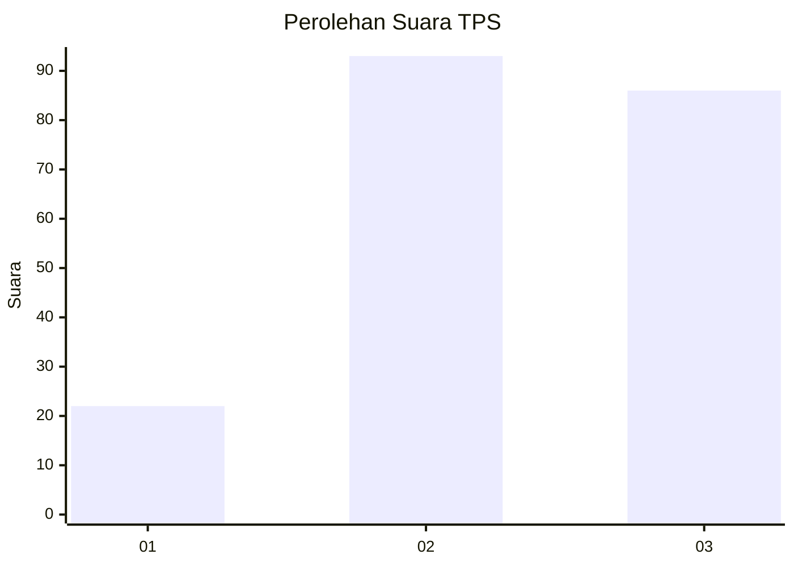
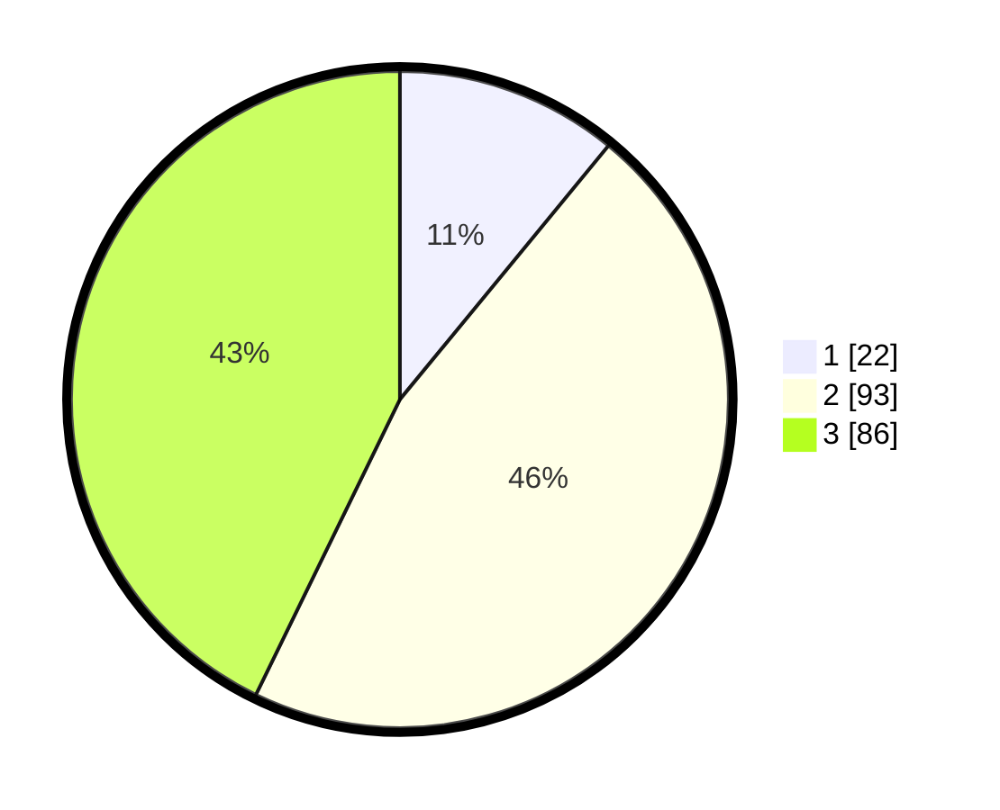

# Hasil

## Grafik

## Tabel

| No. | Nama Paslon    | Suara | Suara (raw) | Persentase |
|:--- |:-------------- | -----:| -----------:| ----------:|
| 1   | ANIES MUHAIMIN | 22    | [22][p-1]   | 10,95      |
| 2   | PRABOWO GIBRAN | 93    | [93][p-2]   | 46,27      |
| 3   | GANJAR MAHFUD  | 86    | [86][p-3]   | 42,79      |

[p-1]: https://github.com/gigit-pemilu/pemilu-2024/blob/main/pilpres/hitung-suara/sub/33-jawa-tengah/sub/06-purworejo/sub/03-purwodadi/sub/2025-sumbersari/sub/003-tps/sub/paslon-1.txt
[p-2]: https://github.com/gigit-pemilu/pemilu-2024/blob/main/pilpres/hitung-suara/sub/33-jawa-tengah/sub/06-purworejo/sub/03-purwodadi/sub/2025-sumbersari/sub/003-tps/sub/paslon-2.txt
[p-3]: https://github.com/gigit-pemilu/pemilu-2024/blob/main/pilpres/hitung-suara/sub/33-jawa-tengah/sub/06-purworejo/sub/03-purwodadi/sub/2025-sumbersari/sub/003-tps/sub/paslon-3.txt

## Foto C Plano

https://sirekap-obj-formc.kpu.go.id/7855/pemilu/ppwp/33/06/03/20/25/3306032025003-20240216-203710--1073a2ed-2190-4dfe-8c8d-8513be89b4ef.jpg

https://sirekap-obj-formc.kpu.go.id/7855/pemilu/ppwp/33/06/03/20/25/3306032025003-20240216-203806--05b679a0-e5da-4274-9aa8-02e2058fe086.jpg

https://sirekap-obj-formc.kpu.go.id/7855/pemilu/ppwp/33/06/03/20/25/3306032025003-20240216-205005--18d84ad8-496b-4691-a7e2-6f35331dbc9b.jpg

## Metadata

| Key        | Value               |
| ---------- | ------------------- |
| Time Stamp | 2024-02-16 22:01:00 |

## DATA PEMILIH TETAP

Jumlah pemilih dalam DPT: **201**.
 * L: **0**.
 * P: **0**.

## DATA PENGGUNA HAK PILIH

Jumlah pengguna hak pilih dalam DPT: **0**.
 * L: **720**.
 * P: **0**.

Jumlah pengguna hak pilih dalam DPTb: **770**.
 * L: **10**.
 * P: **408**.

Jumlah pengguna hak pilih dalam DPK: **700**.
 * L: **440**.
 * P: **0**.

Jumlah pengguna hak pilih: **405**.
 * L: **41**.
 * P: **300**.

## JUMLAH SUARA SAH DAN TIDAK SAH

JUMLAH SELURUH SUARA SAH: **201**.

JUMLAH SUARA TIDAK SAH: **7**.

JUMLAH SELURUH SUARA SAH DAN SUARA TIDAK SAH: **208**.

