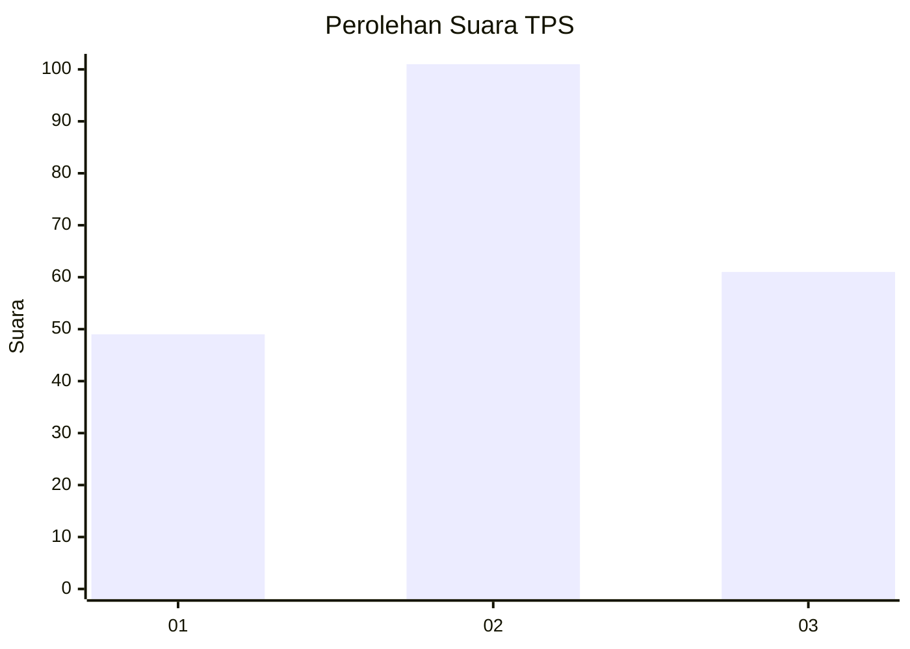
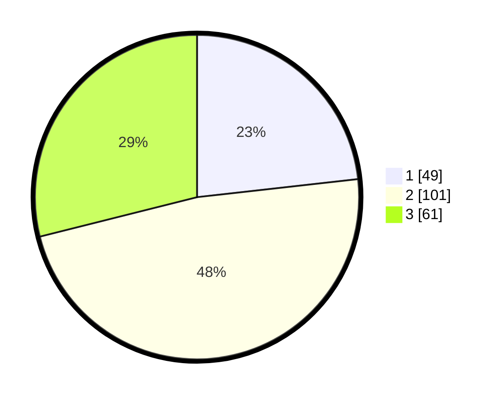

# Hasil

## Grafik

## Tabel

| No. | Nama Paslon    | Suara | Suara (raw) | Persentase |
|:--- |:-------------- | -----:| -----------:| ----------:|
| 1   | ANIES MUHAIMIN | 49    | [49][p-1]   | 23,22      |
| 2   | PRABOWO GIBRAN | 101   | [101][p-2]  | 47,87      |
| 3   | GANJAR MAHFUD  | 61    | [61][p-3]   | 28,91      |

[p-1]: https://github.com/gigit-pemilu/pemilu-2024/blob/main/pilpres/hitung-suara/sub/33-jawa-tengah/sub/06-purworejo/sub/03-purwodadi/sub/2028-jenarkidul/sub/004-tps/sub/paslon-1.txt
[p-2]: https://github.com/gigit-pemilu/pemilu-2024/blob/main/pilpres/hitung-suara/sub/33-jawa-tengah/sub/06-purworejo/sub/03-purwodadi/sub/2028-jenarkidul/sub/004-tps/sub/paslon-2.txt
[p-3]: https://github.com/gigit-pemilu/pemilu-2024/blob/main/pilpres/hitung-suara/sub/33-jawa-tengah/sub/06-purworejo/sub/03-purwodadi/sub/2028-jenarkidul/sub/004-tps/sub/paslon-3.txt

## Foto C Plano

https://sirekap-obj-formc.kpu.go.id/6921/pemilu/ppwp/33/06/03/20/28/3306032028004-20240216-214047--2a57d32d-cb47-4244-bacc-e14b5dfd439f.jpg

https://sirekap-obj-formc.kpu.go.id/6921/pemilu/ppwp/33/06/03/20/28/3306032028004-20240216-213815--4d8624d1-72e1-4e03-8bc1-7abd57a3768f.jpg

https://sirekap-obj-formc.kpu.go.id/6921/pemilu/ppwp/33/06/03/20/28/3306032028004-20240216-213713--7772df8c-8d47-4277-b94e-7f5164abbf1a.jpg

## Metadata

| Key        | Value               |
| ---------- | ------------------- |
| Time Stamp | 2024-02-16 22:01:00 |

## DATA PEMILIH TETAP

Jumlah pemilih dalam DPT: **200**.
 * L: **50**.
 * P: **0**.

## DATA PENGGUNA HAK PILIH

Jumlah pengguna hak pilih dalam DPT: **200**.
 * L: **75**.
 * P: **770**.

Jumlah pengguna hak pilih dalam DPTb: **777**.
 * L: **5**.
 * P: **47**.

Jumlah pengguna hak pilih dalam DPK: **432**.
 * L: **56**.
 * P: **243**.

Jumlah pengguna hak pilih: **225**.
 * L: **50**.
 * P: **522**.

## JUMLAH SUARA SAH DAN TIDAK SAH

JUMLAH SELURUH SUARA SAH: **211**.

JUMLAH SUARA TIDAK SAH: **7**.

JUMLAH SELURUH SUARA SAH DAN SUARA TIDAK SAH: **218**.

