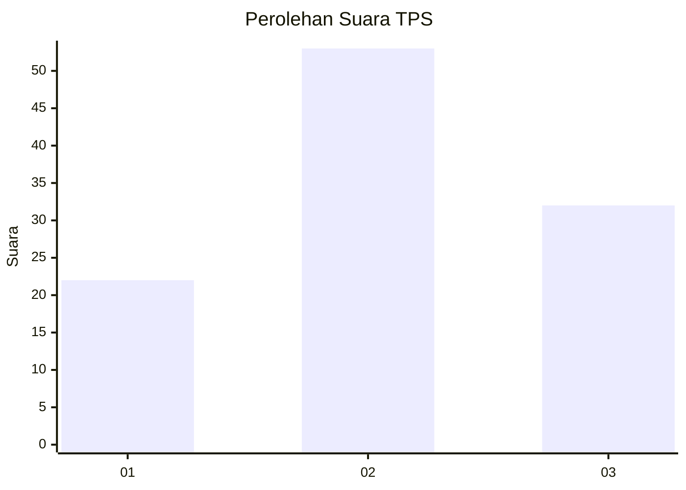
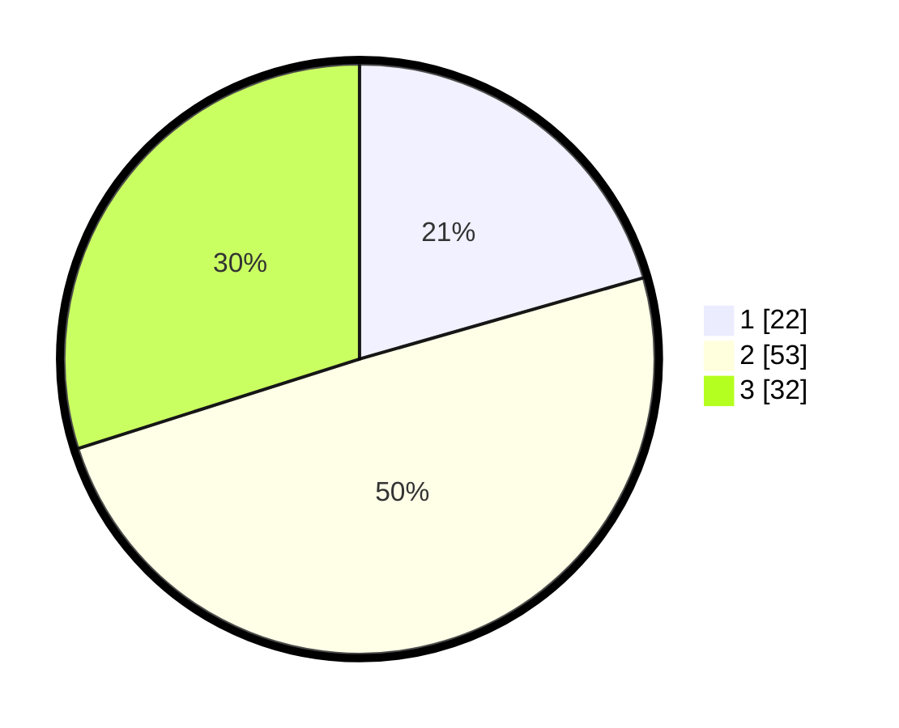

# Hasil

## Grafik

## Tabel

| No. | Nama Paslon    | Suara | Suara (raw) | Persentase |
|:--- |:-------------- | -----:| -----------:| ----------:|
| 1   | ANIES MUHAIMIN | 22    | [22][p-1]   | 20,56      |
| 2   | PRABOWO GIBRAN | 53    | [53][p-2]   | 49,53      |
| 3   | GANJAR MAHFUD  | 32    | [32][p-3]   | 29,91      |

[p-1]: https://github.com/gigit-pemilu/pemilu-2024/blob/main/pilpres/hitung-suara/sub/33-jawa-tengah/sub/06-purworejo/sub/03-purwodadi/sub/2032-tlogorejo/sub/004-tps/sub/paslon-1.txt
[p-2]: https://github.com/gigit-pemilu/pemilu-2024/blob/main/pilpres/hitung-suara/sub/33-jawa-tengah/sub/06-purworejo/sub/03-purwodadi/sub/2032-tlogorejo/sub/004-tps/sub/paslon-2.txt
[p-3]: https://github.com/gigit-pemilu/pemilu-2024/blob/main/pilpres/hitung-suara/sub/33-jawa-tengah/sub/06-purworejo/sub/03-purwodadi/sub/2032-tlogorejo/sub/004-tps/sub/paslon-3.txt

## Foto C Plano

https://sirekap-obj-formc.kpu.go.id/de22/pemilu/ppwp/33/06/03/20/32/3306032032004-20240215-000428--abf5f2b4-e35f-44e6-a6d4-c0695a517c94.jpg

https://sirekap-obj-formc.kpu.go.id/de22/pemilu/ppwp/33/06/03/20/32/3306032032004-20240215-000520--9850b9d0-0790-4c09-a392-7d45008f5657.jpg

https://sirekap-obj-formc.kpu.go.id/de22/pemilu/ppwp/33/06/03/20/32/3306032032004-20240215-000601--72845076-28cc-4450-8587-d70f41dd9db7.jpg

## Metadata

| Key        | Value               |
| ---------- | ------------------- |
| Time Stamp | 2024-02-16 16:25:10 |

