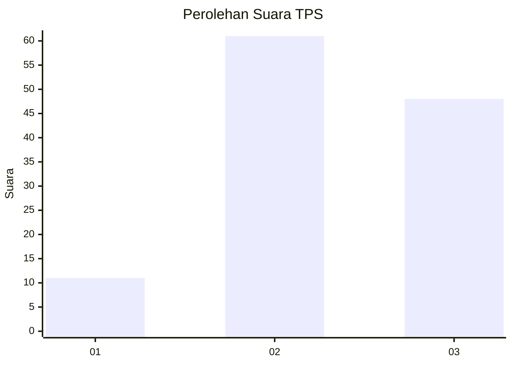
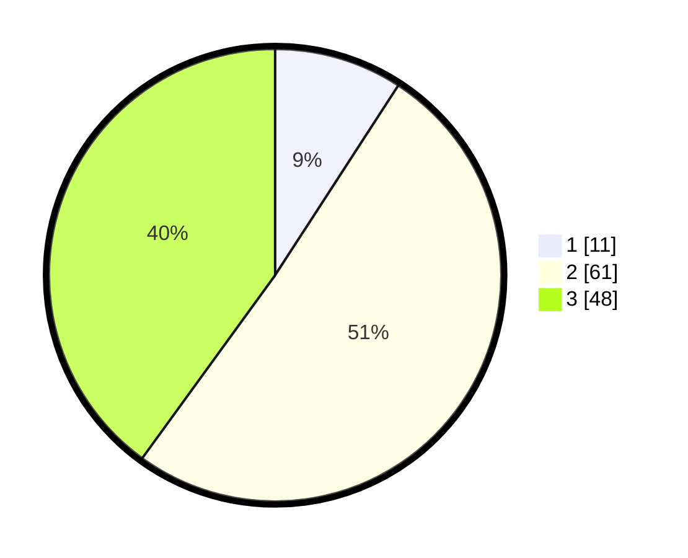

# Hasil

## Grafik

## Tabel

| No. | Nama Paslon    | Suara | Suara (raw) | Persentase |
|:--- |:-------------- | -----:| -----------:| ----------:|
| 1   | ANIES MUHAIMIN | 11    | [11][p-1]   | 9,17       |
| 2   | PRABOWO GIBRAN | 61    | [61][p-2]   | 50,83      |
| 3   | GANJAR MAHFUD  | 48    | [48][p-3]   | 40,00      |

[p-1]: https://github.com/gigit-pemilu/pemilu-2024-33-jawa-tengah/blob/main/pilpres/hitung-suara/sub/33-jawa-tengah/sub/06-purworejo/sub/03-purwodadi/sub/2034-bragolan/sub/005-tps/sub/paslon-1.txt
[p-2]: https://github.com/gigit-pemilu/pemilu-2024-33-jawa-tengah/blob/main/pilpres/hitung-suara/sub/33-jawa-tengah/sub/06-purworejo/sub/03-purwodadi/sub/2034-bragolan/sub/005-tps/sub/paslon-2.txt
[p-3]: https://github.com/gigit-pemilu/pemilu-2024-33-jawa-tengah/blob/main/pilpres/hitung-suara/sub/33-jawa-tengah/sub/06-purworejo/sub/03-purwodadi/sub/2034-bragolan/sub/005-tps/sub/paslon-3.txt

## Foto C Plano

https://sirekap-obj-formc.kpu.go.id/ab37/pemilu/ppwp/33/06/03/20/34/3306032034005-20240215-003548--07797d73-f890-4713-a5bd-f1d50f51ee49.jpg

https://sirekap-obj-formc.kpu.go.id/ab37/pemilu/ppwp/33/06/03/20/34/3306032034005-20240215-003952--d4ce008a-7ef9-4536-81eb-983ca9419d46.jpg

https://sirekap-obj-formc.kpu.go.id/ab37/pemilu/ppwp/33/06/03/20/34/3306032034005-20240215-004102--15d37230-2480-44e8-baf9-ecd7e6052f1c.jpg

## Metadata

| Key        | Value               |
| ---------- | ------------------- |
| Time Stamp | 2024-02-15 16:30:25 |

