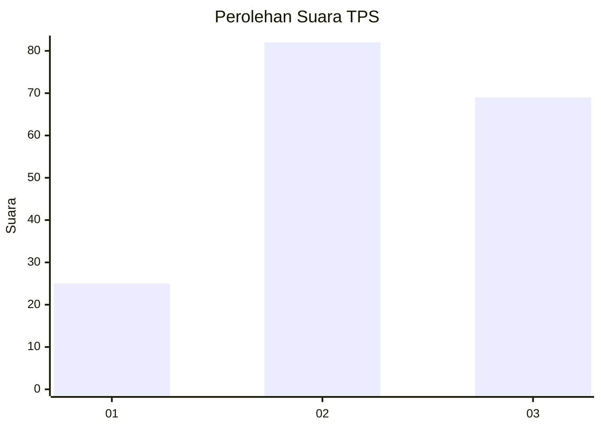
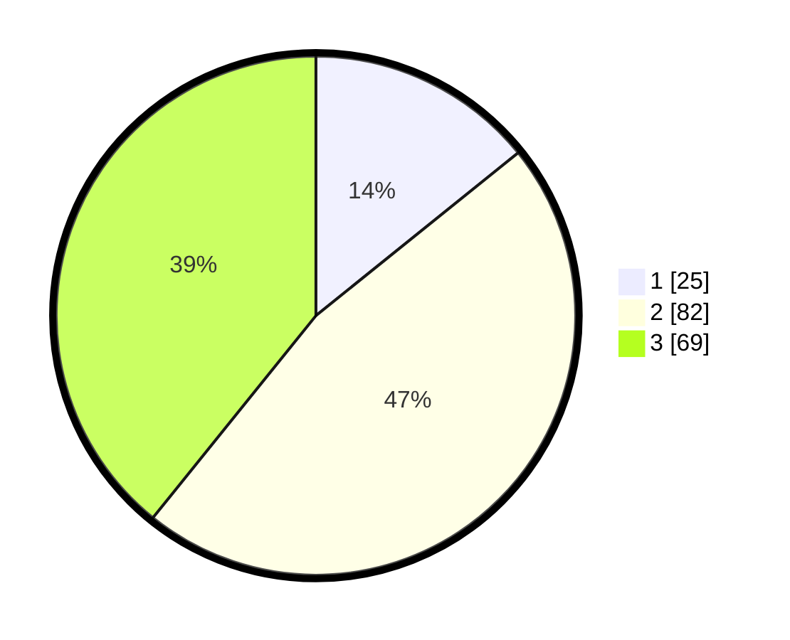

# Hasil

## Grafik

## Tabel

| No. | Nama Paslon    | Suara | Suara (raw) | Persentase |
|:--- |:-------------- | -----:| -----------:| ----------:|
| 1   | ANIES MUHAIMIN | 25    | [25][p-1]   | 14,20      |
| 2   | PRABOWO GIBRAN | 82    | [82][p-2]   | 46,59      |
| 3   | GANJAR MAHFUD  | 69    | [69][p-3]   | 39,20      |

[p-1]: https://github.com/gigit-pemilu/pemilu-2024-33-jawa-tengah/blob/main/pilpres/hitung-suara/sub/33-jawa-tengah/sub/06-purworejo/sub/03-purwodadi/sub/2037-keduren/sub/001-tps/sub/paslon-1.txt
[p-2]: https://github.com/gigit-pemilu/pemilu-2024-33-jawa-tengah/blob/main/pilpres/hitung-suara/sub/33-jawa-tengah/sub/06-purworejo/sub/03-purwodadi/sub/2037-keduren/sub/001-tps/sub/paslon-2.txt
[p-3]: https://github.com/gigit-pemilu/pemilu-2024-33-jawa-tengah/blob/main/pilpres/hitung-suara/sub/33-jawa-tengah/sub/06-purworejo/sub/03-purwodadi/sub/2037-keduren/sub/001-tps/sub/paslon-3.txt

## Foto C Plano

https://sirekap-obj-formc.kpu.go.id/be17/pemilu/ppwp/33/06/03/20/37/3306032037001-20240214-221738--dcb83357-94b1-4f2e-948b-b5616a77a72c.jpg

https://sirekap-obj-formc.kpu.go.id/be17/pemilu/ppwp/33/06/03/20/37/3306032037001-20240214-222118--5f04ada7-7d31-4b42-abd3-aed1b8c4bab8.jpg

https://sirekap-obj-formc.kpu.go.id/be17/pemilu/ppwp/33/06/03/20/37/3306032037001-20240214-185743--93a5cad1-d20c-4d84-8e06-2dd2ef47b400.jpg

## Metadata

| Key        | Value               |
| ---------- | ------------------- |
| Time Stamp | 2024-02-15 21:01:18 |

