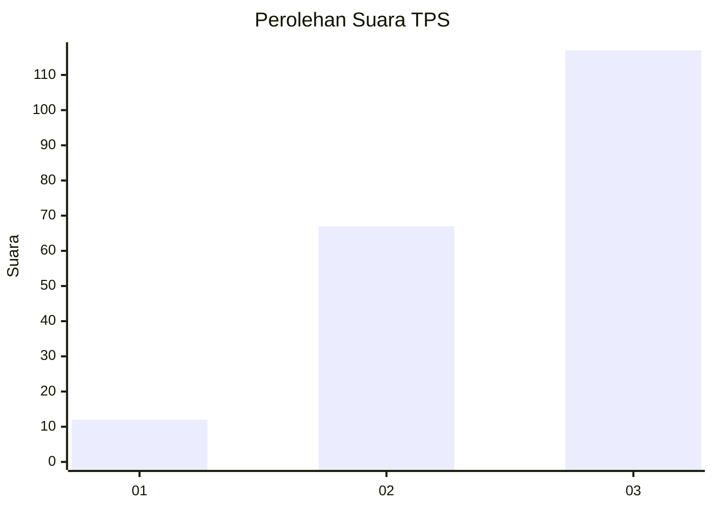
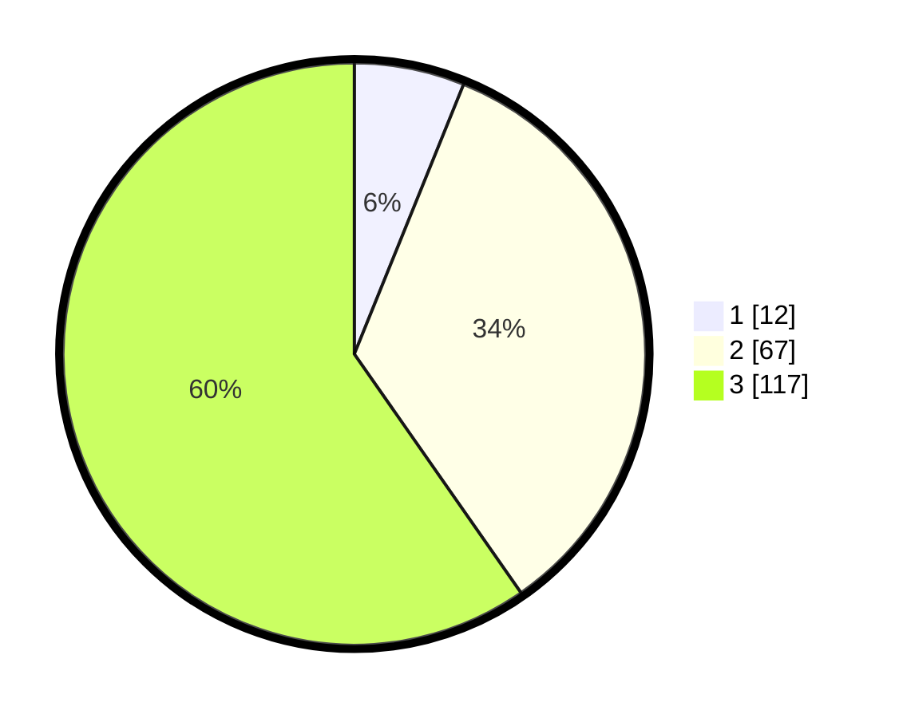

# Hasil

## Grafik

## Tabel

| No. | Nama Paslon    | Suara | Suara (raw) | Persentase |
|:--- |:-------------- | -----:| -----------:| ----------:|
| 1   | ANIES MUHAIMIN | 12    | [12][p-1]   | 6,12       |
| 2   | PRABOWO GIBRAN | 67    | [67][p-2]   | 34,18      |
| 3   | GANJAR MAHFUD  | 117   | [117][p-3]  | 59,69      |

[p-1]: https://github.com/gigit-pemilu/pemilu-2024/blob/main/pilpres/hitung-suara/sub/33-jawa-tengah/sub/06-purworejo/sub/03-purwodadi/sub/2038-sumberrejo/sub/002-tps/sub/paslon-1.txt
[p-2]: https://github.com/gigit-pemilu/pemilu-2024/blob/main/pilpres/hitung-suara/sub/33-jawa-tengah/sub/06-purworejo/sub/03-purwodadi/sub/2038-sumberrejo/sub/002-tps/sub/paslon-2.txt
[p-3]: https://github.com/gigit-pemilu/pemilu-2024/blob/main/pilpres/hitung-suara/sub/33-jawa-tengah/sub/06-purworejo/sub/03-purwodadi/sub/2038-sumberrejo/sub/002-tps/sub/paslon-3.txt

## Foto C Plano

https://sirekap-obj-formc.kpu.go.id/1952/pemilu/ppwp/33/06/03/20/38/3306032038002-20240214-155633--92ad6fcc-7a87-41ea-8c12-ea15dd4d29cc.jpg

https://sirekap-obj-formc.kpu.go.id/1952/pemilu/ppwp/33/06/03/20/38/3306032038002-20240214-141625--de5a16a7-7178-403c-958e-d678ebfb4b25.jpg

https://sirekap-obj-formc.kpu.go.id/1952/pemilu/ppwp/33/06/03/20/38/3306032038002-20240214-155638--ede200af-4c8e-4e7c-b997-c96f3330e3e2.jpg

## Metadata

| Key        | Value               |
| ---------- | ------------------- |
| Time Stamp | 2024-02-15 16:30:25 |

