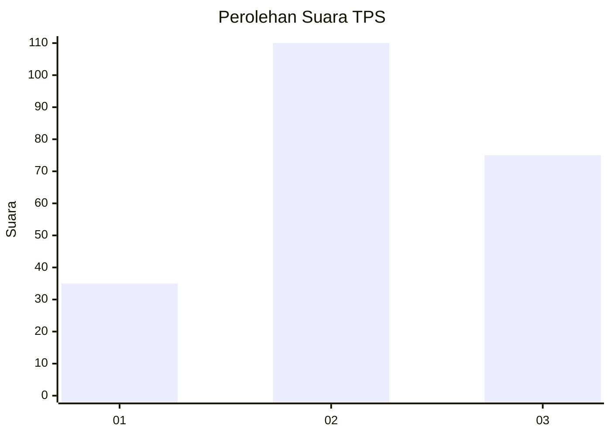
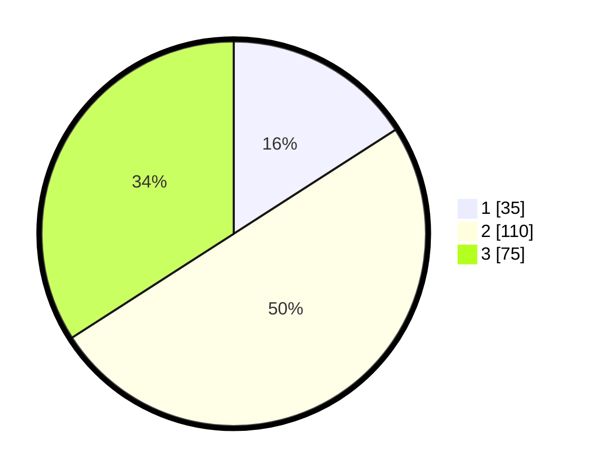

# Hasil

## Grafik

## Tabel

| No. | Nama Paslon    | Suara | Suara (raw) | Persentase |
|:--- |:-------------- | -----:| -----------:| ----------:|
| 1   | ANIES MUHAIMIN | 35    | [35][p-1]   | 15,91      |
| 2   | PRABOWO GIBRAN | 110   | [110][p-2]  | 50,00      |
| 3   | GANJAR MAHFUD  | 75    | [75][p-3]   | 34,09      |

[p-1]: https://github.com/gigit-pemilu/pemilu-2024-33-jawa-tengah/blob/main/pilpres/hitung-suara/sub/33-jawa-tengah/sub/06-purworejo/sub/03-purwodadi/sub/2039-brondongrejo/sub/001-tps/sub/paslon-1.txt
[p-2]: https://github.com/gigit-pemilu/pemilu-2024-33-jawa-tengah/blob/main/pilpres/hitung-suara/sub/33-jawa-tengah/sub/06-purworejo/sub/03-purwodadi/sub/2039-brondongrejo/sub/001-tps/sub/paslon-2.txt
[p-3]: https://github.com/gigit-pemilu/pemilu-2024-33-jawa-tengah/blob/main/pilpres/hitung-suara/sub/33-jawa-tengah/sub/06-purworejo/sub/03-purwodadi/sub/2039-brondongrejo/sub/001-tps/sub/paslon-3.txt

## Foto C Plano

https://sirekap-obj-formc.kpu.go.id/3013/pemilu/ppwp/33/06/03/20/39/3306032039001-20240216-211337--b0f6392e-d4bb-4dc8-b221-7b2395a8fb2a.jpg

https://sirekap-obj-formc.kpu.go.id/3013/pemilu/ppwp/33/06/03/20/39/3306032039001-20240216-205937--b221b685-83cc-46d2-915a-d13661cb54e2.jpg

https://sirekap-obj-formc.kpu.go.id/3013/pemilu/ppwp/33/06/03/20/39/3306032039001-20240216-211003--4e63f4e2-140e-4b91-acce-30c67771d890.jpg

## Metadata

| Key        | Value               |
| ---------- | ------------------- |
| Time Stamp | 2024-02-16 22:01:00 |

## DATA PEMILIH TETAP

Jumlah pemilih dalam DPT: **520**.
 * L: **713**.
 * P: **657**.

## DATA PENGGUNA HAK PILIH

Jumlah pengguna hak pilih dalam DPT: **251**.
 * L: **103**.
 * P: **525**.

Jumlah pengguna hak pilih dalam DPTb: **502**.
 * L: **0**.
 * P: **524**.

Jumlah pengguna hak pilih dalam DPK: **0**.
 * L: **0**.
 * P: **6**.

Jumlah pengguna hak pilih: **270**.
 * L: **503**.
 * P: **246**.

## JUMLAH SUARA SAH DAN TIDAK SAH

JUMLAH SELURUH SUARA SAH: **220**.

JUMLAH SUARA TIDAK SAH: **7**.

JUMLAH SELURUH SUARA SAH DAN SUARA TIDAK SAH: **227**.

