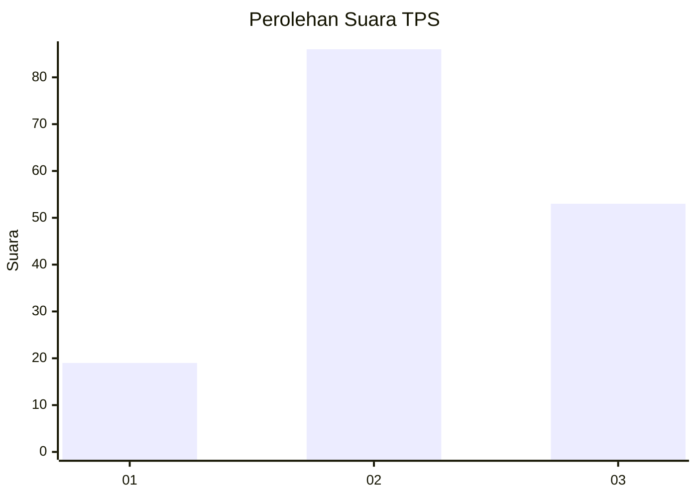
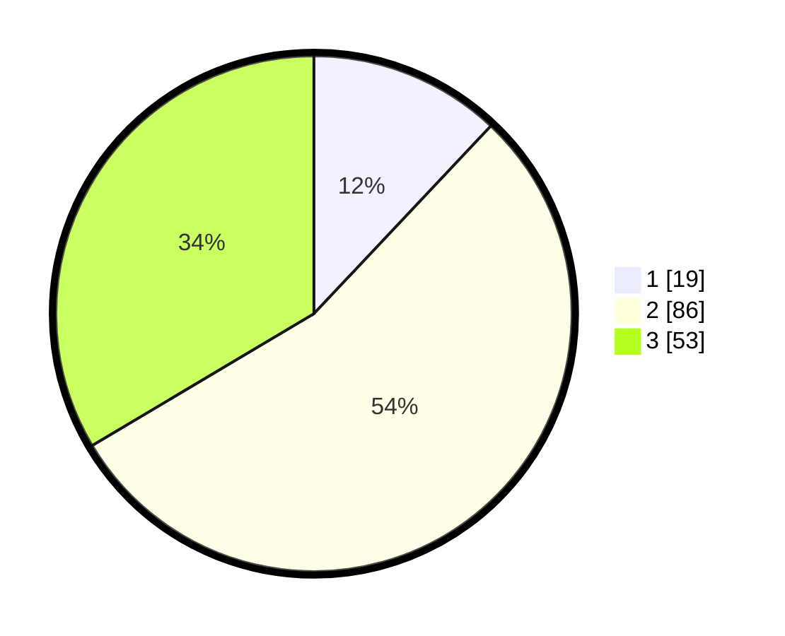

# Hasil

## Grafik

## Tabel

| No. | Nama Paslon    | Suara | Suara (raw) | Persentase |
|:--- |:-------------- | -----:| -----------:| ----------:|
| 1   | ANIES MUHAIMIN | 19    | [19][p-1]   | 12,03      |
| 2   | PRABOWO GIBRAN | 86    | [86][p-2]   | 54,43      |
| 3   | GANJAR MAHFUD  | 53    | [53][p-3]   | 33,54      |

[p-1]: https://github.com/gigit-pemilu/pemilu-2024/blob/main/pilpres/hitung-suara/sub/33-jawa-tengah/sub/06-purworejo/sub/03-purwodadi/sub/2040-sendangsari/sub/001-tps/sub/paslon-1.txt
[p-2]: https://github.com/gigit-pemilu/pemilu-2024/blob/main/pilpres/hitung-suara/sub/33-jawa-tengah/sub/06-purworejo/sub/03-purwodadi/sub/2040-sendangsari/sub/001-tps/sub/paslon-2.txt
[p-3]: https://github.com/gigit-pemilu/pemilu-2024/blob/main/pilpres/hitung-suara/sub/33-jawa-tengah/sub/06-purworejo/sub/03-purwodadi/sub/2040-sendangsari/sub/001-tps/sub/paslon-3.txt

## Foto C Plano

https://sirekap-obj-formc.kpu.go.id/2790/pemilu/ppwp/33/06/03/20/40/3306032040001-20240216-215114--2a3dfe47-c076-4340-a81a-d6b443588c3d.jpg

https://sirekap-obj-formc.kpu.go.id/2790/pemilu/ppwp/33/06/03/20/40/3306032040001-20240216-215135--3d2617e4-848e-40d5-95b1-a5133eaa9fb7.jpg

https://sirekap-obj-formc.kpu.go.id/2790/pemilu/ppwp/33/06/03/20/40/3306032040001-20240216-215330--d4e0d685-9e25-4f47-babf-1136f9c210df.jpg

## Metadata

| Key        | Value               |
| ---------- | ------------------- |
| Time Stamp | 2024-02-16 22:01:00 |

## DATA PEMILIH TETAP

Jumlah pemilih dalam DPT: **143**.
 * L: **92**.
 * P: **230**.

## DATA PENGGUNA HAK PILIH

Jumlah pengguna hak pilih dalam DPT: **3**.
 * L: **14**.
 * P: **7**.

Jumlah pengguna hak pilih dalam DPTb: **5**.
 * L: **1**.
 * P: **50**.

Jumlah pengguna hak pilih dalam DPK: **50**.
 * L: **800**.
 * P: **0**.

Jumlah pengguna hak pilih: **620**.
 * L: **40**.
 * P: **37**.

## JUMLAH SUARA SAH DAN TIDAK SAH

JUMLAH SELURUH SUARA SAH: **158**.

JUMLAH SUARA TIDAK SAH: **3**.

JUMLAH SELURUH SUARA SAH DAN SUARA TIDAK SAH: **161**.

