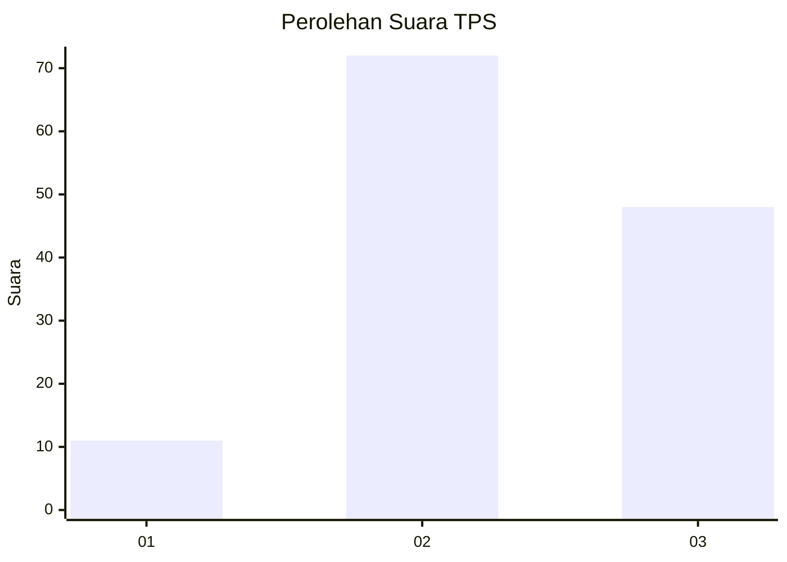
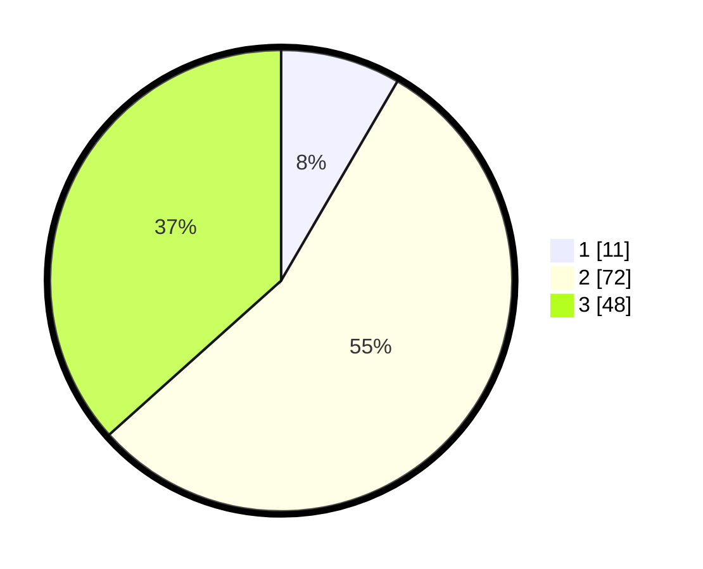

# Hasil

## Grafik

## Tabel

| No. | Nama Paslon    | Suara | Suara (raw) | Persentase |
|:--- |:-------------- | -----:| -----------:| ----------:|
| 1   | ANIES MUHAIMIN | 11    | [11][p-1]   | 8,40       |
| 2   | PRABOWO GIBRAN | 72    | [72][p-2]   | 54,96      |
| 3   | GANJAR MAHFUD  | 48    | [48][p-3]   | 36,64      |

[p-1]: https://github.com/gigit-pemilu/pemilu-2024-33-jawa-tengah/blob/main/pilpres/hitung-suara/sub/33-jawa-tengah/sub/06-purworejo/sub/03-purwodadi/sub/2040-sendangsari/sub/003-tps/sub/paslon-1.txt
[p-2]: https://github.com/gigit-pemilu/pemilu-2024-33-jawa-tengah/blob/main/pilpres/hitung-suara/sub/33-jawa-tengah/sub/06-purworejo/sub/03-purwodadi/sub/2040-sendangsari/sub/003-tps/sub/paslon-2.txt
[p-3]: https://github.com/gigit-pemilu/pemilu-2024-33-jawa-tengah/blob/main/pilpres/hitung-suara/sub/33-jawa-tengah/sub/06-purworejo/sub/03-purwodadi/sub/2040-sendangsari/sub/003-tps/sub/paslon-3.txt

## Foto C Plano

https://sirekap-obj-formc.kpu.go.id/6c97/pemilu/ppwp/33/06/03/20/40/3306032040003-20240216-220029--125996d8-72a7-4eeb-9281-36434e1158c1.jpg

https://sirekap-obj-formc.kpu.go.id/6c97/pemilu/ppwp/33/06/03/20/40/3306032040003-20240216-215934--8da8d22d-3d9c-467e-9ee0-a34052f685d4.jpg

https://sirekap-obj-formc.kpu.go.id/6c97/pemilu/ppwp/33/06/03/20/40/3306032040003-20240216-215304--952f9294-9819-4112-9521-0da98ac625c2.jpg

## Metadata

| Key        | Value               |
| ---------- | ------------------- |
| Time Stamp | 2024-02-16 22:30:00 |

## DATA PEMILIH TETAP

Jumlah pemilih dalam DPT: **107**.
 * L: **777**.
 * P: **707**.

## DATA PENGGUNA HAK PILIH

Jumlah pengguna hak pilih dalam DPT: **777**.
 * L: **54**.
 * P: **42**.

Jumlah pengguna hak pilih dalam DPTb: **77**.
 * L: **0**.
 * P: **0**.

Jumlah pengguna hak pilih dalam DPK: **55**.
 * L: **300**.
 * P: **0**.

Jumlah pengguna hak pilih: **543**.
 * L: **59**.
 * P: **82**.

## JUMLAH SUARA SAH DAN TIDAK SAH

JUMLAH SELURUH SUARA SAH: **131**.

JUMLAH SUARA TIDAK SAH: **9**.

JUMLAH SELURUH SUARA SAH DAN SUARA TIDAK SAH: **140**.

