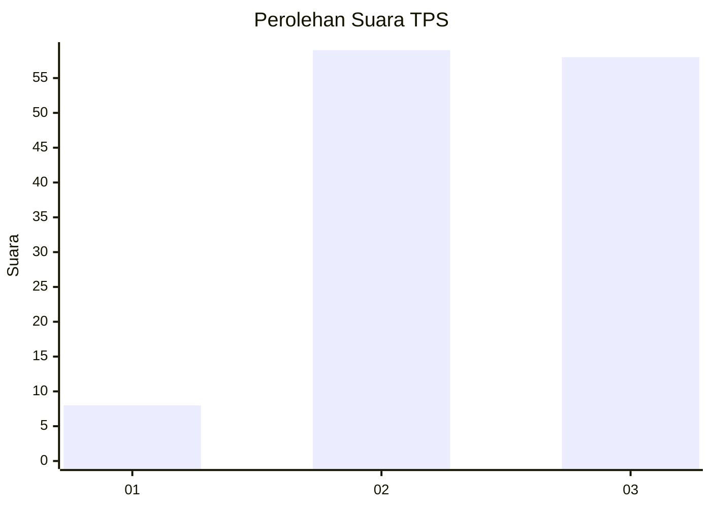
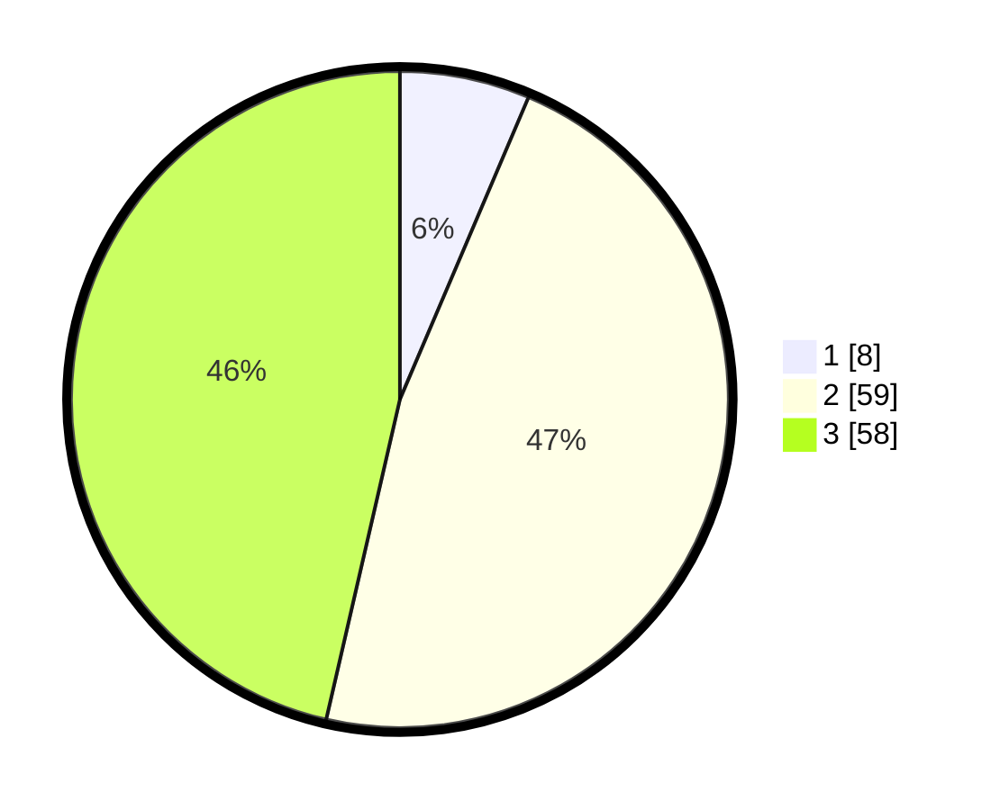

# Hasil

## Grafik

## Tabel

| No. | Nama Paslon    | Suara | Suara (raw) | Persentase |
|:--- |:-------------- | -----:| -----------:| ----------:|
| 1   | ANIES MUHAIMIN | 8     | [8][p-1]    | 6,40       |
| 2   | PRABOWO GIBRAN | 59    | [59][p-2]   | 47,20      |
| 3   | GANJAR MAHFUD  | 58    | [58][p-3]   | 46,40      |

[p-1]: https://github.com/gigit-pemilu/pemilu-2024/blob/main/pilpres/hitung-suara/sub/33-jawa-tengah/sub/06-purworejo/sub/04-bagelen/sub/2004-bugel/sub/004-tps/sub/paslon-1.txt
[p-2]: https://github.com/gigit-pemilu/pemilu-2024/blob/main/pilpres/hitung-suara/sub/33-jawa-tengah/sub/06-purworejo/sub/04-bagelen/sub/2004-bugel/sub/004-tps/sub/paslon-2.txt
[p-3]: https://github.com/gigit-pemilu/pemilu-2024/blob/main/pilpres/hitung-suara/sub/33-jawa-tengah/sub/06-purworejo/sub/04-bagelen/sub/2004-bugel/sub/004-tps/sub/paslon-3.txt

## Foto C Plano

https://sirekap-obj-formc.kpu.go.id/eac0/pemilu/ppwp/33/06/04/20/04/3306042004004-20240214-210908--75581636-8a72-46a4-9027-e90768a3dfe5.jpg

https://sirekap-obj-formc.kpu.go.id/eac0/pemilu/ppwp/33/06/04/20/04/3306042004004-20240214-211056--41170dd2-8e52-4ccb-8f97-9bcbd341ba3c.jpg

https://sirekap-obj-formc.kpu.go.id/eac0/pemilu/ppwp/33/06/04/20/04/3306042004004-20240214-211224--e102c5d9-e019-459e-bfe1-1f38dc6312d9.jpg

## Metadata

| Key        | Value               |
| ---------- | ------------------- |
| Time Stamp | 2024-02-15 03:06:03 |

