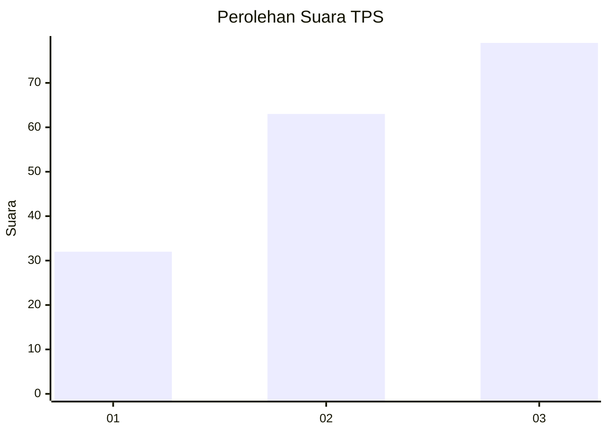
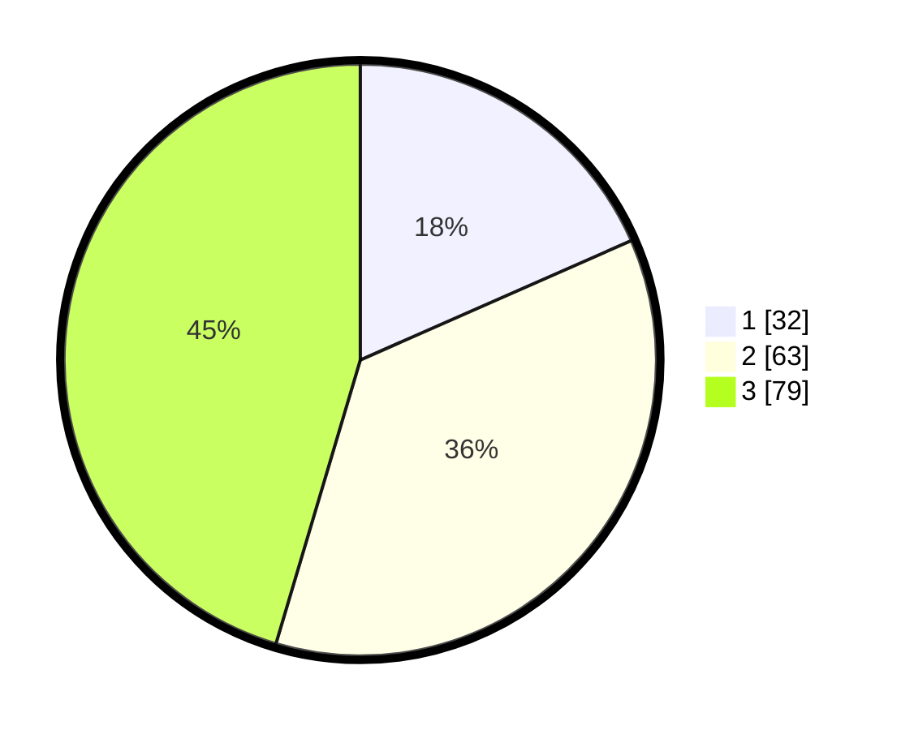

# Hasil

## Grafik

## Tabel

| No. | Nama Paslon    | Suara | Suara (raw) | Persentase |
|:--- |:-------------- | -----:| -----------:| ----------:|
| 1   | ANIES MUHAIMIN | 32    | [32][p-1]   | 18,39      |
| 2   | PRABOWO GIBRAN | 63    | [63][p-2]   | 36,21      |
| 3   | GANJAR MAHFUD  | 79    | [79][p-3]   | 45,40      |

[p-1]: https://github.com/gigit-pemilu/pemilu-2024-33-jawa-tengah/blob/main/pilpres/hitung-suara/sub/33-jawa-tengah/sub/06-purworejo/sub/05-kaligesing/sub/2002-somongari/sub/001-tps/sub/paslon-1.txt
[p-2]: https://github.com/gigit-pemilu/pemilu-2024-33-jawa-tengah/blob/main/pilpres/hitung-suara/sub/33-jawa-tengah/sub/06-purworejo/sub/05-kaligesing/sub/2002-somongari/sub/001-tps/sub/paslon-2.txt
[p-3]: https://github.com/gigit-pemilu/pemilu-2024-33-jawa-tengah/blob/main/pilpres/hitung-suara/sub/33-jawa-tengah/sub/06-purworejo/sub/05-kaligesing/sub/2002-somongari/sub/001-tps/sub/paslon-3.txt

## Foto C Plano

https://sirekap-obj-formc.kpu.go.id/76ef/pemilu/ppwp/33/06/05/20/02/3306052002001-20240216-103742--66f7b7ba-3f75-4f13-b284-29a550094850.jpg

https://sirekap-obj-formc.kpu.go.id/76ef/pemilu/ppwp/33/06/05/20/02/3306052002001-20240216-103838--e3e2bba1-0087-4b57-8352-0cf146eba480.jpg

https://sirekap-obj-formc.kpu.go.id/76ef/pemilu/ppwp/33/06/05/20/02/3306052002001-20240214-204236--cae887e6-3efa-441e-bcbc-d12e9ebb94f5.jpg

## Metadata

| Key        | Value               |
| ---------- | ------------------- |
| Time Stamp | 2024-02-16 11:00:29 |

