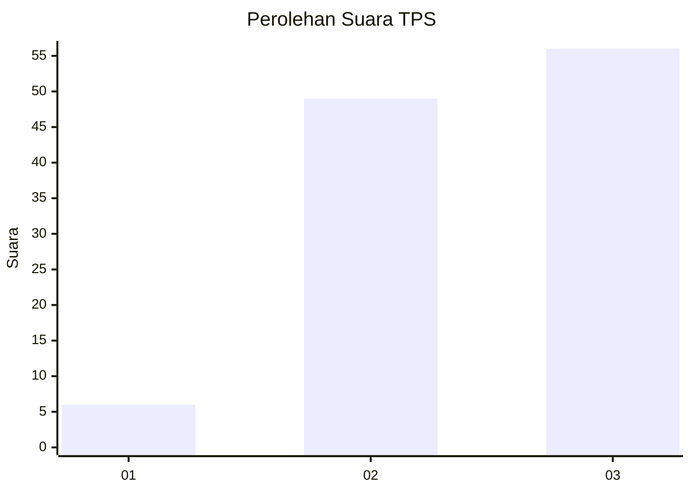
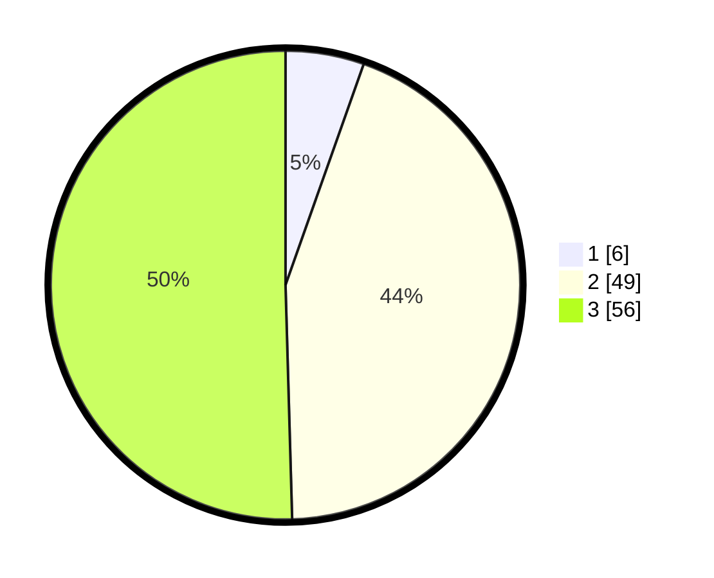

# Hasil

## Grafik

## Tabel

| No. | Nama Paslon    | Suara | Suara (raw) | Persentase |
|:--- |:-------------- | -----:| -----------:| ----------:|
| 1   | ANIES MUHAIMIN | 6     | [6][p-1]    | 5,41       |
| 2   | PRABOWO GIBRAN | 49    | [49][p-2]   | 44,14      |
| 3   | GANJAR MAHFUD  | 56    | [56][p-3]   | 50,45      |

[p-1]: https://github.com/gigit-pemilu/pemilu-2024/blob/main/pilpres/hitung-suara/sub/33-jawa-tengah/sub/06-purworejo/sub/05-kaligesing/sub/2003-donorejo/sub/004-tps/sub/paslon-1.txt
[p-2]: https://github.com/gigit-pemilu/pemilu-2024/blob/main/pilpres/hitung-suara/sub/33-jawa-tengah/sub/06-purworejo/sub/05-kaligesing/sub/2003-donorejo/sub/004-tps/sub/paslon-2.txt
[p-3]: https://github.com/gigit-pemilu/pemilu-2024/blob/main/pilpres/hitung-suara/sub/33-jawa-tengah/sub/06-purworejo/sub/05-kaligesing/sub/2003-donorejo/sub/004-tps/sub/paslon-3.txt

## Foto C Plano

https://sirekap-obj-formc.kpu.go.id/b1f2/pemilu/ppwp/33/06/05/20/03/3306052003004-20240217-125749--0177b5d9-8654-45ce-a9d2-7d9e426dbfa1.jpg

https://sirekap-obj-formc.kpu.go.id/b1f2/pemilu/ppwp/33/06/05/20/03/3306052003004-20240214-224607--7cfd244e-b0d9-4677-a079-63084f33bdd5.jpg

https://sirekap-obj-formc.kpu.go.id/b1f2/pemilu/ppwp/33/06/05/20/03/3306052003004-20240214-224623--9bd907d7-7cb7-4014-8b0c-bc1deee5fe39.jpg

## Metadata

| Key        | Value               |
| ---------- | ------------------- |
| Time Stamp | 2024-02-17 13:37:34 |

