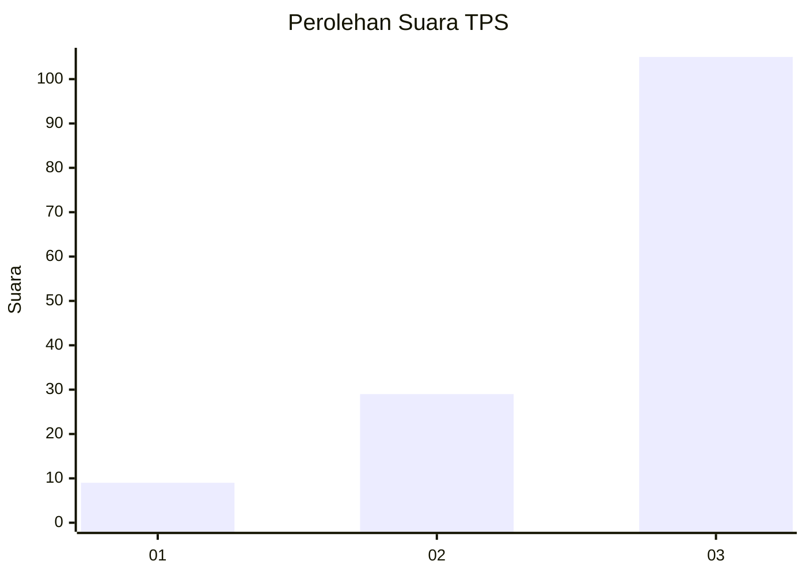
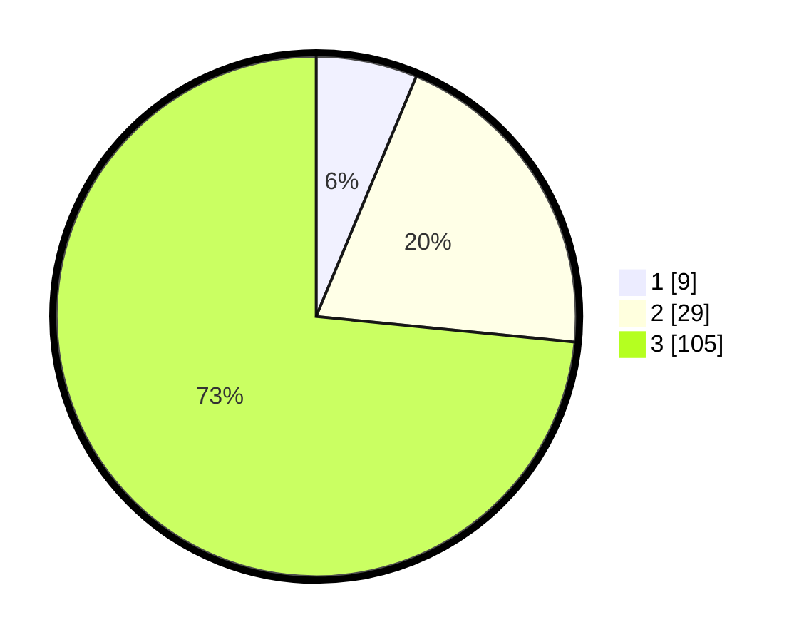

# Hasil

## Grafik

## Tabel

| No. | Nama Paslon    | Suara | Suara (raw) | Persentase |
|:--- |:-------------- | -----:| -----------:| ----------:|
| 1   | ANIES MUHAIMIN | 9     | [9][p-1]    | 6,29       |
| 2   | PRABOWO GIBRAN | 29    | [29][p-2]   | 20,28      |
| 3   | GANJAR MAHFUD  | 105   | [105][p-3]  | 73,43      |

[p-1]: https://github.com/gigit-pemilu/pemilu-2024-33-jawa-tengah/blob/main/pilpres/hitung-suara/sub/33-jawa-tengah/sub/06-purworejo/sub/05-kaligesing/sub/2003-donorejo/sub/007-tps/sub/paslon-1.txt
[p-2]: https://github.com/gigit-pemilu/pemilu-2024-33-jawa-tengah/blob/main/pilpres/hitung-suara/sub/33-jawa-tengah/sub/06-purworejo/sub/05-kaligesing/sub/2003-donorejo/sub/007-tps/sub/paslon-2.txt
[p-3]: https://github.com/gigit-pemilu/pemilu-2024-33-jawa-tengah/blob/main/pilpres/hitung-suara/sub/33-jawa-tengah/sub/06-purworejo/sub/05-kaligesing/sub/2003-donorejo/sub/007-tps/sub/paslon-3.txt

## Foto C Plano

https://sirekap-obj-formc.kpu.go.id/6e99/pemilu/ppwp/33/06/05/20/03/3306052003007-20240217-164514--a330625b-7a0e-43e7-96ed-20c856b8214a.jpg

https://sirekap-obj-formc.kpu.go.id/6e99/pemilu/ppwp/33/06/05/20/03/3306052003007-20240214-233945--e4b11a56-e4ff-4b76-a1a7-5ee084eb41ca.jpg

https://sirekap-obj-formc.kpu.go.id/6e99/pemilu/ppwp/33/06/05/20/03/3306052003007-20240214-235927--6d478b22-bcf7-4bce-ba11-8e842e71b006.jpg

## Metadata

| Key        | Value               |
| ---------- | ------------------- |
| Time Stamp | 2024-02-17 16:52:47 |

