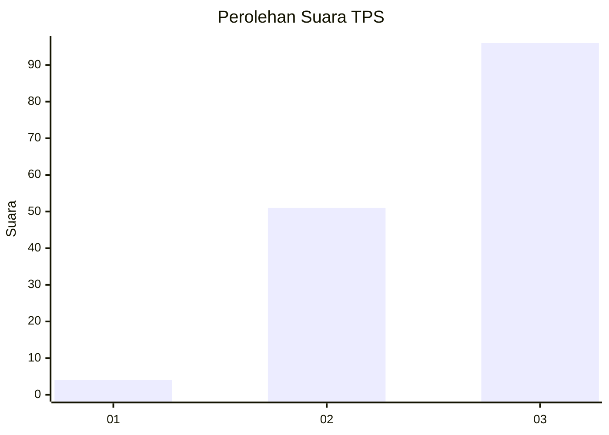
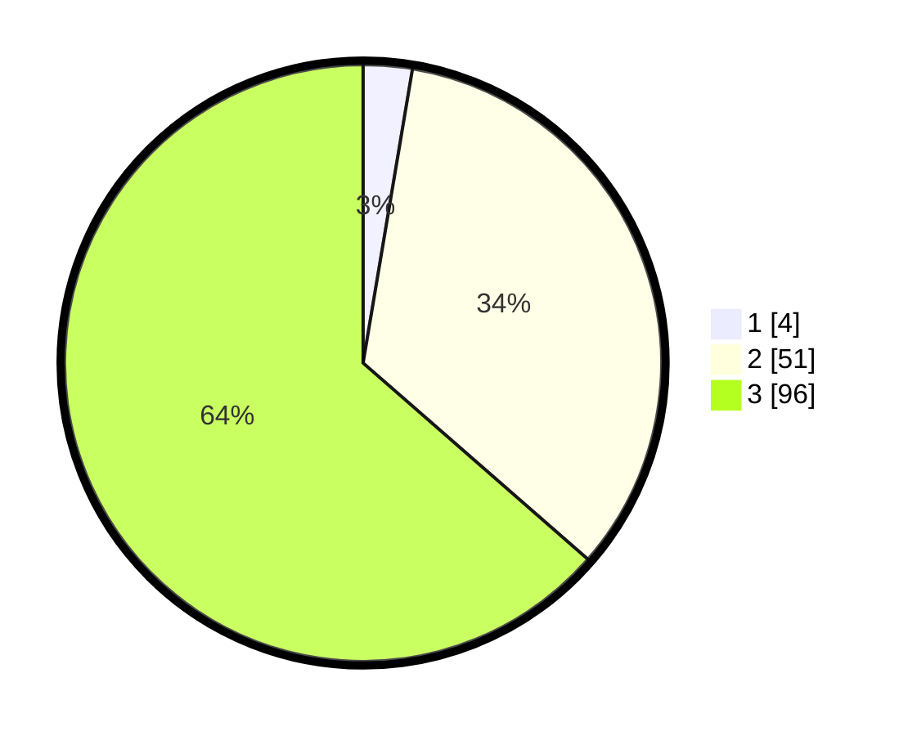

# Hasil

## Grafik

## Tabel

| No. | Nama Paslon    | Suara | Suara (raw) | Persentase |
|:--- |:-------------- | -----:| -----------:| ----------:|
| 1   | ANIES MUHAIMIN | 4     | [4][p-1]    | 2,65       |
| 2   | PRABOWO GIBRAN | 51    | [51][p-2]   | 33,77      |
| 3   | GANJAR MAHFUD  | 96    | [96][p-3]   | 63,58      |

[p-1]: https://github.com/gigit-pemilu/pemilu-2024/blob/main/pilpres/hitung-suara/sub/33-jawa-tengah/sub/06-purworejo/sub/05-kaligesing/sub/2006-kaligono/sub/009-tps/sub/paslon-1.txt
[p-2]: https://github.com/gigit-pemilu/pemilu-2024/blob/main/pilpres/hitung-suara/sub/33-jawa-tengah/sub/06-purworejo/sub/05-kaligesing/sub/2006-kaligono/sub/009-tps/sub/paslon-2.txt
[p-3]: https://github.com/gigit-pemilu/pemilu-2024/blob/main/pilpres/hitung-suara/sub/33-jawa-tengah/sub/06-purworejo/sub/05-kaligesing/sub/2006-kaligono/sub/009-tps/sub/paslon-3.txt

## Foto C Plano

https://sirekap-obj-formc.kpu.go.id/8167/pemilu/ppwp/33/06/05/20/06/3306052006009-20240217-203306--d553f026-8a49-4c2a-81a2-c1e3f7b1efbe.jpg

https://sirekap-obj-formc.kpu.go.id/8167/pemilu/ppwp/33/06/05/20/06/3306052006009-20240217-202350--cf8d0c74-0a89-44f1-a506-1b52807ab055.jpg

https://sirekap-obj-formc.kpu.go.id/8167/pemilu/ppwp/33/06/05/20/06/3306052006009-20240217-203411--f494d851-193d-43ea-b294-a2ca9ca8e4d6.jpg

## Metadata

| Key        | Value               |
| ---------- | ------------------- |
| Time Stamp | 2024-02-19 06:16:00 |

