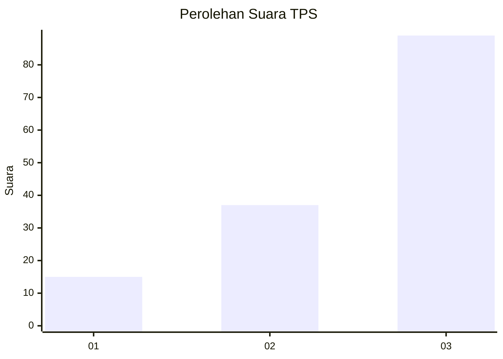
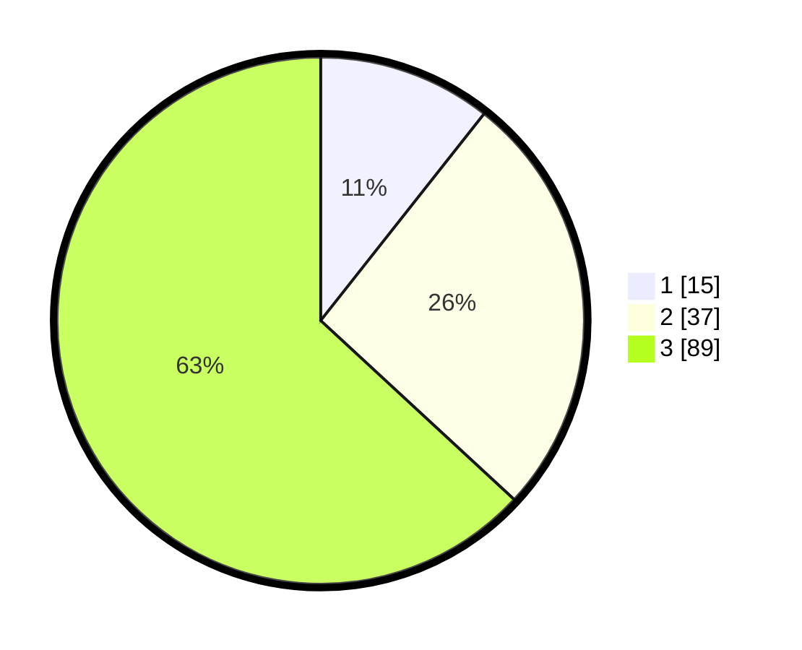

# Hasil

## Grafik

## Tabel

| No. | Nama Paslon    | Suara | Suara (raw) | Persentase |
|:--- |:-------------- | -----:| -----------:| ----------:|
| 1   | ANIES MUHAIMIN | 15    | [15][p-1]   | 10,64      |
| 2   | PRABOWO GIBRAN | 37    | [37][p-2]   | 26,24      |
| 3   | GANJAR MAHFUD  | 89    | [89][p-3]   | 63,12      |

[p-1]: https://github.com/gigit-pemilu/pemilu-2024/blob/main/pilpres/hitung-suara/sub/33-jawa-tengah/sub/06-purworejo/sub/05-kaligesing/sub/2007-tlogoguwo/sub/001-tps/sub/paslon-1.txt
[p-2]: https://github.com/gigit-pemilu/pemilu-2024/blob/main/pilpres/hitung-suara/sub/33-jawa-tengah/sub/06-purworejo/sub/05-kaligesing/sub/2007-tlogoguwo/sub/001-tps/sub/paslon-2.txt
[p-3]: https://github.com/gigit-pemilu/pemilu-2024/blob/main/pilpres/hitung-suara/sub/33-jawa-tengah/sub/06-purworejo/sub/05-kaligesing/sub/2007-tlogoguwo/sub/001-tps/sub/paslon-3.txt

## Foto C Plano

https://sirekap-obj-formc.kpu.go.id/3f2d/pemilu/ppwp/33/06/05/20/07/3306052007001-20240214-234953--37a7ec53-d233-4cd1-a018-f9d0f1085165.jpg

https://sirekap-obj-formc.kpu.go.id/3f2d/pemilu/ppwp/33/06/05/20/07/3306052007001-20240214-235049--816a4be6-fb25-4779-bf51-baae0b5490da.jpg

https://sirekap-obj-formc.kpu.go.id/3f2d/pemilu/ppwp/33/06/05/20/07/3306052007001-20240214-235100--665999e2-5289-4218-88ac-625d6623df0a.jpg

## Metadata

| Key        | Value               |
| ---------- | ------------------- |
| Time Stamp | 2024-02-17 10:30:03 |

