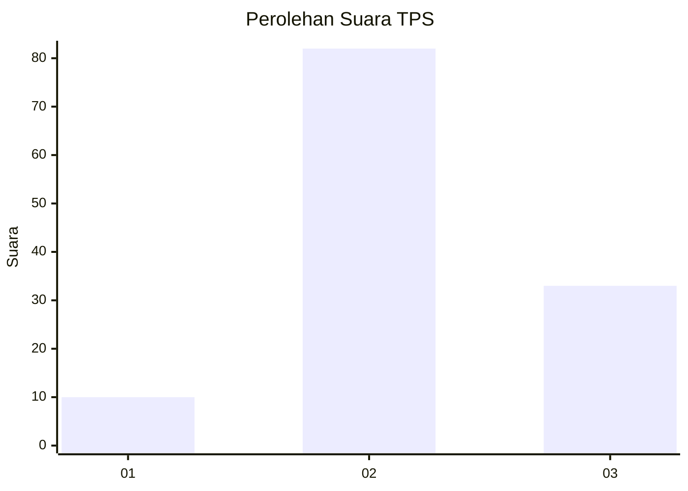
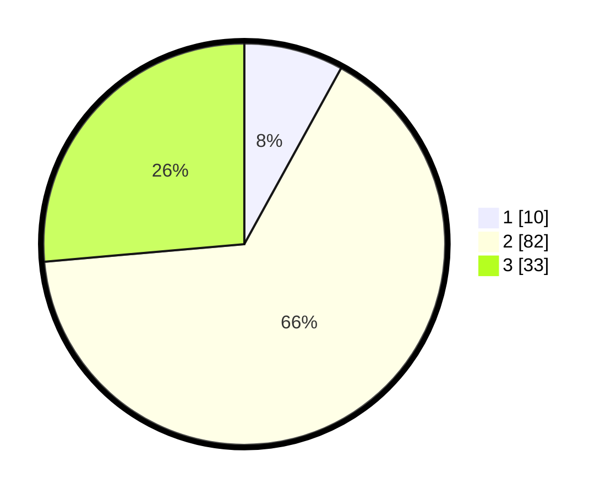

# Hasil

## Grafik

## Tabel

| No. | Nama Paslon    | Suara | Suara (raw) | Persentase |
|:--- |:-------------- | -----:| -----------:| ----------:|
| 1   | ANIES MUHAIMIN | 10    | [10][p-1]   | 8,00       |
| 2   | PRABOWO GIBRAN | 82    | [82][p-2]   | 65,60      |
| 3   | GANJAR MAHFUD  | 33    | [33][p-3]   | 26,40      |

[p-1]: https://github.com/gigit-pemilu/pemilu-2024/blob/main/pilpres/hitung-suara/sub/33-jawa-tengah/sub/06-purworejo/sub/05-kaligesing/sub/2010-tlogobulu/sub/002-tps/sub/paslon-1.txt
[p-2]: https://github.com/gigit-pemilu/pemilu-2024/blob/main/pilpres/hitung-suara/sub/33-jawa-tengah/sub/06-purworejo/sub/05-kaligesing/sub/2010-tlogobulu/sub/002-tps/sub/paslon-2.txt
[p-3]: https://github.com/gigit-pemilu/pemilu-2024/blob/main/pilpres/hitung-suara/sub/33-jawa-tengah/sub/06-purworejo/sub/05-kaligesing/sub/2010-tlogobulu/sub/002-tps/sub/paslon-3.txt

## Foto C Plano

https://sirekap-obj-formc.kpu.go.id/ee30/pemilu/ppwp/33/06/05/20/10/3306052010002-20240215-020746--e5e6d978-a2d4-4c44-bce1-fe3ef893afc0.jpg

https://sirekap-obj-formc.kpu.go.id/ee30/pemilu/ppwp/33/06/05/20/10/3306052010002-20240214-141121--3300a0f7-6906-42d1-a142-fde803038392.jpg

https://sirekap-obj-formc.kpu.go.id/ee30/pemilu/ppwp/33/06/05/20/10/3306052010002-20240215-075125--24013a5c-37da-4933-91f2-84807600b2ff.jpg

## Metadata

| Key        | Value               |
| ---------- | ------------------- |
| Time Stamp | 2024-02-17 10:30:03 |

