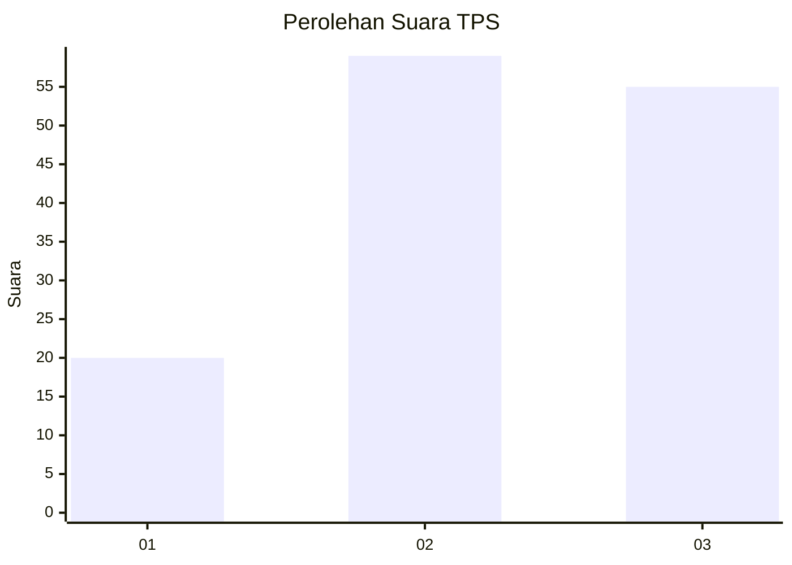
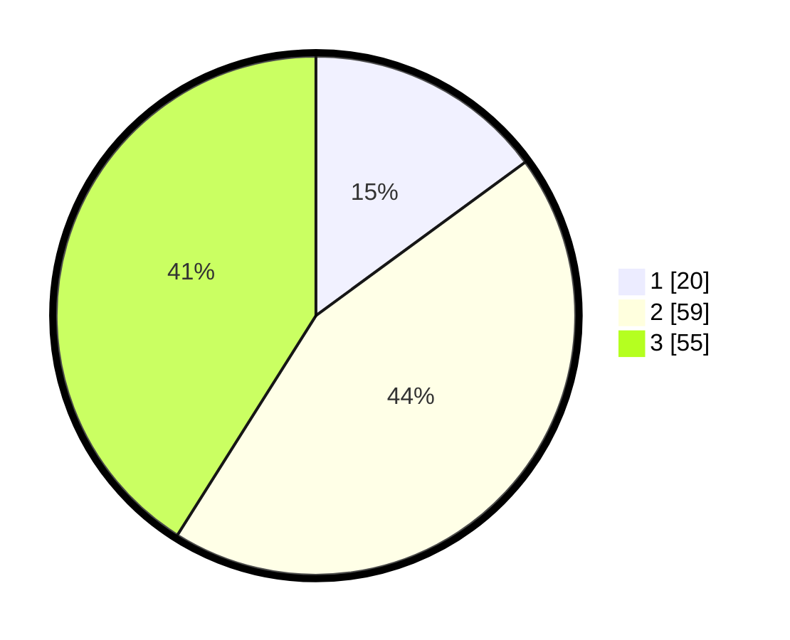

# Hasil

## Grafik

## Tabel

| No. | Nama Paslon    | Suara | Suara (raw) | Persentase |
|:--- |:-------------- | -----:| -----------:| ----------:|
| 1   | ANIES MUHAIMIN | 20    | [20][p-1]   | 14,93      |
| 2   | PRABOWO GIBRAN | 59    | [59][p-2]   | 44,03      |
| 3   | GANJAR MAHFUD  | 55    | [55][p-3]   | 41,04      |

[p-1]: https://github.com/gigit-pemilu/pemilu-2024-33-jawa-tengah/blob/main/pilpres/hitung-suara/sub/33-jawa-tengah/sub/06-purworejo/sub/05-kaligesing/sub/2018-sudorogo/sub/004-tps/sub/paslon-1.txt
[p-2]: https://github.com/gigit-pemilu/pemilu-2024-33-jawa-tengah/blob/main/pilpres/hitung-suara/sub/33-jawa-tengah/sub/06-purworejo/sub/05-kaligesing/sub/2018-sudorogo/sub/004-tps/sub/paslon-2.txt
[p-3]: https://github.com/gigit-pemilu/pemilu-2024-33-jawa-tengah/blob/main/pilpres/hitung-suara/sub/33-jawa-tengah/sub/06-purworejo/sub/05-kaligesing/sub/2018-sudorogo/sub/004-tps/sub/paslon-3.txt

## Foto C Plano

https://sirekap-obj-formc.kpu.go.id/b315/pemilu/ppwp/33/06/05/20/18/3306052018004-20240214-233655--b7678d59-f7a4-4b68-bf48-4bdcf96523e9.jpg

https://sirekap-obj-formc.kpu.go.id/b315/pemilu/ppwp/33/06/05/20/18/3306052018004-20240214-233921--241098f5-9364-47a9-a093-aaa2cfc275e5.jpg

https://sirekap-obj-formc.kpu.go.id/b315/pemilu/ppwp/33/06/05/20/18/3306052018004-20240214-234156--ca480d43-560e-45a0-851c-ad9609cc3de2.jpg

## Metadata

| Key        | Value               |
| ---------- | ------------------- |
| Time Stamp | 2024-02-15 06:00:23 |

