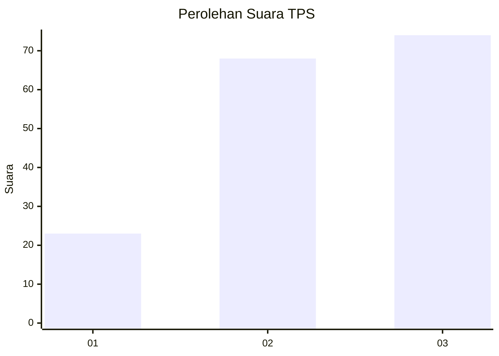
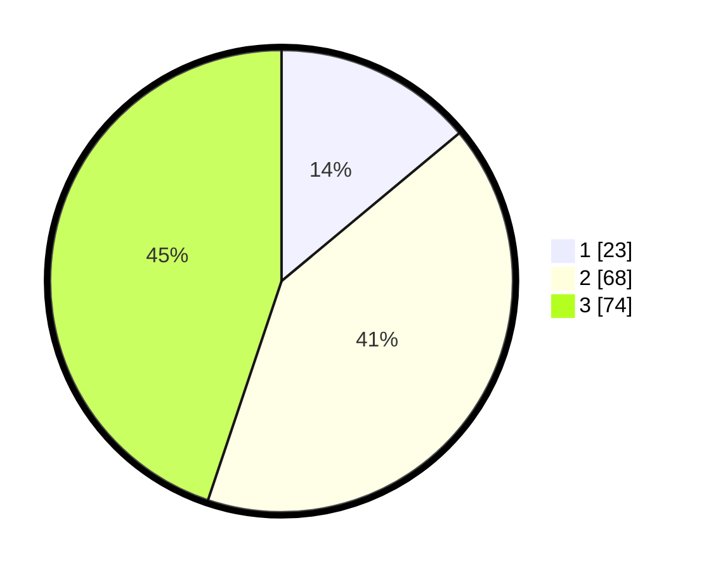

# Hasil

## Grafik

## Tabel

| No. | Nama Paslon    | Suara | Suara (raw) | Persentase |
|:--- |:-------------- | -----:| -----------:| ----------:|
| 1   | ANIES MUHAIMIN | 23    | [23][p-1]   | 13,94      |
| 2   | PRABOWO GIBRAN | 68    | [68][p-2]   | 41,21      |
| 3   | GANJAR MAHFUD  | 74    | [74][p-3]   | 44,85      |

[p-1]: https://github.com/gigit-pemilu/pemilu-2024-33-jawa-tengah/blob/main/pilpres/hitung-suara/sub/33-jawa-tengah/sub/06-purworejo/sub/06-purworejo/sub/1007-cangkrepkidul/sub/006-tps/sub/paslon-1.txt
[p-2]: https://github.com/gigit-pemilu/pemilu-2024-33-jawa-tengah/blob/main/pilpres/hitung-suara/sub/33-jawa-tengah/sub/06-purworejo/sub/06-purworejo/sub/1007-cangkrepkidul/sub/006-tps/sub/paslon-2.txt
[p-3]: https://github.com/gigit-pemilu/pemilu-2024-33-jawa-tengah/blob/main/pilpres/hitung-suara/sub/33-jawa-tengah/sub/06-purworejo/sub/06-purworejo/sub/1007-cangkrepkidul/sub/006-tps/sub/paslon-3.txt

## Foto C Plano

https://sirekap-obj-formc.kpu.go.id/a022/pemilu/ppwp/33/06/06/10/07/3306061007006-20240214-212500--e60e92c8-2a6e-4f64-9ec2-305ad2b8a66b.jpg

https://sirekap-obj-formc.kpu.go.id/a022/pemilu/ppwp/33/06/06/10/07/3306061007006-20240214-212922--b8a181d7-d578-4733-812b-a9244bfa704d.jpg

https://sirekap-obj-formc.kpu.go.id/a022/pemilu/ppwp/33/06/06/10/07/3306061007006-20240214-213354--a9170f30-f0c2-48a4-b27a-3890b7546e6f.jpg

## Metadata

| Key        | Value               |
| ---------- | ------------------- |
| Time Stamp | 2024-02-15 04:00:24 |

