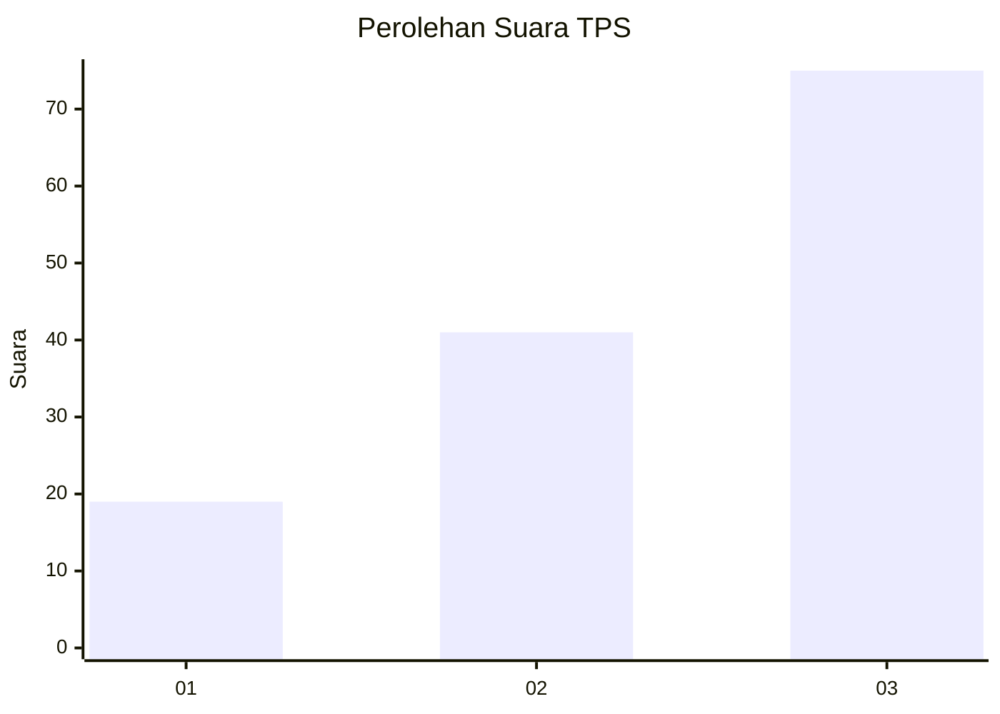
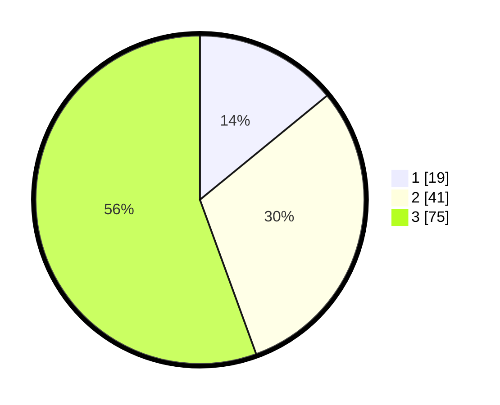

# Hasil

## Grafik

## Tabel

| No. | Nama Paslon    | Suara | Suara (raw) | Persentase |
|:--- |:-------------- | -----:| -----------:| ----------:|
| 1   | ANIES MUHAIMIN | 19    | [19][p-1]   | 14,07      |
| 2   | PRABOWO GIBRAN | 41    | [41][p-2]   | 30,37      |
| 3   | GANJAR MAHFUD  | 75    | [75][p-3]   | 55,56      |

[p-1]: https://github.com/gigit-pemilu/pemilu-2024-33-jawa-tengah/blob/main/pilpres/hitung-suara/sub/33-jawa-tengah/sub/06-purworejo/sub/06-purworejo/sub/1008-cangkreplor/sub/015-tps/sub/paslon-1.txt
[p-2]: https://github.com/gigit-pemilu/pemilu-2024-33-jawa-tengah/blob/main/pilpres/hitung-suara/sub/33-jawa-tengah/sub/06-purworejo/sub/06-purworejo/sub/1008-cangkreplor/sub/015-tps/sub/paslon-2.txt
[p-3]: https://github.com/gigit-pemilu/pemilu-2024-33-jawa-tengah/blob/main/pilpres/hitung-suara/sub/33-jawa-tengah/sub/06-purworejo/sub/06-purworejo/sub/1008-cangkreplor/sub/015-tps/sub/paslon-3.txt

## Foto C Plano

https://sirekap-obj-formc.kpu.go.id/b61b/pemilu/ppwp/33/06/06/10/08/3306061008015-20240215-025345--70348a15-73d5-4e03-9143-b402fb6d1c73.jpg

https://sirekap-obj-formc.kpu.go.id/b61b/pemilu/ppwp/33/06/06/10/08/3306061008015-20240215-025504--38c63336-52ff-449e-a307-1293330dc52a.jpg

https://sirekap-obj-formc.kpu.go.id/b61b/pemilu/ppwp/33/06/06/10/08/3306061008015-20240215-033517--4f50ff05-e575-462d-a775-a82f27527507.jpg

## Metadata

| Key        | Value               |
| ---------- | ------------------- |
| Time Stamp | 2024-02-15 16:00:26 |

