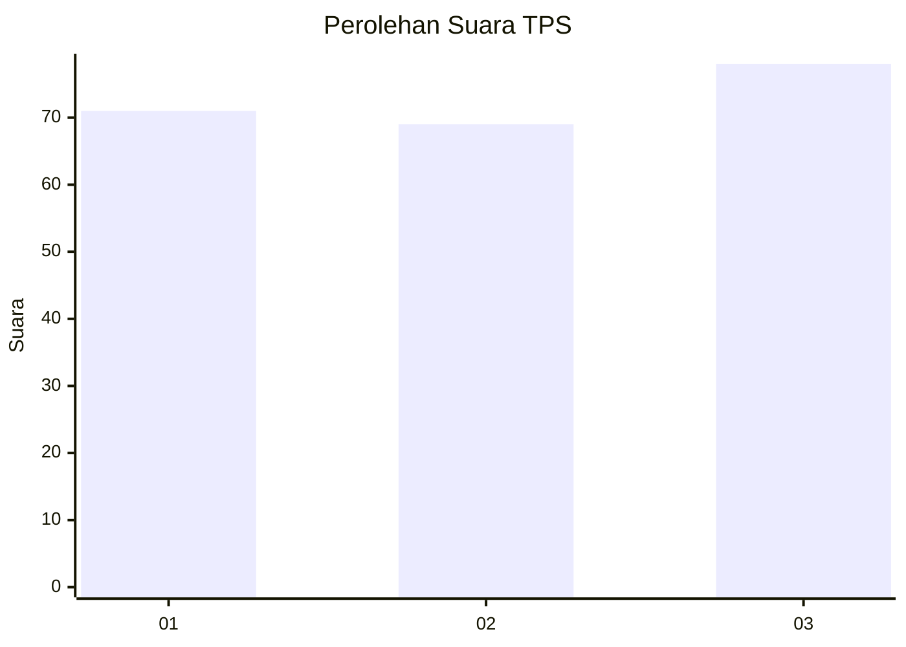
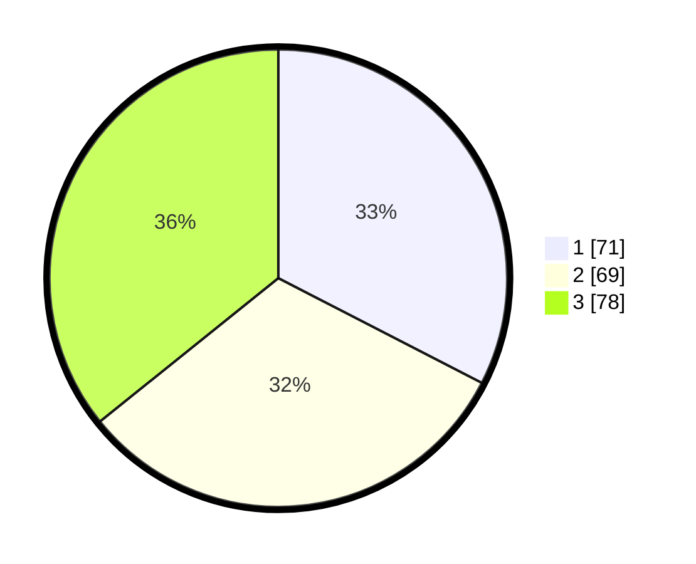

# Hasil

## Grafik

## Tabel

| No. | Nama Paslon    | Suara | Suara (raw) | Persentase |
|:--- |:-------------- | -----:| -----------:| ----------:|
| 1   | ANIES MUHAIMIN | 71    | [71][p-1]   | 32,57      |
| 2   | PRABOWO GIBRAN | 69    | [69][p-2]   | 31,65      |
| 3   | GANJAR MAHFUD  | 78    | [78][p-3]   | 35,78      |

[p-1]: https://github.com/gigit-pemilu/pemilu-2024/blob/main/pilpres/hitung-suara/sub/33-jawa-tengah/sub/06-purworejo/sub/06-purworejo/sub/1013-pangenjurutengah/sub/025-tps/sub/paslon-1.txt
[p-2]: https://github.com/gigit-pemilu/pemilu-2024/blob/main/pilpres/hitung-suara/sub/33-jawa-tengah/sub/06-purworejo/sub/06-purworejo/sub/1013-pangenjurutengah/sub/025-tps/sub/paslon-2.txt
[p-3]: https://github.com/gigit-pemilu/pemilu-2024/blob/main/pilpres/hitung-suara/sub/33-jawa-tengah/sub/06-purworejo/sub/06-purworejo/sub/1013-pangenjurutengah/sub/025-tps/sub/paslon-3.txt

## Foto C Plano

https://sirekap-obj-formc.kpu.go.id/3a41/pemilu/ppwp/33/06/06/10/13/3306061013025-20240215-044636--ddc29597-2851-46c9-be9b-eb0dd55f3a2c.jpg

https://sirekap-obj-formc.kpu.go.id/3a41/pemilu/ppwp/33/06/06/10/13/3306061013025-20240215-044729--c22a8bdc-d48e-4a8d-9885-2e8d00804783.jpg

https://sirekap-obj-formc.kpu.go.id/3a41/pemilu/ppwp/33/06/06/10/13/3306061013025-20240215-044954--b296e8a5-b51b-4f23-9f60-c4224ff85140.jpg

## Metadata

| Key        | Value               |
| ---------- | ------------------- |
| Time Stamp | 2024-02-15 16:30:25 |

