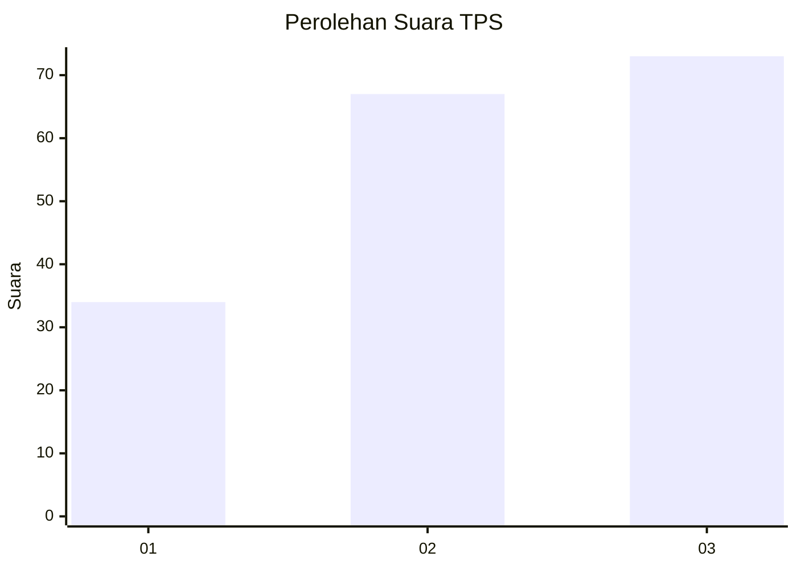
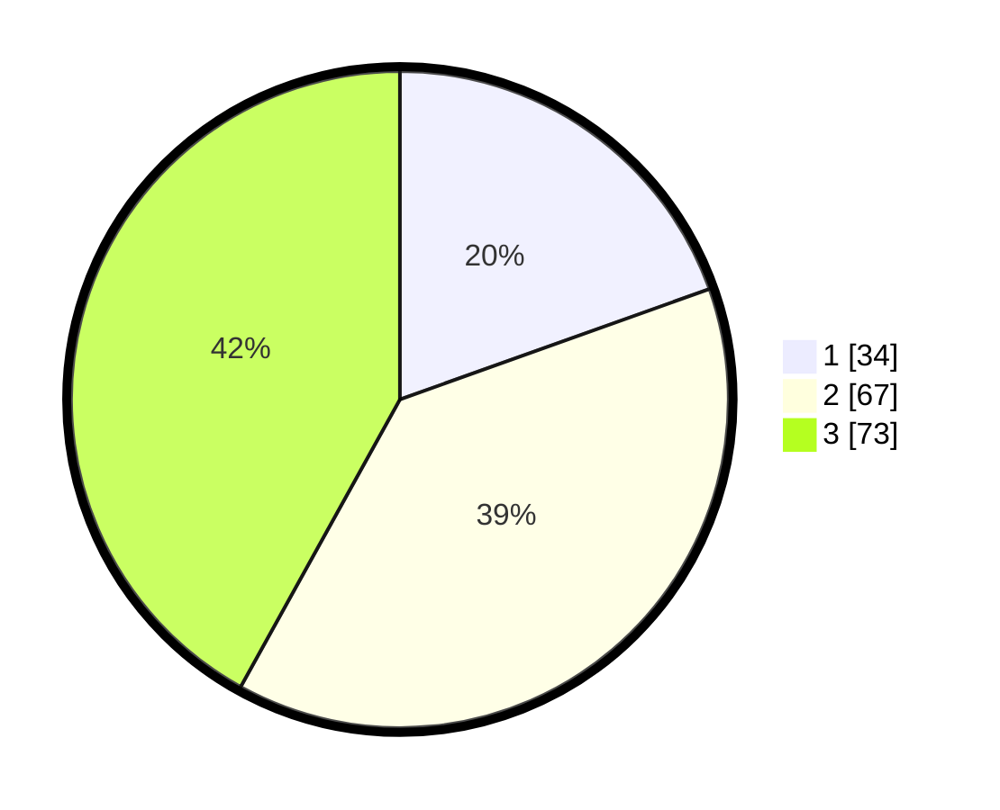

# Hasil

## Grafik

## Tabel

| No. | Nama Paslon    | Suara | Suara (raw) | Persentase |
|:--- |:-------------- | -----:| -----------:| ----------:|
| 1   | ANIES MUHAIMIN | 34    | [34][p-1]   | 19,54      |
| 2   | PRABOWO GIBRAN | 67    | [67][p-2]   | 38,51      |
| 3   | GANJAR MAHFUD  | 73    | [73][p-3]   | 41,95      |

[p-1]: https://github.com/gigit-pemilu/pemilu-2024-33-jawa-tengah/blob/main/pilpres/hitung-suara/sub/33-jawa-tengah/sub/06-purworejo/sub/06-purworejo/sub/1016-paduroso/sub/001-tps/sub/paslon-1.txt
[p-2]: https://github.com/gigit-pemilu/pemilu-2024-33-jawa-tengah/blob/main/pilpres/hitung-suara/sub/33-jawa-tengah/sub/06-purworejo/sub/06-purworejo/sub/1016-paduroso/sub/001-tps/sub/paslon-2.txt
[p-3]: https://github.com/gigit-pemilu/pemilu-2024-33-jawa-tengah/blob/main/pilpres/hitung-suara/sub/33-jawa-tengah/sub/06-purworejo/sub/06-purworejo/sub/1016-paduroso/sub/001-tps/sub/paslon-3.txt

## Foto C Plano

https://sirekap-obj-formc.kpu.go.id/b821/pemilu/ppwp/33/06/06/10/16/3306061016001-20240214-213343--d2efa494-39cf-4800-b79b-a8833a36144d.jpg

https://sirekap-obj-formc.kpu.go.id/b821/pemilu/ppwp/33/06/06/10/16/3306061016001-20240214-200436--5fe067c3-8415-4ec4-a2a7-9e46574e218d.jpg

https://sirekap-obj-formc.kpu.go.id/b821/pemilu/ppwp/33/06/06/10/16/3306061016001-20240214-212157--0570e667-bd0c-4b4c-96d7-acbde19f7c9f.jpg

## Metadata

| Key        | Value               |
| ---------- | ------------------- |
| Time Stamp | 2024-02-15 16:00:26 |

