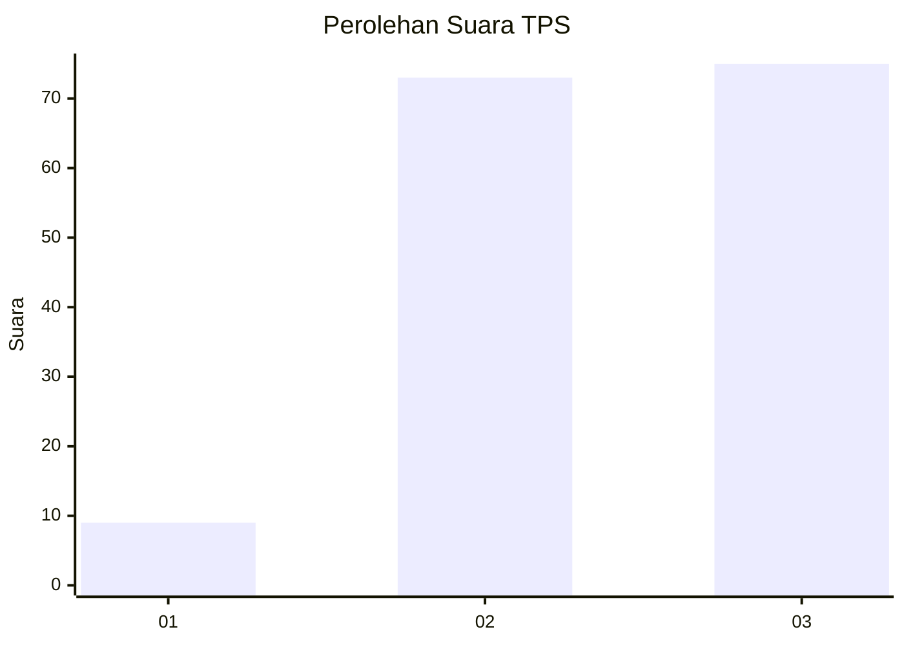
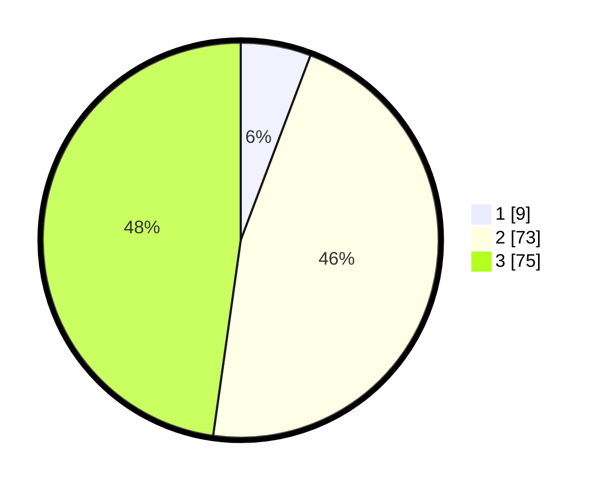

# Hasil

## Grafik

## Tabel

| No. | Nama Paslon    | Suara | Suara (raw) | Persentase |
|:--- |:-------------- | -----:| -----------:| ----------:|
| 1   | ANIES MUHAIMIN | 9     | [9][p-1]    | 5,73       |
| 2   | PRABOWO GIBRAN | 73    | [73][p-2]   | 46,50      |
| 3   | GANJAR MAHFUD  | 75    | [75][p-3]   | 47,77      |

[p-1]: https://github.com/gigit-pemilu/pemilu-2024/blob/main/pilpres/hitung-suara/sub/33-jawa-tengah/sub/06-purworejo/sub/06-purworejo/sub/1017-purworejo/sub/006-tps/sub/paslon-1.txt
[p-2]: https://github.com/gigit-pemilu/pemilu-2024/blob/main/pilpres/hitung-suara/sub/33-jawa-tengah/sub/06-purworejo/sub/06-purworejo/sub/1017-purworejo/sub/006-tps/sub/paslon-2.txt
[p-3]: https://github.com/gigit-pemilu/pemilu-2024/blob/main/pilpres/hitung-suara/sub/33-jawa-tengah/sub/06-purworejo/sub/06-purworejo/sub/1017-purworejo/sub/006-tps/sub/paslon-3.txt

## Foto C Plano

https://sirekap-obj-formc.kpu.go.id/75a7/pemilu/ppwp/33/06/06/10/17/3306061017006-20240214-231847--d3b789fc-f887-416d-b92b-7bf04fe2b73c.jpg

https://sirekap-obj-formc.kpu.go.id/75a7/pemilu/ppwp/33/06/06/10/17/3306061017006-20240214-232142--f97800b3-dd3b-4054-8e3b-bdf3496b574d.jpg

https://sirekap-obj-formc.kpu.go.id/75a7/pemilu/ppwp/33/06/06/10/17/3306061017006-20240214-232446--d3f0ba24-d4d0-42c6-a25a-df17a72ee54c.jpg

## Metadata

| Key        | Value               |
| ---------- | ------------------- |
| Time Stamp | 2024-02-15 16:30:25 |

