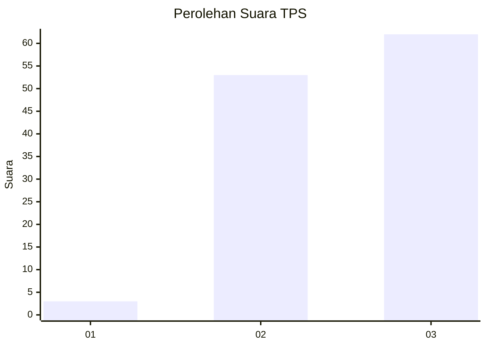
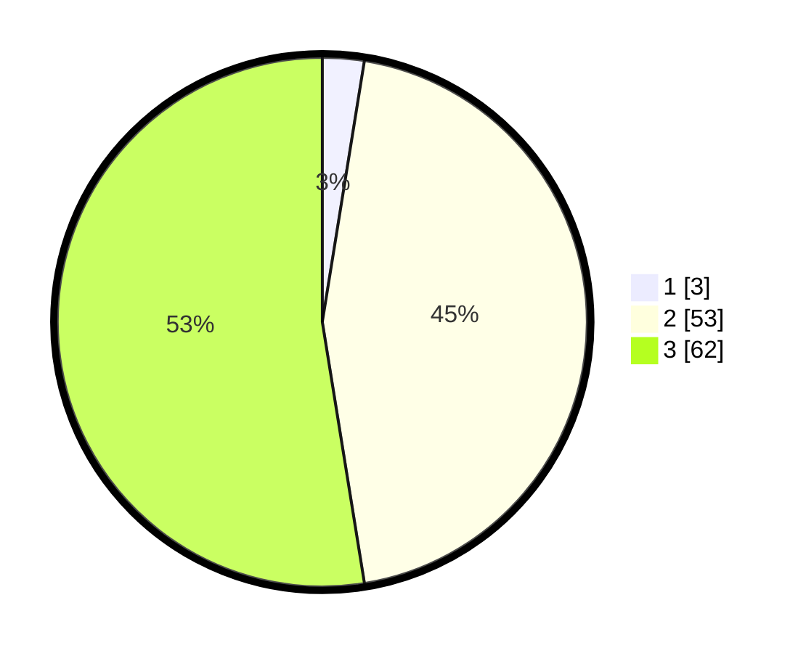

# Hasil

## Grafik

## Tabel

| No. | Nama Paslon    | Suara | Suara (raw) | Persentase |
|:--- |:-------------- | -----:| -----------:| ----------:|
| 1   | ANIES MUHAIMIN | 3     | [3][p-1]    | 2,54       |
| 2   | PRABOWO GIBRAN | 53    | [53][p-2]   | 44,92      |
| 3   | GANJAR MAHFUD  | 62    | [62][p-3]   | 52,54      |

[p-1]: https://github.com/gigit-pemilu/pemilu-2024-33-jawa-tengah/blob/main/pilpres/hitung-suara/sub/33-jawa-tengah/sub/06-purworejo/sub/06-purworejo/sub/1017-purworejo/sub/008-tps/sub/paslon-1.txt
[p-2]: https://github.com/gigit-pemilu/pemilu-2024-33-jawa-tengah/blob/main/pilpres/hitung-suara/sub/33-jawa-tengah/sub/06-purworejo/sub/06-purworejo/sub/1017-purworejo/sub/008-tps/sub/paslon-2.txt
[p-3]: https://github.com/gigit-pemilu/pemilu-2024-33-jawa-tengah/blob/main/pilpres/hitung-suara/sub/33-jawa-tengah/sub/06-purworejo/sub/06-purworejo/sub/1017-purworejo/sub/008-tps/sub/paslon-3.txt

## Foto C Plano

https://sirekap-obj-formc.kpu.go.id/513f/pemilu/ppwp/33/06/06/10/17/3306061017008-20240214-233007--45c0bad3-b1d1-426b-9545-2a6bf789a24d.jpg

https://sirekap-obj-formc.kpu.go.id/513f/pemilu/ppwp/33/06/06/10/17/3306061017008-20240214-233212--ef7bd8cc-d957-4c98-9f3e-c92d55493084.jpg

https://sirekap-obj-formc.kpu.go.id/513f/pemilu/ppwp/33/06/06/10/17/3306061017008-20240214-233428--c253b6c2-bc09-44e2-b031-ae7ea446e86e.jpg

## Metadata

| Key        | Value               |
| ---------- | ------------------- |
| Time Stamp | 2024-02-15 16:30:25 |

