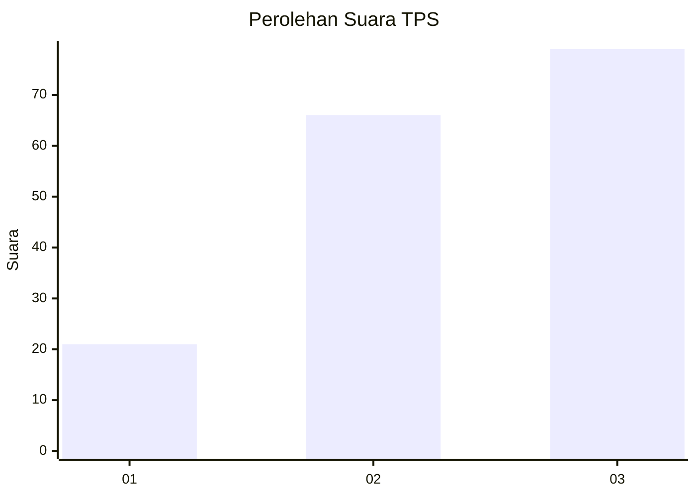
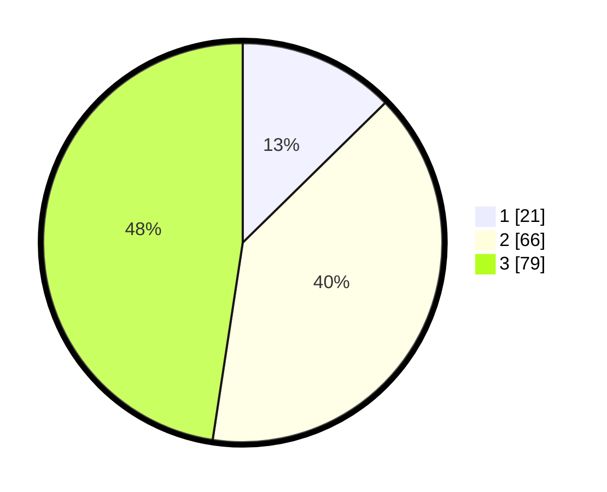

# Hasil

## Grafik

## Tabel

| No. | Nama Paslon    | Suara | Suara (raw) | Persentase |
|:--- |:-------------- | -----:| -----------:| ----------:|
| 1   | ANIES MUHAIMIN | 21    | [21][p-1]   | 12,65      |
| 2   | PRABOWO GIBRAN | 66    | [66][p-2]   | 39,76      |
| 3   | GANJAR MAHFUD  | 79    | [79][p-3]   | 47,59      |

[p-1]: https://github.com/gigit-pemilu/pemilu-2024/blob/main/pilpres/hitung-suara/sub/33-jawa-tengah/sub/06-purworejo/sub/06-purworejo/sub/1017-purworejo/sub/014-tps/sub/paslon-1.txt
[p-2]: https://github.com/gigit-pemilu/pemilu-2024/blob/main/pilpres/hitung-suara/sub/33-jawa-tengah/sub/06-purworejo/sub/06-purworejo/sub/1017-purworejo/sub/014-tps/sub/paslon-2.txt
[p-3]: https://github.com/gigit-pemilu/pemilu-2024/blob/main/pilpres/hitung-suara/sub/33-jawa-tengah/sub/06-purworejo/sub/06-purworejo/sub/1017-purworejo/sub/014-tps/sub/paslon-3.txt

## Foto C Plano

https://sirekap-obj-formc.kpu.go.id/c83e/pemilu/ppwp/33/06/06/10/17/3306061017014-20240214-235052--40a6b59b-cece-4bdb-bb3b-854088846674.jpg

https://sirekap-obj-formc.kpu.go.id/c83e/pemilu/ppwp/33/06/06/10/17/3306061017014-20240214-235711--9bcc9d17-3fc1-42e9-ae00-a0e1491bf4fe.jpg

https://sirekap-obj-formc.kpu.go.id/c83e/pemilu/ppwp/33/06/06/10/17/3306061017014-20240214-235904--489c0979-ab40-40f4-832b-446f382e49f0.jpg

## Metadata

| Key        | Value               |
| ---------- | ------------------- |
| Time Stamp | 2024-02-19 06:16:00 |

