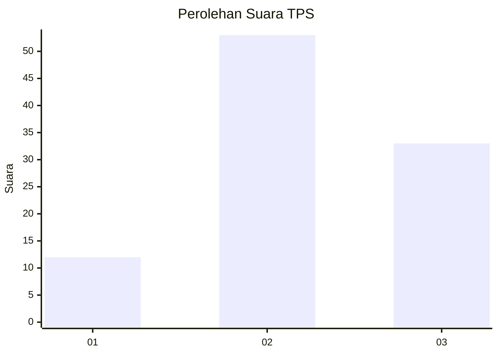
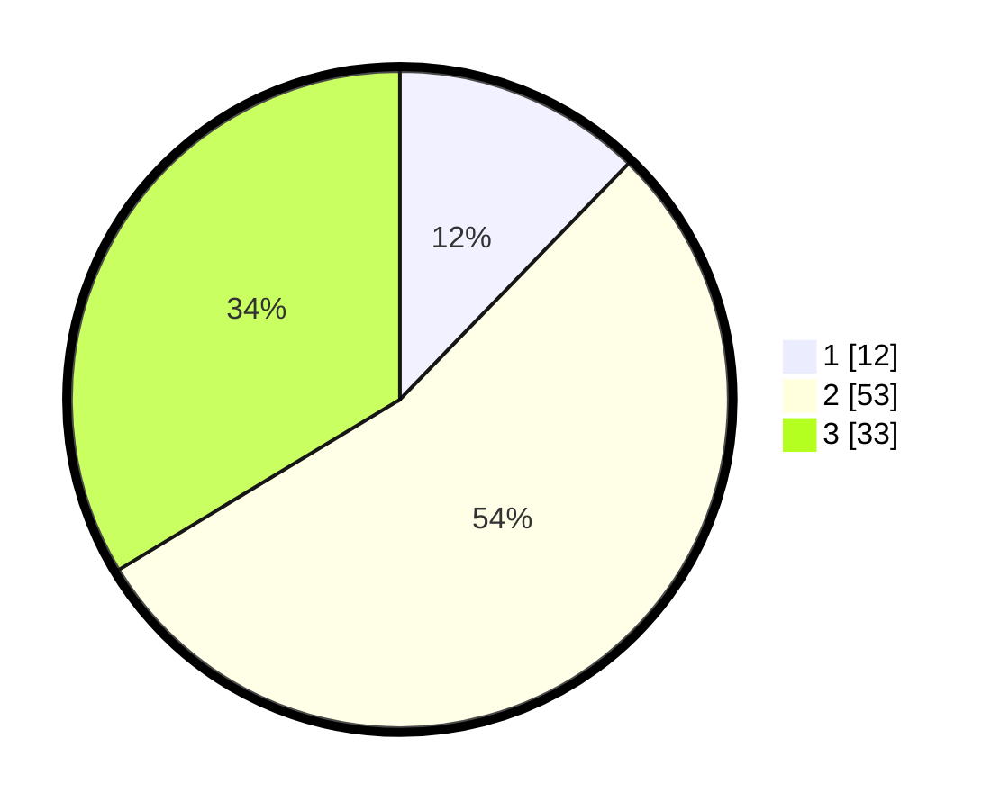

# Hasil

## Grafik

## Tabel

| No. | Nama Paslon    | Suara | Suara (raw) | Persentase |
|:--- |:-------------- | -----:| -----------:| ----------:|
| 1   | ANIES MUHAIMIN | 12    | [12][p-1]   | 12,24      |
| 2   | PRABOWO GIBRAN | 53    | [53][p-2]   | 54,08      |
| 3   | GANJAR MAHFUD  | 33    | [33][p-3]   | 33,67      |

[p-1]: https://github.com/gigit-pemilu/pemilu-2024/blob/main/pilpres/hitung-suara/sub/33-jawa-tengah/sub/06-purworejo/sub/06-purworejo/sub/1017-purworejo/sub/036-tps/sub/paslon-1.txt
[p-2]: https://github.com/gigit-pemilu/pemilu-2024/blob/main/pilpres/hitung-suara/sub/33-jawa-tengah/sub/06-purworejo/sub/06-purworejo/sub/1017-purworejo/sub/036-tps/sub/paslon-2.txt
[p-3]: https://github.com/gigit-pemilu/pemilu-2024/blob/main/pilpres/hitung-suara/sub/33-jawa-tengah/sub/06-purworejo/sub/06-purworejo/sub/1017-purworejo/sub/036-tps/sub/paslon-3.txt

## Foto C Plano

https://sirekap-obj-formc.kpu.go.id/917c/pemilu/ppwp/33/06/06/10/17/3306061017036-20240214-222748--c711af62-6fc8-40a1-a2c5-f0eabadafe5f.jpg

https://sirekap-obj-formc.kpu.go.id/917c/pemilu/ppwp/33/06/06/10/17/3306061017036-20240215-002116--603aaf03-e169-48a1-90fd-6af9635ae2df.jpg

https://sirekap-obj-formc.kpu.go.id/917c/pemilu/ppwp/33/06/06/10/17/3306061017036-20240214-222922--2b321d13-c4b1-4c80-ab93-32b1338f8699.jpg

## Metadata

| Key        | Value               |
| ---------- | ------------------- |
| Time Stamp | 2024-02-16 22:30:00 |

