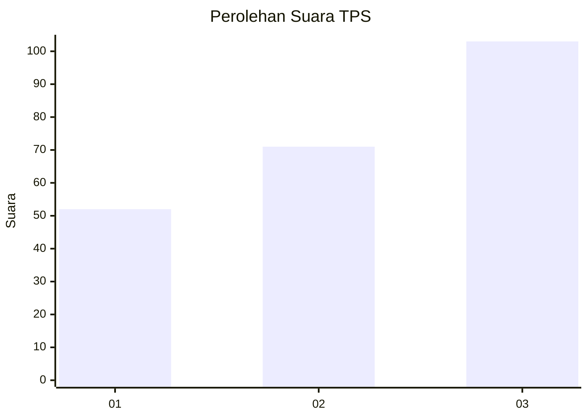
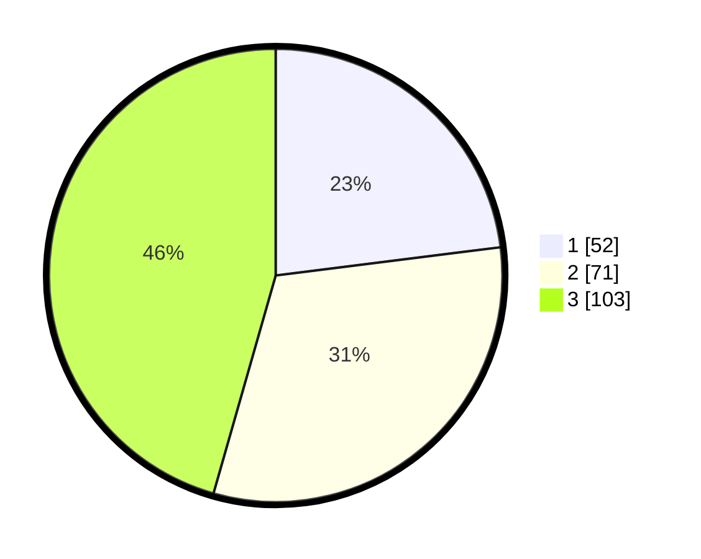

# Hasil

## Grafik

## Tabel

| No. | Nama Paslon    | Suara | Suara (raw) | Persentase |
|:--- |:-------------- | -----:| -----------:| ----------:|
| 1   | ANIES MUHAIMIN | 52    | [52][p-1]   | 23,01      |
| 2   | PRABOWO GIBRAN | 71    | [71][p-2]   | 31,42      |
| 3   | GANJAR MAHFUD  | 103   | [103][p-3]  | 45,58      |

[p-1]: https://github.com/gigit-pemilu/pemilu-2024-33-jawa-tengah/blob/main/pilpres/hitung-suara/sub/33-jawa-tengah/sub/06-purworejo/sub/06-purworejo/sub/1019-mudal/sub/001-tps/sub/paslon-1.txt
[p-2]: https://github.com/gigit-pemilu/pemilu-2024-33-jawa-tengah/blob/main/pilpres/hitung-suara/sub/33-jawa-tengah/sub/06-purworejo/sub/06-purworejo/sub/1019-mudal/sub/001-tps/sub/paslon-2.txt
[p-3]: https://github.com/gigit-pemilu/pemilu-2024-33-jawa-tengah/blob/main/pilpres/hitung-suara/sub/33-jawa-tengah/sub/06-purworejo/sub/06-purworejo/sub/1019-mudal/sub/001-tps/sub/paslon-3.txt

## Foto C Plano

https://sirekap-obj-formc.kpu.go.id/78cf/pemilu/ppwp/33/06/06/10/19/3306061019001-20240214-230853--9a41251b-fa61-4650-b1af-a49965ce8206.jpg

https://sirekap-obj-formc.kpu.go.id/78cf/pemilu/ppwp/33/06/06/10/19/3306061019001-20240214-232933--70df6164-c120-488a-8407-7e879e9a444e.jpg

https://sirekap-obj-formc.kpu.go.id/78cf/pemilu/ppwp/33/06/06/10/19/3306061019001-20240214-233315--f5c04773-134c-4f71-b230-9c3d203859d0.jpg

## Metadata

| Key        | Value               |
| ---------- | ------------------- |
| Time Stamp | 2024-02-15 16:30:25 |

