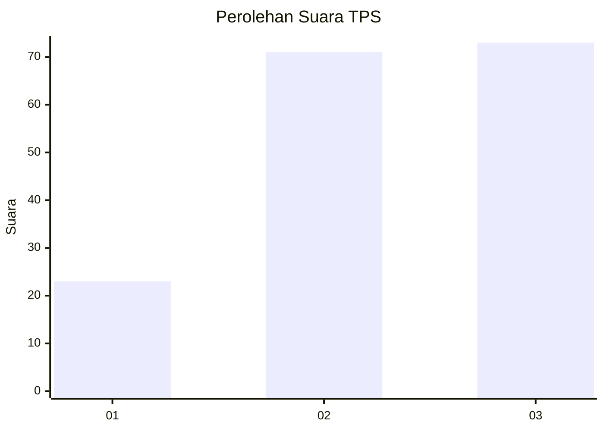
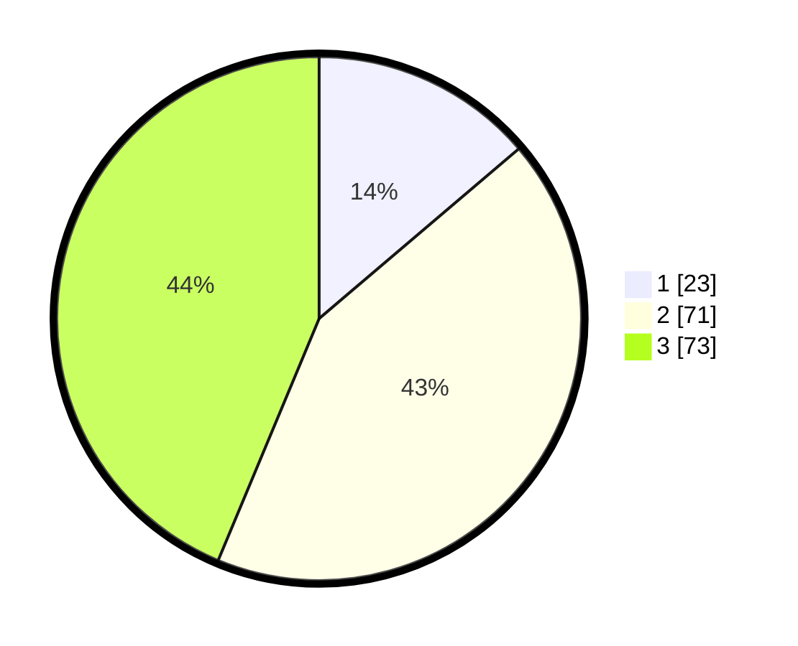

# Hasil

## Grafik

## Tabel

| No. | Nama Paslon    | Suara | Suara (raw) | Persentase |
|:--- |:-------------- | -----:| -----------:| ----------:|
| 1   | ANIES MUHAIMIN | 23    | [23][p-1]   | 13,77      |
| 2   | PRABOWO GIBRAN | 71    | [71][p-2]   | 42,51      |
| 3   | GANJAR MAHFUD  | 73    | [73][p-3]   | 43,71      |

[p-1]: https://github.com/gigit-pemilu/pemilu-2024/blob/main/pilpres/hitung-suara/sub/33-jawa-tengah/sub/06-purworejo/sub/06-purworejo/sub/1021-baledono/sub/023-tps/sub/paslon-1.txt
[p-2]: https://github.com/gigit-pemilu/pemilu-2024/blob/main/pilpres/hitung-suara/sub/33-jawa-tengah/sub/06-purworejo/sub/06-purworejo/sub/1021-baledono/sub/023-tps/sub/paslon-2.txt
[p-3]: https://github.com/gigit-pemilu/pemilu-2024/blob/main/pilpres/hitung-suara/sub/33-jawa-tengah/sub/06-purworejo/sub/06-purworejo/sub/1021-baledono/sub/023-tps/sub/paslon-3.txt

## Foto C Plano

https://sirekap-obj-formc.kpu.go.id/abdf/pemilu/ppwp/33/06/06/10/21/3306061021023-20240215-005805--9f7ef71a-1388-42ff-acb2-a56d43c6ce7c.jpg

https://sirekap-obj-formc.kpu.go.id/abdf/pemilu/ppwp/33/06/06/10/21/3306061021023-20240215-005821--e8bede1a-4cb1-40b6-9d9b-fceedd405f7e.jpg

https://sirekap-obj-formc.kpu.go.id/abdf/pemilu/ppwp/33/06/06/10/21/3306061021023-20240215-154649--f04f4a43-f25f-44e6-ae0c-11961577a9d0.jpg

## Metadata

| Key        | Value               |
| ---------- | ------------------- |
| Time Stamp | 2024-02-15 16:00:26 |

