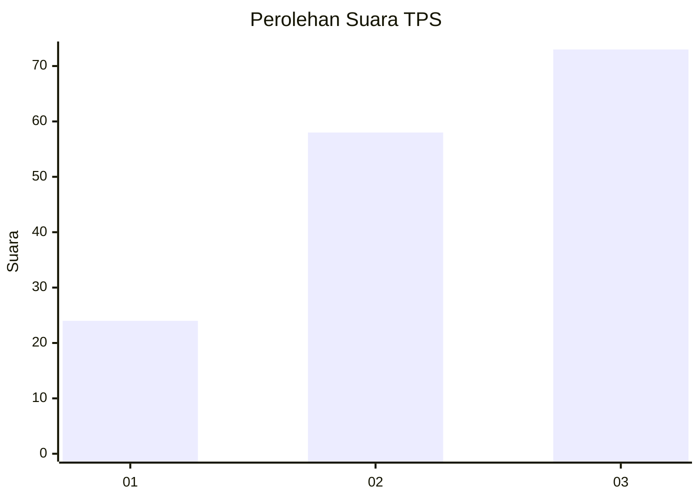
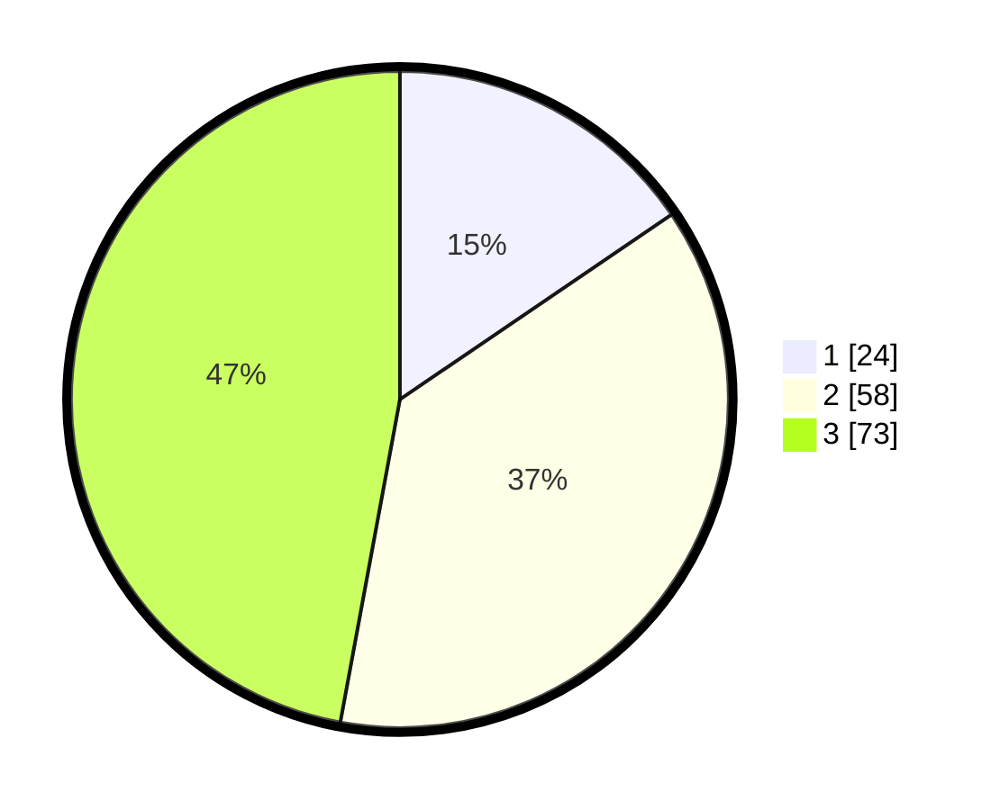

# Hasil

## Grafik

## Tabel

| No. | Nama Paslon    | Suara | Suara (raw) | Persentase |
|:--- |:-------------- | -----:| -----------:| ----------:|
| 1   | ANIES MUHAIMIN | 24    | [24][p-1]   | 15,48      |
| 2   | PRABOWO GIBRAN | 58    | [58][p-2]   | 37,42      |
| 3   | GANJAR MAHFUD  | 73    | [73][p-3]   | 47,10      |

[p-1]: https://github.com/gigit-pemilu/pemilu-2024/blob/main/pilpres/hitung-suara/sub/33-jawa-tengah/sub/06-purworejo/sub/06-purworejo/sub/2004-ganggeng/sub/007-tps/sub/paslon-1.txt
[p-2]: https://github.com/gigit-pemilu/pemilu-2024/blob/main/pilpres/hitung-suara/sub/33-jawa-tengah/sub/06-purworejo/sub/06-purworejo/sub/2004-ganggeng/sub/007-tps/sub/paslon-2.txt
[p-3]: https://github.com/gigit-pemilu/pemilu-2024/blob/main/pilpres/hitung-suara/sub/33-jawa-tengah/sub/06-purworejo/sub/06-purworejo/sub/2004-ganggeng/sub/007-tps/sub/paslon-3.txt

## Foto C Plano

https://sirekap-obj-formc.kpu.go.id/d050/pemilu/ppwp/33/06/06/20/04/3306062004007-20240215-012005--4d640504-0809-490f-b343-0031797834e9.jpg

https://sirekap-obj-formc.kpu.go.id/d050/pemilu/ppwp/33/06/06/20/04/3306062004007-20240215-013251--ecacc7af-4ab8-488f-8f21-74bfa67b73da.jpg

https://sirekap-obj-formc.kpu.go.id/d050/pemilu/ppwp/33/06/06/20/04/3306062004007-20240215-013533--0f315fff-d704-4e47-be2a-c38a01557425.jpg

## Metadata

| Key        | Value               |
| ---------- | ------------------- |
| Time Stamp | 2024-02-16 22:30:00 |

