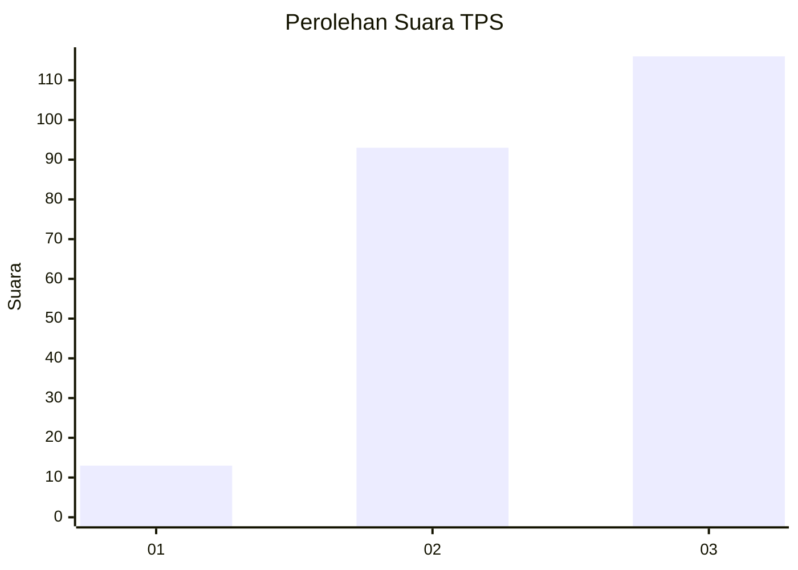
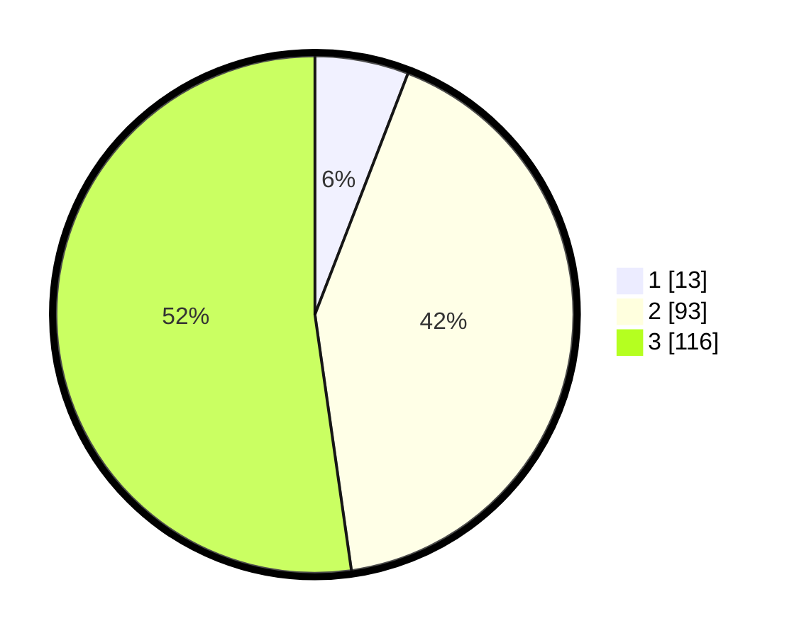

# Hasil

## Grafik

## Tabel

| No. | Nama Paslon    | Suara | Suara (raw) | Persentase |
|:--- |:-------------- | -----:| -----------:| ----------:|
| 1   | ANIES MUHAIMIN | 13    | [13][p-1]   | 5,86       |
| 2   | PRABOWO GIBRAN | 93    | [93][p-2]   | 41,89      |
| 3   | GANJAR MAHFUD  | 116   | [116][p-3]  | 52,25      |

[p-1]: https://github.com/gigit-pemilu/pemilu-2024/blob/main/pilpres/hitung-suara/sub/33-jawa-tengah/sub/06-purworejo/sub/06-purworejo/sub/2004-ganggeng/sub/008-tps/sub/paslon-1.txt
[p-2]: https://github.com/gigit-pemilu/pemilu-2024/blob/main/pilpres/hitung-suara/sub/33-jawa-tengah/sub/06-purworejo/sub/06-purworejo/sub/2004-ganggeng/sub/008-tps/sub/paslon-2.txt
[p-3]: https://github.com/gigit-pemilu/pemilu-2024/blob/main/pilpres/hitung-suara/sub/33-jawa-tengah/sub/06-purworejo/sub/06-purworejo/sub/2004-ganggeng/sub/008-tps/sub/paslon-3.txt

## Foto C Plano

https://sirekap-obj-formc.kpu.go.id/c3a9/pemilu/ppwp/33/06/06/20/04/3306062004008-20240215-002842--51d741e8-83a2-4ed2-8a86-4dd665322174.jpg

https://sirekap-obj-formc.kpu.go.id/c3a9/pemilu/ppwp/33/06/06/20/04/3306062004008-20240215-002934--445b32d1-4224-4735-aca5-6763ca9014c4.jpg

https://sirekap-obj-formc.kpu.go.id/c3a9/pemilu/ppwp/33/06/06/20/04/3306062004008-20240215-003016--8aa61cc3-99f4-4ab2-8750-ea3766b8fdc7.jpg

## Metadata

| Key        | Value               |
| ---------- | ------------------- |
| Time Stamp | 2024-02-15 16:00:26 |

