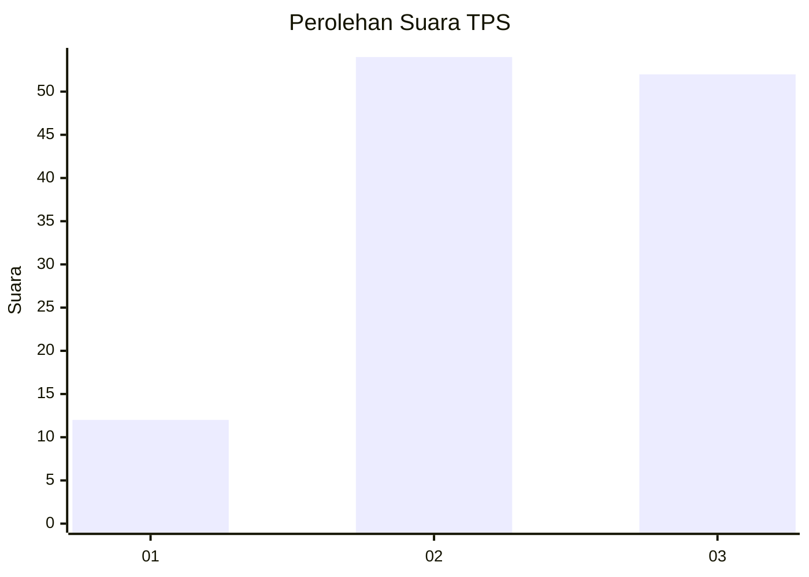
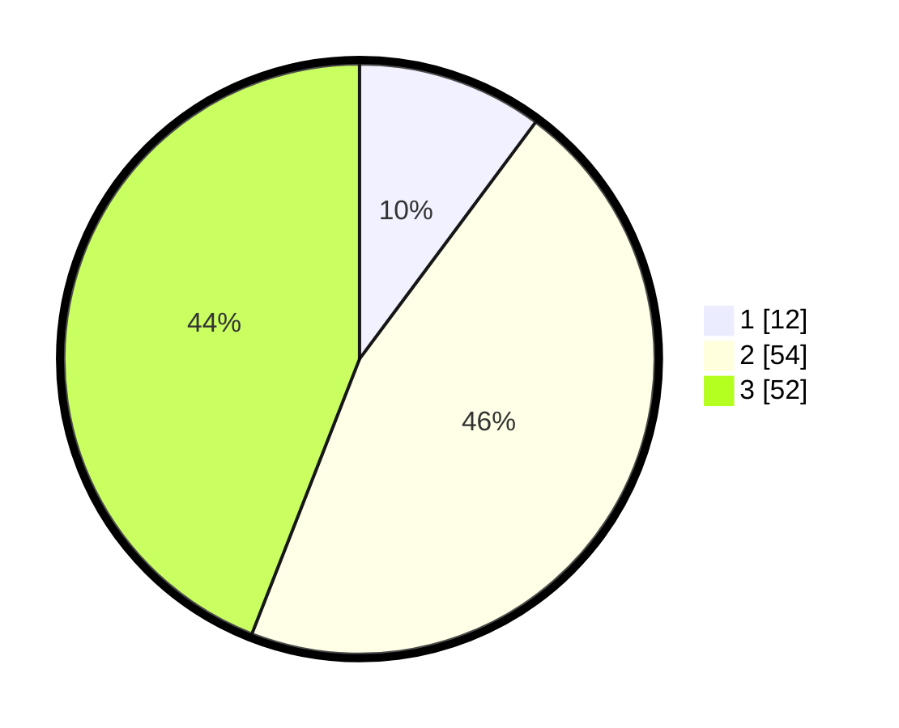

# Hasil

## Grafik

## Tabel

| No. | Nama Paslon    | Suara | Suara (raw) | Persentase |
|:--- |:-------------- | -----:| -----------:| ----------:|
| 1   | ANIES MUHAIMIN | 12    | [12][p-1]   | 10,17      |
| 2   | PRABOWO GIBRAN | 54    | [54][p-2]   | 45,76      |
| 3   | GANJAR MAHFUD  | 52    | [52][p-3]   | 44,07      |

[p-1]: https://github.com/gigit-pemilu/pemilu-2024-33-jawa-tengah/blob/main/pilpres/hitung-suara/sub/33-jawa-tengah/sub/06-purworejo/sub/06-purworejo/sub/2009-sidorejo/sub/001-tps/sub/paslon-1.txt
[p-2]: https://github.com/gigit-pemilu/pemilu-2024-33-jawa-tengah/blob/main/pilpres/hitung-suara/sub/33-jawa-tengah/sub/06-purworejo/sub/06-purworejo/sub/2009-sidorejo/sub/001-tps/sub/paslon-2.txt
[p-3]: https://github.com/gigit-pemilu/pemilu-2024-33-jawa-tengah/blob/main/pilpres/hitung-suara/sub/33-jawa-tengah/sub/06-purworejo/sub/06-purworejo/sub/2009-sidorejo/sub/001-tps/sub/paslon-3.txt

## Foto C Plano

https://sirekap-obj-formc.kpu.go.id/932d/pemilu/ppwp/33/06/06/20/09/3306062009001-20240214-214039--8ee5cba1-5e13-4f6b-a2c9-5f0157f03ea4.jpg

https://sirekap-obj-formc.kpu.go.id/932d/pemilu/ppwp/33/06/06/20/09/3306062009001-20240214-213333--7c32dfde-5b91-4ae9-9a2e-cdee77605d8c.jpg

https://sirekap-obj-formc.kpu.go.id/932d/pemilu/ppwp/33/06/06/20/09/3306062009001-20240214-213749--0c3f932a-7e86-4b4e-b3d5-e619cace2ddf.jpg

## Metadata

| Key        | Value               |
| ---------- | ------------------- |
| Time Stamp | 2024-02-15 16:00:26 |

