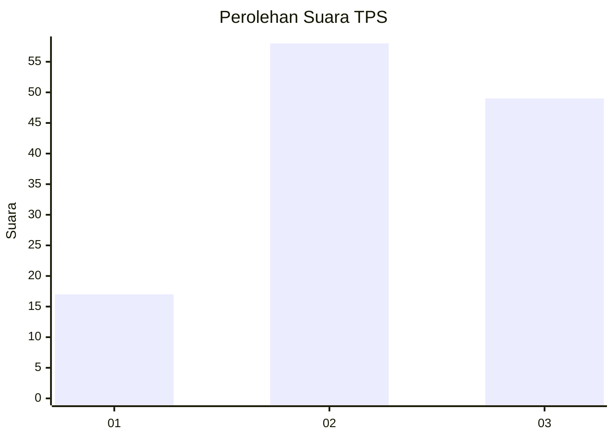
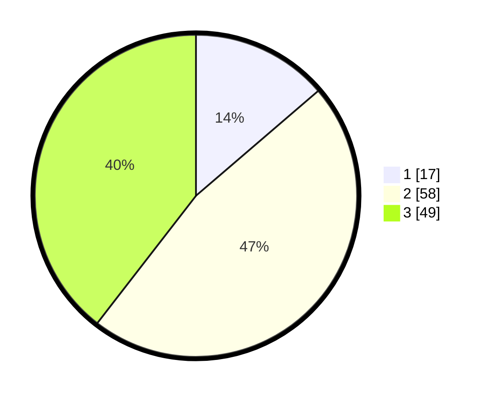

# Hasil

## Grafik

## Tabel

| No. | Nama Paslon    | Suara | Suara (raw) | Persentase |
|:--- |:-------------- | -----:| -----------:| ----------:|
| 1   | ANIES MUHAIMIN | 17    | [17][p-1]   | 13,71      |
| 2   | PRABOWO GIBRAN | 58    | [58][p-2]   | 46,77      |
| 3   | GANJAR MAHFUD  | 49    | [49][p-3]   | 39,52      |

[p-1]: https://github.com/gigit-pemilu/pemilu-2024/blob/main/pilpres/hitung-suara/sub/33-jawa-tengah/sub/06-purworejo/sub/06-purworejo/sub/2009-sidorejo/sub/003-tps/sub/paslon-1.txt
[p-2]: https://github.com/gigit-pemilu/pemilu-2024/blob/main/pilpres/hitung-suara/sub/33-jawa-tengah/sub/06-purworejo/sub/06-purworejo/sub/2009-sidorejo/sub/003-tps/sub/paslon-2.txt
[p-3]: https://github.com/gigit-pemilu/pemilu-2024/blob/main/pilpres/hitung-suara/sub/33-jawa-tengah/sub/06-purworejo/sub/06-purworejo/sub/2009-sidorejo/sub/003-tps/sub/paslon-3.txt

## Foto C Plano

https://sirekap-obj-formc.kpu.go.id/7b52/pemilu/ppwp/33/06/06/20/09/3306062009003-20240214-231808--d3d332d1-0751-4901-ab78-b592dbd5ec15.jpg

https://sirekap-obj-formc.kpu.go.id/7b52/pemilu/ppwp/33/06/06/20/09/3306062009003-20240214-232208--e0859121-a1bf-4fb5-80de-38c62cff2630.jpg

https://sirekap-obj-formc.kpu.go.id/7b52/pemilu/ppwp/33/06/06/20/09/3306062009003-20240214-232323--690e45d8-93d6-44e6-928b-cdfd11f22d29.jpg

## Metadata

| Key        | Value               |
| ---------- | ------------------- |
| Time Stamp | 2024-02-15 16:00:26 |

