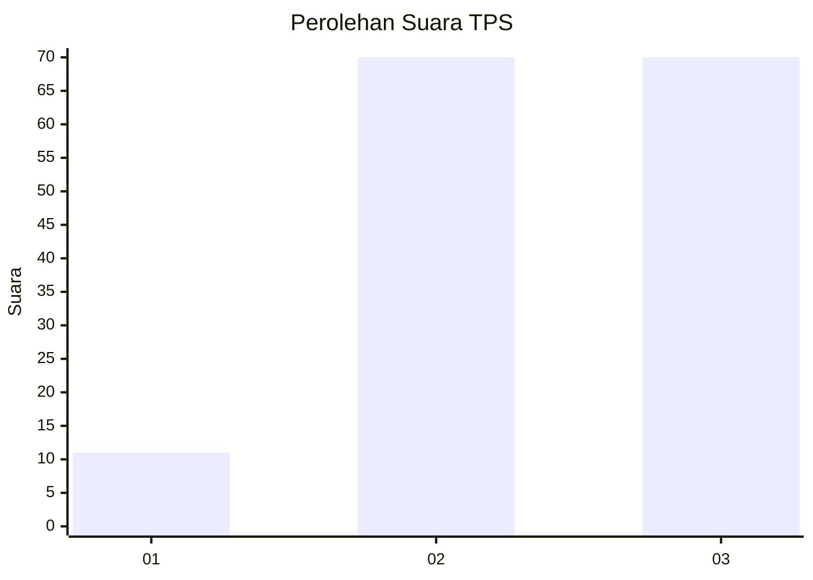
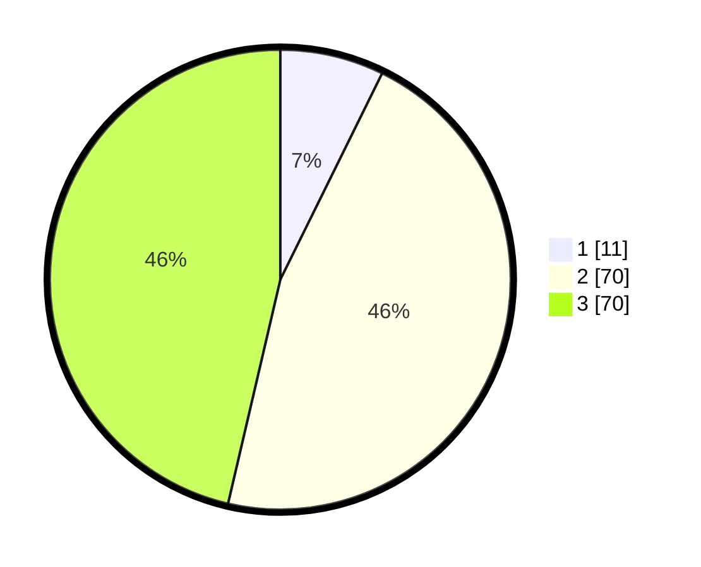

# Hasil

## Grafik

## Tabel

| No. | Nama Paslon    | Suara | Suara (raw) | Persentase |
|:--- |:-------------- | -----:| -----------:| ----------:|
| 1   | ANIES MUHAIMIN | 11    | [11][p-1]   | 7,28       |
| 2   | PRABOWO GIBRAN | 70    | [70][p-2]   | 46,36      |
| 3   | GANJAR MAHFUD  | 70    | [70][p-3]   | 46,36      |

[p-1]: https://github.com/gigit-pemilu/pemilu-2024-33-jawa-tengah/blob/main/pilpres/hitung-suara/sub/33-jawa-tengah/sub/06-purworejo/sub/06-purworejo/sub/2009-sidorejo/sub/005-tps/sub/paslon-1.txt
[p-2]: https://github.com/gigit-pemilu/pemilu-2024-33-jawa-tengah/blob/main/pilpres/hitung-suara/sub/33-jawa-tengah/sub/06-purworejo/sub/06-purworejo/sub/2009-sidorejo/sub/005-tps/sub/paslon-2.txt
[p-3]: https://github.com/gigit-pemilu/pemilu-2024-33-jawa-tengah/blob/main/pilpres/hitung-suara/sub/33-jawa-tengah/sub/06-purworejo/sub/06-purworejo/sub/2009-sidorejo/sub/005-tps/sub/paslon-3.txt

## Foto C Plano

https://sirekap-obj-formc.kpu.go.id/1092/pemilu/ppwp/33/06/06/20/09/3306062009005-20240214-214810--7dd2a827-da1e-4eea-8944-b75bd140463b.jpg

https://sirekap-obj-formc.kpu.go.id/1092/pemilu/ppwp/33/06/06/20/09/3306062009005-20240214-211229--90d1e694-522d-4534-bed8-295c2ec31c9f.jpg

https://sirekap-obj-formc.kpu.go.id/1092/pemilu/ppwp/33/06/06/20/09/3306062009005-20240214-211407--87a6b584-61f5-46a6-a687-311cba9401fa.jpg

## Metadata

| Key        | Value               |
| ---------- | ------------------- |
| Time Stamp | 2024-02-15 04:00:24 |

