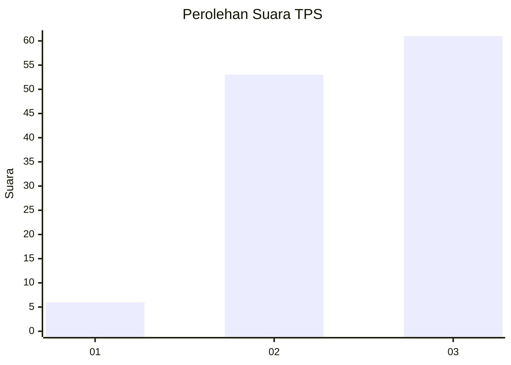
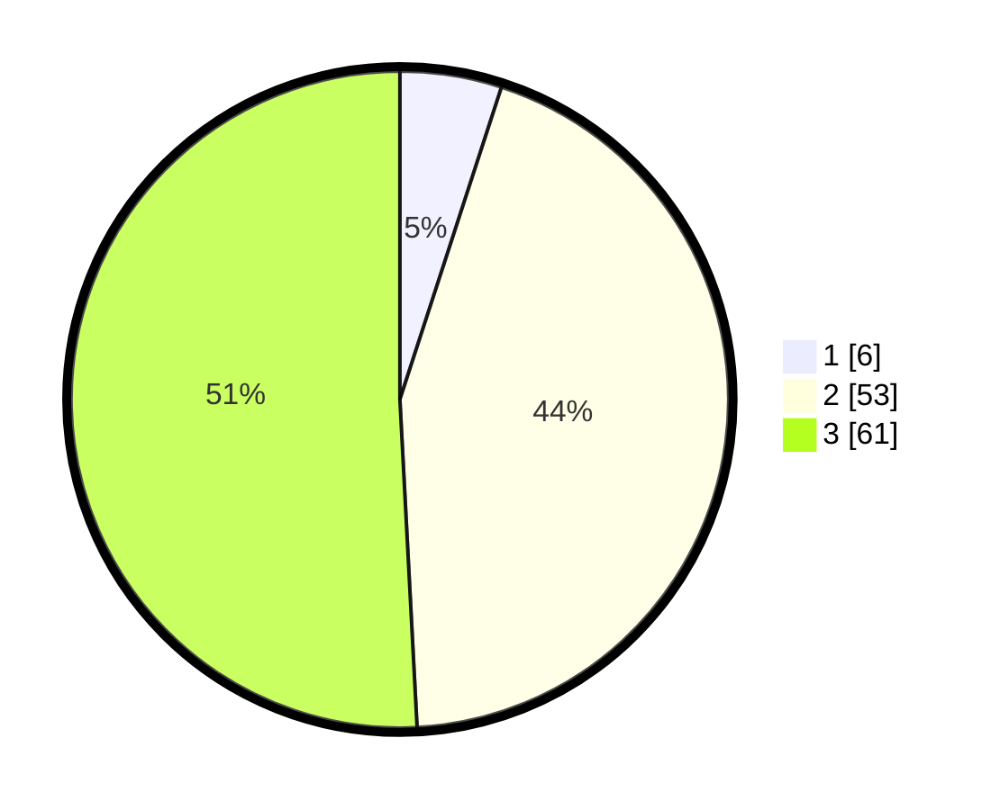

# Hasil

## Grafik

## Tabel

| No. | Nama Paslon    | Suara | Suara (raw) | Persentase |
|:--- |:-------------- | -----:| -----------:| ----------:|
| 1   | ANIES MUHAIMIN | 6     | [6][p-1]    | 5,00       |
| 2   | PRABOWO GIBRAN | 53    | [53][p-2]   | 44,17      |
| 3   | GANJAR MAHFUD  | 61    | [61][p-3]   | 50,83      |

[p-1]: https://github.com/gigit-pemilu/pemilu-2024/blob/main/pilpres/hitung-suara/sub/33-jawa-tengah/sub/06-purworejo/sub/06-purworejo/sub/2023-sidomulyo/sub/003-tps/sub/paslon-1.txt
[p-2]: https://github.com/gigit-pemilu/pemilu-2024/blob/main/pilpres/hitung-suara/sub/33-jawa-tengah/sub/06-purworejo/sub/06-purworejo/sub/2023-sidomulyo/sub/003-tps/sub/paslon-2.txt
[p-3]: https://github.com/gigit-pemilu/pemilu-2024/blob/main/pilpres/hitung-suara/sub/33-jawa-tengah/sub/06-purworejo/sub/06-purworejo/sub/2023-sidomulyo/sub/003-tps/sub/paslon-3.txt

## Foto C Plano

https://sirekap-obj-formc.kpu.go.id/e3f6/pemilu/ppwp/33/06/06/20/23/3306062023003-20240214-215652--fe607196-f160-465e-bd83-219652de46f4.jpg

https://sirekap-obj-formc.kpu.go.id/e3f6/pemilu/ppwp/33/06/06/20/23/3306062023003-20240214-140951--57f45154-183c-4ead-80c4-7640b0fd9f1e.jpg

https://sirekap-obj-formc.kpu.go.id/e3f6/pemilu/ppwp/33/06/06/20/23/3306062023003-20240214-140954--3ffc5a79-4eda-40f9-a19b-ae4b47e3282f.jpg

## Metadata

| Key        | Value               |
| ---------- | ------------------- |
| Time Stamp | 2024-02-15 00:41:44 |

