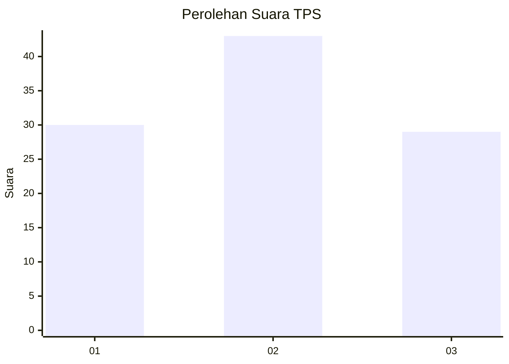
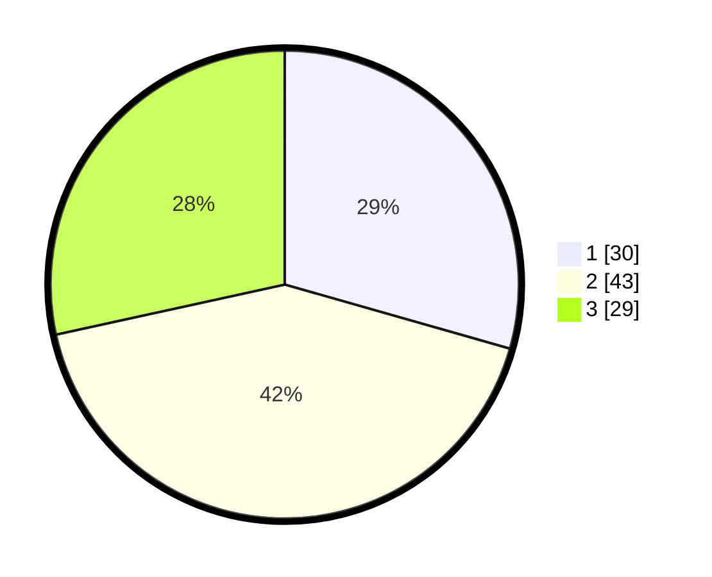

# Hasil

## Grafik

## Tabel

| No. | Nama Paslon    | Suara | Suara (raw) | Persentase |
|:--- |:-------------- | -----:| -----------:| ----------:|
| 1   | ANIES MUHAIMIN | 30    | [30][p-1]   | 29,41      |
| 2   | PRABOWO GIBRAN | 43    | [43][p-2]   | 42,16      |
| 3   | GANJAR MAHFUD  | 29    | [29][p-3]   | 28,43      |

[p-1]: https://github.com/gigit-pemilu/pemilu-2024/blob/main/pilpres/hitung-suara/sub/33-jawa-tengah/sub/06-purworejo/sub/06-purworejo/sub/2023-sidomulyo/sub/009-tps/sub/paslon-1.txt
[p-2]: https://github.com/gigit-pemilu/pemilu-2024/blob/main/pilpres/hitung-suara/sub/33-jawa-tengah/sub/06-purworejo/sub/06-purworejo/sub/2023-sidomulyo/sub/009-tps/sub/paslon-2.txt
[p-3]: https://github.com/gigit-pemilu/pemilu-2024/blob/main/pilpres/hitung-suara/sub/33-jawa-tengah/sub/06-purworejo/sub/06-purworejo/sub/2023-sidomulyo/sub/009-tps/sub/paslon-3.txt

## Foto C Plano

https://sirekap-obj-formc.kpu.go.id/5e0d/pemilu/ppwp/33/06/06/20/23/3306062023009-20240214-214029--907bc275-b43c-43d8-b989-65b1151edd98.jpg

https://sirekap-obj-formc.kpu.go.id/5e0d/pemilu/ppwp/33/06/06/20/23/3306062023009-20240214-214203--9a914eee-56f8-4ddc-9c88-3fd17a8690e0.jpg

https://sirekap-obj-formc.kpu.go.id/5e0d/pemilu/ppwp/33/06/06/20/23/3306062023009-20240214-214325--ea4d27c3-085f-421b-bd41-552a9146aad1.jpg

## Metadata

| Key        | Value               |
| ---------- | ------------------- |
| Time Stamp | 2024-02-15 16:00:26 |

