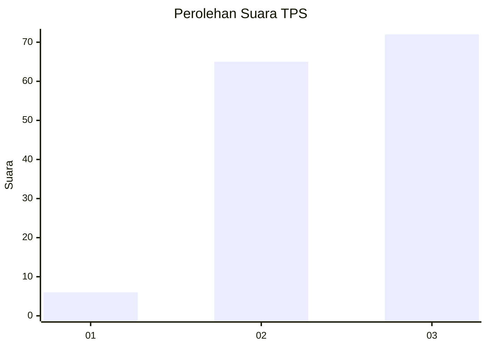
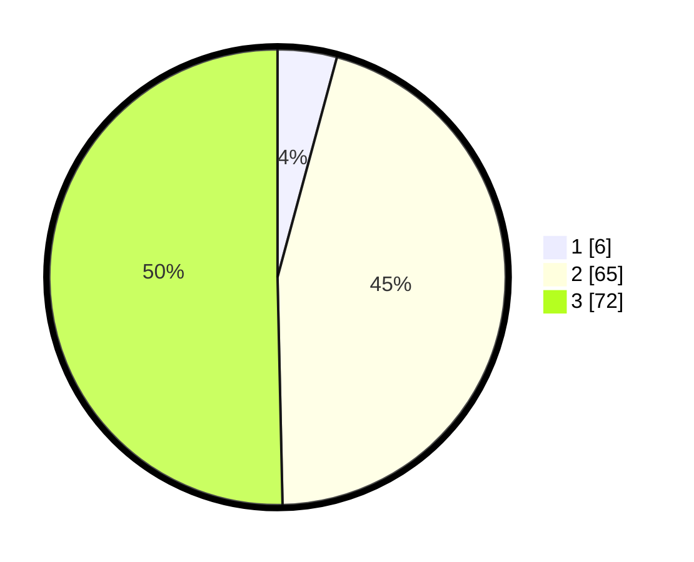

# Hasil

## Grafik

## Tabel

| No. | Nama Paslon    | Suara | Suara (raw) | Persentase |
|:--- |:-------------- | -----:| -----------:| ----------:|
| 1   | ANIES MUHAIMIN | 6     | [6][p-1]    | 4,20       |
| 2   | PRABOWO GIBRAN | 65    | [65][p-2]   | 45,45      |
| 3   | GANJAR MAHFUD  | 72    | [72][p-3]   | 50,35      |

[p-1]: https://github.com/gigit-pemilu/pemilu-2024-33-jawa-tengah/blob/main/pilpres/hitung-suara/sub/33-jawa-tengah/sub/06-purworejo/sub/06-purworejo/sub/2023-sidomulyo/sub/012-tps/sub/paslon-1.txt
[p-2]: https://github.com/gigit-pemilu/pemilu-2024-33-jawa-tengah/blob/main/pilpres/hitung-suara/sub/33-jawa-tengah/sub/06-purworejo/sub/06-purworejo/sub/2023-sidomulyo/sub/012-tps/sub/paslon-2.txt
[p-3]: https://github.com/gigit-pemilu/pemilu-2024-33-jawa-tengah/blob/main/pilpres/hitung-suara/sub/33-jawa-tengah/sub/06-purworejo/sub/06-purworejo/sub/2023-sidomulyo/sub/012-tps/sub/paslon-3.txt

## Foto C Plano

https://sirekap-obj-formc.kpu.go.id/45f1/pemilu/ppwp/33/06/06/20/23/3306062023012-20240215-003903--29063e1d-1551-421b-a327-428818da5272.jpg

https://sirekap-obj-formc.kpu.go.id/45f1/pemilu/ppwp/33/06/06/20/23/3306062023012-20240215-004015--d9f84264-b24e-4323-9f27-1427064db9f2.jpg

https://sirekap-obj-formc.kpu.go.id/45f1/pemilu/ppwp/33/06/06/20/23/3306062023012-20240215-004135--f0e7f2f5-cf39-4307-9899-728bcf0e6964.jpg

## Metadata

| Key        | Value               |
| ---------- | ------------------- |
| Time Stamp | 2024-02-15 16:00:26 |

