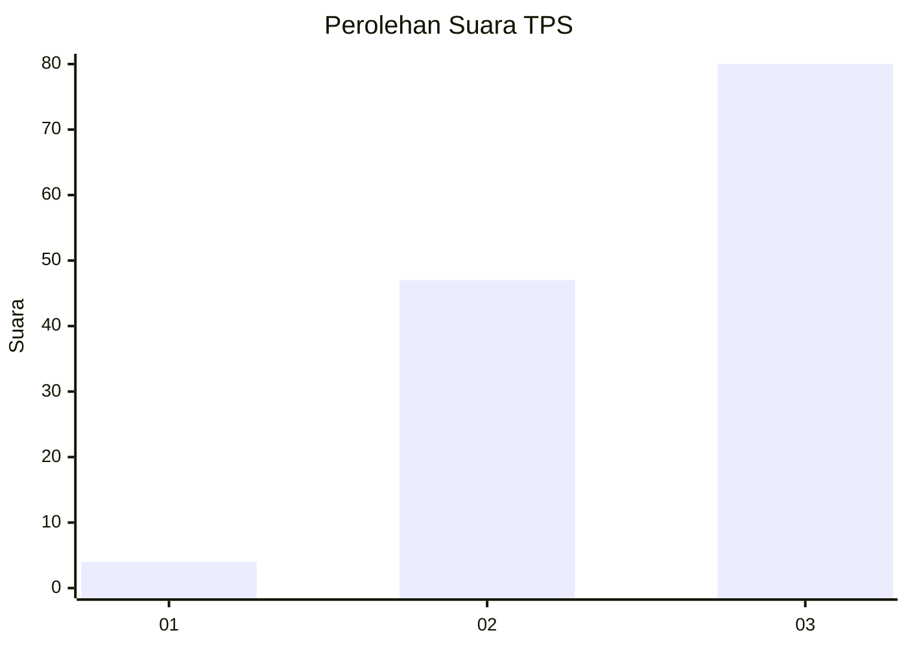
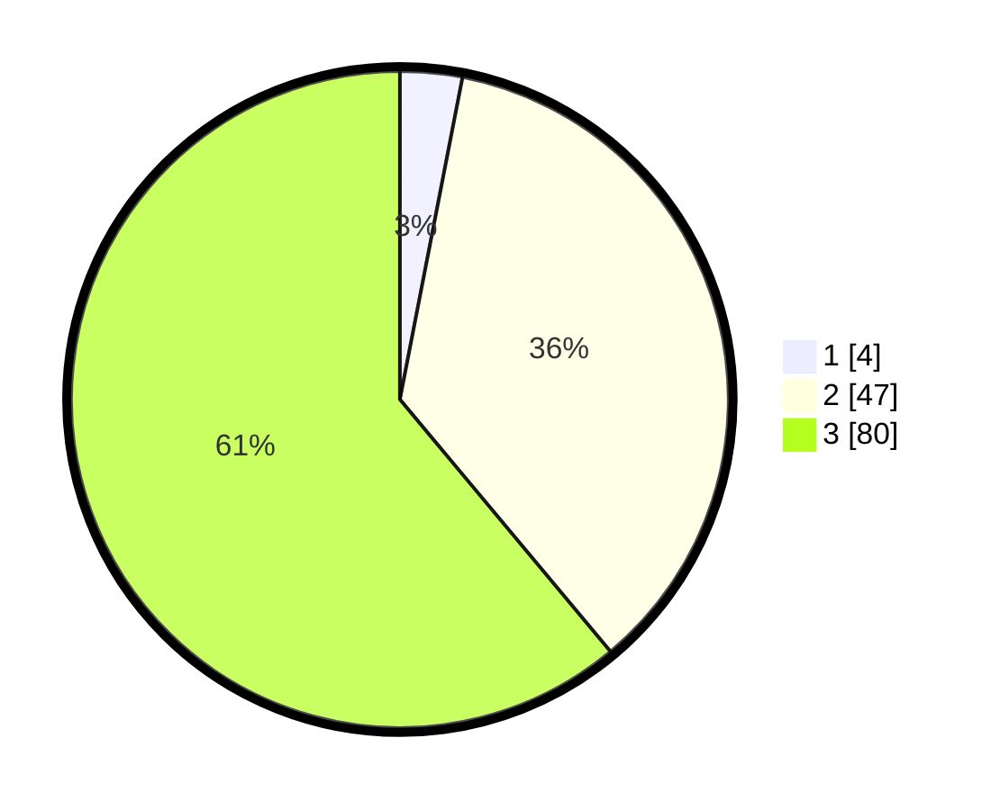

# Hasil

## Grafik

## Tabel

| No. | Nama Paslon    | Suara | Suara (raw) | Persentase |
|:--- |:-------------- | -----:| -----------:| ----------:|
| 1   | ANIES MUHAIMIN | 4     | [4][p-1]    | 3,05       |
| 2   | PRABOWO GIBRAN | 47    | [47][p-2]   | 35,88      |
| 3   | GANJAR MAHFUD  | 80    | [80][p-3]   | 61,07      |

[p-1]: https://github.com/gigit-pemilu/pemilu-2024-33-jawa-tengah/blob/main/pilpres/hitung-suara/sub/33-jawa-tengah/sub/06-purworejo/sub/06-purworejo/sub/2025-donorati/sub/002-tps/sub/paslon-1.txt
[p-2]: https://github.com/gigit-pemilu/pemilu-2024-33-jawa-tengah/blob/main/pilpres/hitung-suara/sub/33-jawa-tengah/sub/06-purworejo/sub/06-purworejo/sub/2025-donorati/sub/002-tps/sub/paslon-2.txt
[p-3]: https://github.com/gigit-pemilu/pemilu-2024-33-jawa-tengah/blob/main/pilpres/hitung-suara/sub/33-jawa-tengah/sub/06-purworejo/sub/06-purworejo/sub/2025-donorati/sub/002-tps/sub/paslon-3.txt

## Foto C Plano

https://sirekap-obj-formc.kpu.go.id/67e2/pemilu/ppwp/33/06/06/20/25/3306062025002-20240214-141509--d9aa068e-e1c7-4b6d-b85a-100e7e8f9634.jpg

https://sirekap-obj-formc.kpu.go.id/67e2/pemilu/ppwp/33/06/06/20/25/3306062025002-20240214-141622--1268f37f-84cc-4394-aa02-be51b7bbfd8a.jpg

https://sirekap-obj-formc.kpu.go.id/67e2/pemilu/ppwp/33/06/06/20/25/3306062025002-20240214-141747--509bf32e-0c79-4c22-aea8-e4698ca286d6.jpg

## Metadata

| Key        | Value               |
| ---------- | ------------------- |
| Time Stamp | 2024-02-14 21:46:01 |

