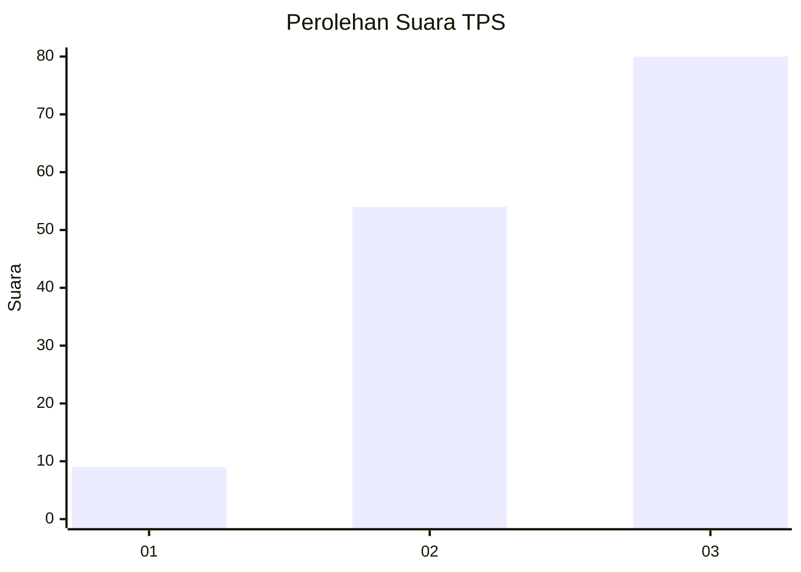
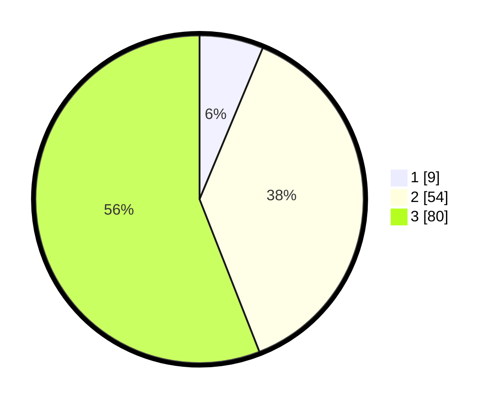

# Hasil

## Grafik

## Tabel

| No. | Nama Paslon    | Suara | Suara (raw) | Persentase |
|:--- |:-------------- | -----:| -----------:| ----------:|
| 1   | ANIES MUHAIMIN | 9     | [9][p-1]    | 6,29       |
| 2   | PRABOWO GIBRAN | 54    | [54][p-2]   | 37,76      |
| 3   | GANJAR MAHFUD  | 80    | [80][p-3]   | 55,94      |

[p-1]: https://github.com/gigit-pemilu/pemilu-2024/blob/main/pilpres/hitung-suara/sub/33-jawa-tengah/sub/06-purworejo/sub/06-purworejo/sub/2025-donorati/sub/003-tps/sub/paslon-1.txt
[p-2]: https://github.com/gigit-pemilu/pemilu-2024/blob/main/pilpres/hitung-suara/sub/33-jawa-tengah/sub/06-purworejo/sub/06-purworejo/sub/2025-donorati/sub/003-tps/sub/paslon-2.txt
[p-3]: https://github.com/gigit-pemilu/pemilu-2024/blob/main/pilpres/hitung-suara/sub/33-jawa-tengah/sub/06-purworejo/sub/06-purworejo/sub/2025-donorati/sub/003-tps/sub/paslon-3.txt

## Foto C Plano

https://sirekap-obj-formc.kpu.go.id/ec8f/pemilu/ppwp/33/06/06/20/25/3306062025003-20240215-015538--9c7aecce-2f5b-4dc3-938f-4d7e3e97656a.jpg

https://sirekap-obj-formc.kpu.go.id/ec8f/pemilu/ppwp/33/06/06/20/25/3306062025003-20240215-015633--dc3fcb82-59d6-4e47-af04-2e9ea0eca8b1.jpg

https://sirekap-obj-formc.kpu.go.id/ec8f/pemilu/ppwp/33/06/06/20/25/3306062025003-20240215-015728--ef13b81c-08ea-415c-b29c-5066d4c47d27.jpg

## Metadata

| Key        | Value               |
| ---------- | ------------------- |
| Time Stamp | 2024-02-15 16:00:26 |

